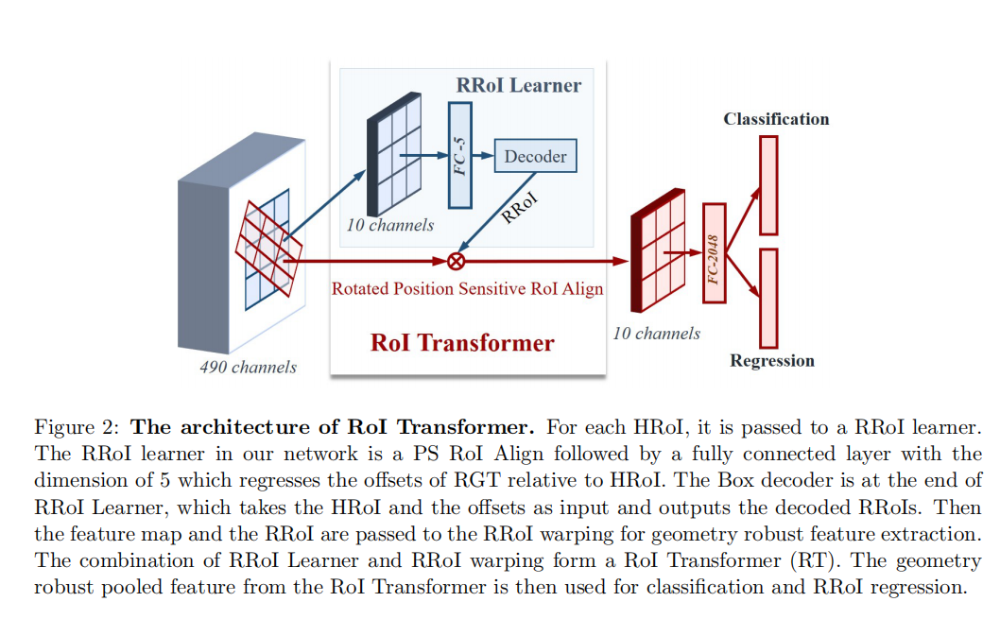
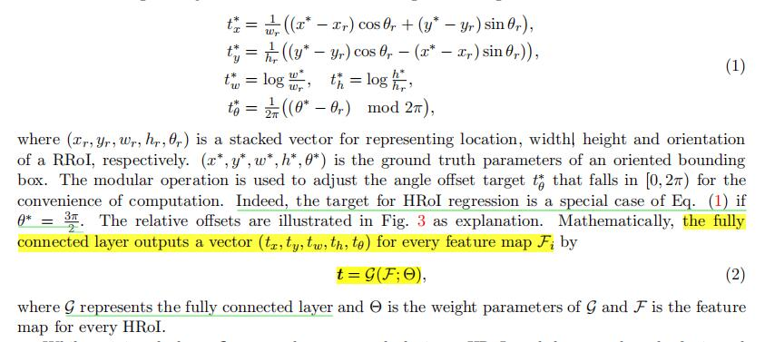
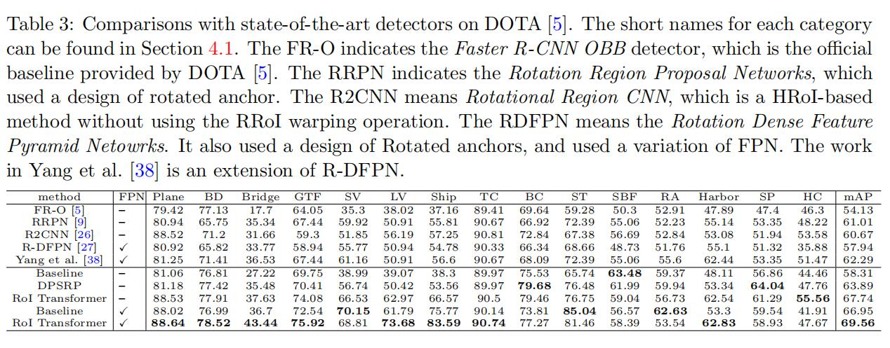

# Learning RoI Transformer for Detecting Oriented Objects in Aerial Images
**paper:**[Detecting Oriented Objects in Aerial Images](https://arxiv.org/abs/1812.00155)`CVPR2018`

## DataSet
- DOTA
- HRSC2016

## Abstract
Object detection in aerial images is an active yet challenging task in computer vision because of the birdview perspective, the highly complexbackgrounds, and the variant appearances of objects. Especially when detecting densely packed objects in aerial images, methods relying on horizontal proposals for common object detection often introduce mismatches between the Region of Interests (RoIs) and objects. This leads to the common misalignment between the final object classification confidence and localization accuracy.Although rotated anchors have been used to tackle this problem, the design of them always multiplies the number of anchors and dramatically increases the computational complexity. In this paper, we propose a RoI Transformer to address these problems. More precisely, to improve the quality of region proposals, we first designed a Rotated RoI (RRoI) learner to transform aHorizontal Region of Interest (HRoI) into aRotated Region of Interest (RRoI).Based on the RRoIs, we then proposed a Rotated Position Sensitive RoI Align(RPS-RoI-Align) module to extract rotation-invariant features from them for boosting subsequent classification and regression. Our RoI Transformer is with light weight and can be easily embedded into detectors for oriented object detection. A simple implementation of the RoI Transformer has achievedstate-of-the-art performances on two common and challenging aerial datasets,i.e., DOTA and HRSC2016, with a neglectable reduction to detection speed. OurRoI Transformer exceeds the deformable Position Sensitive RoI pooling when oriented bounding-box annotations are available. Extensive experiments have also validated the flexibility and effectiveness of our RoI Transformer. The results demonstrate that it can be easily integrated with other detector architectures and significantly improve the performances.
在计算机视觉中遥感影像进行对象识别是很有挑战的任务，因为它是俯瞰图，而且有高复杂度的背景信息，并且物体的外观多变。在遥感影像中，特别是检测密集物体，利用传统的对象检测方法里的水平方向的候选框经常会导致感兴趣区域与物体匹配错误。这将会导致错误的最终的物体分类和定位精度。尽管旋转的anchors已经被用来解决这个问题，但是这种设计经常需要大量的anchors和巨大的计算量。在这篇论文中，我们提出了ROI转换器来解决这些问题。更精确来说，为了提高我们候选框的质量，我们首先提出了旋转ROI（RROI）学习器来水平方向的感兴趣区域（HROI）转变成可以旋转的感兴趣区域（RROI）。基于RROIs，我们又提出了可旋转的位置敏感ROI匹配模型（RPS-ROI-Align）来提取旋转不变的特征来改进后来的分类和回归。我们的ROI转换器是轻量级的而且可以很容易嵌入到其他的旋转对象的检测中。我们ROI转换器的一个简单实现在两个最常见而且具有挑战性的遥感数据集中已经实现了最好的表现，比如DOTA、HRSC2016数据集，并且降低的检测速度可以忽略。当可旋转的边界框可得到时，我们的ROI转换器已经超过了可形变的位置敏感ROI Pooling。大量的实验也已经经过验证我们的ROI转换器有更好的灵活性和效率。结果也已经证明，它可以很容易地与其他检测器相结合而且会显著改进检测质量。
    
## Contribution
- We propose a supervised rotated RoI leaner, which is a learnable module that can transform Horizontal RoIs to RRoIs。
      我们提出了一个有监督的可学习的可旋转ROI学习器，它能实现将水平的ROIs（HRoIS）转换为RROIs。这种设计不仅有效减轻了ROIs和物体的匹配错误，而且也避免了为检测不同方向的物体而需要的大量的RROIs。
- We designe a Rotated Position Sensitive RoI Alignment module for spatially invariant feature extraction, which can effectively boost the object classification and location regression.
       我们为了提取控件不变的特征设计了一个可旋转的位置敏感ROI匹配模型，它可以有效地促进物体分类和定位回归。在使用light-head RoI-wise operation时，这个模型是一个主要的设计，它能够保证高效率和低复杂度。
- We achieve state-of-the-art performance on several public large-scale datasets for oriented object detection in aerial images.
        我们实现了在所有的公开大规模数据集中在遥感影像中检测多方向的物体中最好的表现力。实验也已经表明提出的ROI转换器可以很容易地嵌入到其他的检测架构中，并且具有很好的检测改进效果。
        
       

 ROI Tranformer主要结构有两个（实际是一个可以训练的全连接层）：RROI Learner 和 Rotated Position Sensitive RoI Align。如图所示。

- ROI Learner：主要是致力于从水平方向的ROIs（HROI）的特征图中学习得到可旋转的ROIs（RROI）。论文中描述的过程如下图所示，实际上也就是说，水平方向的ROI（HROI）的回归就是公式（1）的一种特例，即当θ为3π/2。最后的输出向量为（tx,ty,tw,th,tθ）。

-  Rotated Position Sensitive(RPS) RoI Align：该结构主要用来提取在网络中的可旋转的不变特征（rotation-invariant features）。给定输入特征图size为H × W × C 和一个RRoI (xr, yr, wr, hr, θr)，然后RPS RoI pooling将输入的RROI划分为K×K个小区域bins，然后最终会得到一个size为(K × K × C)的特征图y。
 
 
 ## Result
 
 
