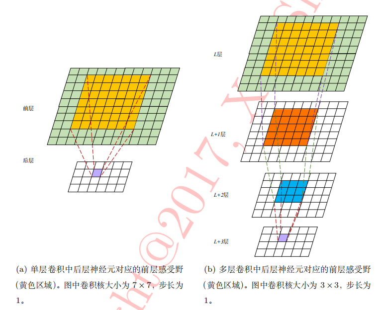

# MULTI-SCALE CONTEXT AGGREGATION BY DILATED CONVOLUTIONS

**paper:**[multi-scale context aggregation by dilated convolutions](https://arxiv.org/abs/1511.07122) `CVPR2015`

## Abstract
State-of-the-art models for semantic segmentation are based on adaptations of convolutional networks that had originally been designed for image classification. However, dense prediction and image classification are structurally different. In this work, we develop a new convolutional network module that is specifically designed for dense prediction. The presented module uses dilated convolutions to systematically aggregate multi-scale contextual information without losing resolution. The architecture is based on the fact that dilated convolutions support exponential expansion of the receptive field without loss of resolution or coverage. We show that the presented context module increases the accuracy of state-of-the-art semantic segmentation systems. In addition, we examine the adaptation of image classification networks to dense prediction and show that simplifying the adapted network can increase accuracy.

用于语义分割的最好的模型是以卷积神经网络为基础，卷积神经网络最初为了图像的分类而设计。然而，密集预测和图像分类结构上很不同。在本篇论文中，我们设计了一个新的卷积神经网络模型，主要是为了密集预测而设计。现在的这个模型利用空洞卷积来系统地结合多尺度的上下文信息而不丢失分辨率。空洞卷积支持感受野指数级地增加而不丢失分辨率，我们的结构就是以这个事实为基础的。我们证明了现在的上下文模型增加了最好的语义分割系统的精度。除此之外，我们测试了图像分类网络到密集预测中的适应性，发现简单的适配的网络可以增加精度。

## Contribution
本文主要提出了空洞卷积的概念，dilated convolution，能够整合多尺度的内容信息，而且不损失分辨率，并且支持感受野的指数级的增长。如图所示。

对于上图中感受野的分析：f0经过1-dilated conv（1空洞卷积相当于普通的卷积）后，得到的特征图f1在f0上的感受野为3×3。

f1再经过2-dilated conv（2空洞卷积）后，得到的特征图f2在f1上的感受野为5×5（5=3+2×(2-1)），而f1在f0上的感受野为3×3，所以f2在f0上的感受野为7×7（7=5+2×(3-1)/2）。

f2再经过4-dilated conv（4空洞卷积）后，得到的特征图f3在f2上的感受野为9×9（9=3+2×(4-1)），而f2在f0上的感受野为7×7，所以f3在f0上的感受野为15×15（15=9+(7-1)）。

## 总结
对于空洞卷积（基本卷积核为3×3）：
- 从原图上看，相当于在原图上做采样，采样频率根据rate参数设置。当rate=1时，是原图不丢失任何信息采样，此时卷积操作相当于标准卷积操作。当rate>1时，就是在原图上每隔（rate-1）个像素采样，然后将采样点与kernel做卷积，这样做其实变相增大了感受野。
- 从kernel角度去看空洞卷积，就是扩大了kernel的size，在原先的kernel中，相邻点之间插入（rate-1）个零，然后将扩大的kernel和原图做卷积，还是相当于增大了感受野。

本论文中主要是将该空洞卷积用于语义分割。

## 感受野

对于感受野的计算，假设前一层在原图上的感受野为P0，而前一层经过的卷积核大小为s的卷积后得到该层，所以该层在前一层的感受野为s×s，该层在原图上的感受野为s+2×(P0-1)/2 = s+(P0-1)  （P0一般为奇数）

自动计算公式：[计算](https://fomoro.com/projects/project/receptive-field-calculator)

