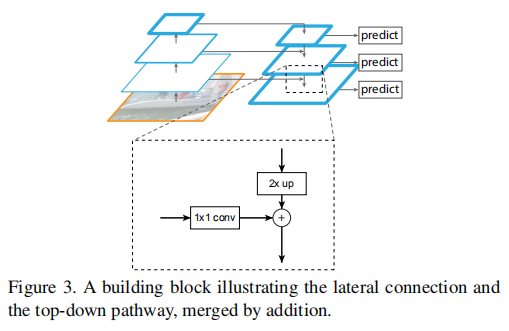

# FPN
**paper:**[Feature Pyramid Networks for Object Detection](https://arxiv.org/abs/1612.03144)`CVPR2017`

## Abstract
特征金字塔(Feature Pyramid)是识别系统中用于检测不同尺度目标的基本组件。最近的深度学习目标检测器已经避免了金字塔表示，部分原因是它们是计算和内存密集型的。在本文中，利用深度卷积网络内在的多尺度、金字塔分级来构造具有很少额外成本的特征金字塔。开发了一种具有横向连接的自顶向下架构(A top-down architecture with lateral connections)，用于在所有尺度上构建高级语义特征映射。这种称为特征金字塔网络（FPN）的架构在应用中作为通用特征提取器表现出了显著的改进。在一个基本的Faster R-CNN系统中使用FPN，该方法可以在COCO检测基准数据集上取得最先进的单模型结果，结果超过了所有现有的单模型输入，包括COCO 2016挑战赛的获奖者。此外，该方法可以在GPU上以6FPS运行，因此是多尺度目标检测的实用和准确的解决方案。

## Contribution

提出了特征金字塔网络（FPN）的三个主要部分：
- Bottom-up Pathway：卷积网络的前馈计算，由不同比例的特征映射组成的特征层级，paper中利用残差块conv2、conv3、conv4、conv5的输出，记为{C2,C3,C4,C5}，它们相对于输入图像的步长分别为{4,8,16,32}。
- Top-down Pathway：通过在空间上更抽象但语义更强的高层特征图进行上采样来幻化高分辨率的特征，随后通过横向连接从底向上路径，使得高层特征得到增强，即将低分辨率的特征图做2倍上采样（paper中说为简单使用最近邻上采样），然后通过按元素相加，将上采样映射与相应的自底向上特征合并，最后每层都附加一个3×3卷积来生成最终特征映射，这是为了减少上采样的混叠效应。最终，得到的特征映射集为{P2,P3,P4,P5}，分别对应于{C2,C3,C4,C5}，并且对应的具有相同的尺寸。
- Lateral Connection：横向连接，即将自底向上的层进行1×1的卷积。采用1×1的卷积是为了减少特征图的数量，paper中使用的是256维的特征。

由此，可以将FPN网络分别作用到RPN网络和Fast RCNN中，以达到高效的检测效果。需要注意，网络的predict是在自上而下的每个特征图上都预测，即{P2,P3,P4,P5}。

# Spatial Pyramid Pooling in Deep Convolutional Networks for Visual Recognition
**paper:** [SPP-NET](https://arxiv.org/abs/1406.4729) `CVPR2015`

## Abstract
之前深度卷积神经网络（CNNs）都需要输入的图像尺寸固定（比如224×224）。这种人为的需要导致面对任意尺寸和比例的图像或子图像时降低识别的精度。本文中，我们给网络配上一个叫做 `“空间金字塔池化”(spatial pyramid pooling,)`的池化策略以消除上述限制。这个我们称之为SPP-net的网络结构能够产生`固定大小`的输出而不关心输入图像的尺寸或比例。金字塔池化对物体的形变十分鲁棒。由于诸多优点，SPP-net可以普遍帮助改进各类基于CNN的图像分类方法。在ImageNet2012数据集上，SPP-net将各种CNN架构的精度都大幅提升，尽管这些架构有着各自不同的设计。在PASCAL VOC 2007和Caltech101数据集上，SPP-net使用单一全图像表示在没有调优的情况下都达到了最好成绩。SPP-net在物体检测上也表现突出。使用SPP-net，只需要从整张图片计算一次特征图（feature map），然后对任意尺寸的区域（子图像）进行特征池化以产生一个固定尺寸的表示用于训练检测器。这个方法避免了反复计算卷积特征。在处理测试图像时，我们的方法在VOC2007数据集上，达到相同或更好的性能情况下，比R-CNN方法快`24-102`倍。在ImageNet大规模视觉识别任务挑战`（ILSVRC）2014`上，我们的方法在物体检测上`排名第2`，在物体`分类上排名第3`，参赛的总共有38个组。本文也介绍了为了这个比赛所作的一些改进。

## Contribution

关于空间金字塔池化其结构如图所示，用在卷积层之后，用户连接卷积层和全连接层，因为只有全连接层才要求输入的尺寸固定，而在卷积层不管输入尺寸多大都只是卷积核在整张图像上滑动，得到与输入有一定比例的输出，而全连接层需要将输入的全部像素连接起来。论文中在说明金字塔池化时，在得到卷积之后的特征图后，用不同大小的块提取特征，paper中分别利用4×4,2×2,1×1，将这三个网格分别放到特征图上，在每个特征图的每个块上求池化（最大池化或者平均池化），所以一共可以得到16+4+1=21块，刚好是要提取的21维特征，图中卷积之后有256个过滤器，所以经过SPP网络后得到21×256的固定大小的输出向量。

另外，首先假定卷积层之后输出的特征图为a×a，则对于n×n块的金字塔层级，进行池化时滑动窗口即卷积核的大小为[a/n]向上取整，步长stride_size为[a/n]向下取整，这样a×a的特征图经过这样的卷积核和步长的池化操作后就会得到n×n个向量。paper中说明了一个三级的金字塔，其中卷积之后的输出特征为13×13，三层金字塔分别为3×3,2×2,1×1，所以可以分别求出每层的卷积核大小和滑动步长的大小如图所示。

将spp-net用在对象检测时，因时间比较早，paper中是在r-cnn的基础上，与rcnn不同，paper中，先得到2000候选框（该方法与rcnn一致），然后对整个输入图片计算卷积得到特征图，然后在该特征图的候选框位置，执行spp空间特征金字塔，得到固定的输出向量，然后就可以送进全连接层对该候选框进行分类。

