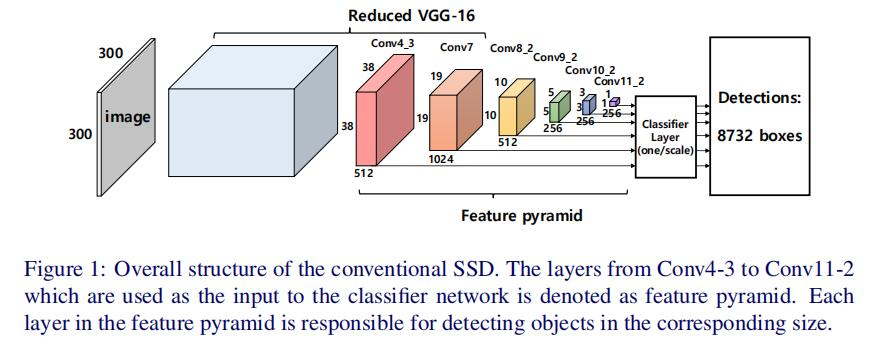
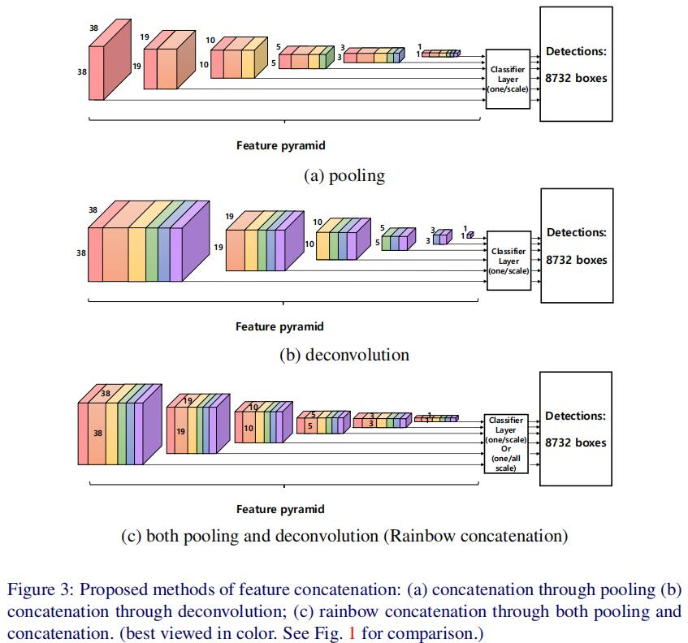
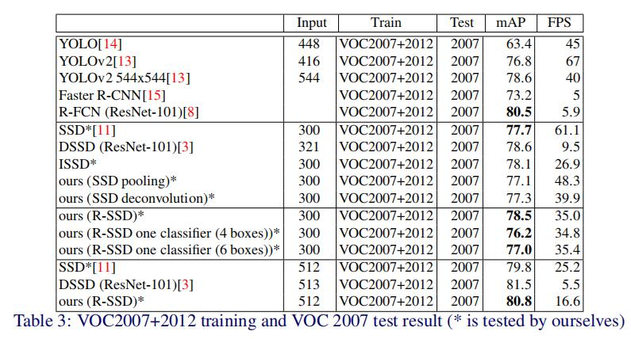

# R-SSD

**paper:**[Enhancement of SSD by concatenating feature maps for object detection](https://arxiv.org/abs/1705.09587) `CVPR2017`

## DataSet
PASCAL VOC

## Abstract
We propose an object detection method that improves the accuracy of the conventional SSD (Single Shot Multibox Detector), which is one of the top object detection algorithms in both aspects of accuracy and speed. The performance of a deep network is known to be improved as the number of feature maps increases. However, it is difficult to improve the performance by simply raising the number of feature maps. In this paper, we propose and analyze how to use feature maps effectively to improve the performance of the conventional SSD. The enhanced performance was obtained by changing the structure close to the classifier network, rather than growing layers close to the input data, e.g., by replacing VGGNet with ResNet. The proposed network is suitable for sharing the weights in the classifier networks, by which property, the training can be faster with better generalization power. For the Pascal VOC 2007 test set trained with VOC 2007 and VOC 2012 training sets, the proposed network with the input size of 300 x 300 achieved 78.5% mAP (mean average precision) at the speed of 35.0 FPS (frame per second), while the network with a 512 x 512 sized input achieved 80.8% mAP at 16.6 FPS using Nvidia Titan X GPU. The proposed network shows state-of-the-art mAP, which is better than those of the conventional SSD, YOLO, Faster-RCNN and RFCN. Also, it is faster than Faster-RCNN and RFCN.

我们提出了一种能够改进传统的SSD检测精度的对象检测的方法，它具有很好的检测精度和速度，是最好的对象检测方法之一。因为特征图数目的增加我们也知道深度网络的表现也会提高。然而，仅仅增加特征图的数目来改进表现是很困难的。在这篇论文中，我们提出并且分析了高效实用特征图来提高传统的SSD的表现。这个表现的提高是通过改变靠近分类器网络的结构，而不是增加输入数据的层，比如把VGGNet替换成ResNet。我们提出的网络适合在分类器网络里共享权重，通过这种特性，我们的训练可以更快。在Pascal VOC2007和2012数据集上训练，然后在VOC2007数据集上测试，当网络输入的图片为300×300时mAp达到78.5%并且速度为35FPS，当网络输入的图片为512×512时mAp达到80.8%并且速度为16.6FPS，使用的是Nvidia Titan X GPU。提出的网络展现了最好的mAp，它比传统的SSD、yolo、faster-RCNN和RFCN更好。而且，它比Faster-RCNN和RFCN很快。

## Contribution

- it creates a relationship between each scale of feature pyramid to prevent unnecessary detection such as multiple boxes in different scales for one object.
它创造了在特征金字塔中的每个尺度之间的联系，从而避免了不必要的检测，比如在不同尺度的多个boxes检测同一个物体。

- by efficiently increasing the number of feature maps of each layer in the feature pyramid, the accuracy is improved without much time overhead.
通过高效增加了特征金字塔中的每层特征图的数量，提高了精度而且没有过多的时间消耗。

- the number of feature maps for different layers are matched so that a single classifier can be used for different scales
不同层之间的特征图的数量是相同匹配的，因此在不同的特征尺度上可以使用单一的分类器网络。

## Rainbow concatenation

传统的SSD网络的全部模型如上图所示，它是在不同的尺度的特征图上单独进行预测，所以会有两个问题：
- 不同层的feature map都是独立作为分类网络的输入，因此容易出现相同物体被不同大小的框同时检测出来。
- 对小尺寸的物体检测效果比较差（虽然大部分的对象检测算法都会有这个问题）

本文中为了解决该问题，提出了以下两个方法：
- 在分类网络中考虑特征金字塔的不同层的特征之间的关系。
- 增加特征金字塔中每层的通道数。

如上图所示
- 图a是将低层的特征图通过池化使之与高层的特征图size相同，然后连接到高层的特征图上。
- 图b是将高层的特征图通过反卷积上采样操作使之与低层的特征图size相同，然后连接到低层的特征图上。
- 图c是我们的模型，同时使用低层向高层的池化操作和高层向低层的反卷积上采样操作，然后进行连接，所以最后得到的不同尺度的层的特征图的数目都是一致的，其中模型中的反卷积操作仅仅是执行batch normalization后的deconvolution。这样的话，一个特定大小的物体就会被在特征金字塔上特定尺度的层检测到，所以就会避免了传统的SSD中一个物体被不同的boxes框中。而同时，因为特征金字塔的每层的特征图数目相同，因此对于不同尺度的层的检测器网络的权重就可以实现共享。

## Result

实验测试是在VOC2007+2012作为训练集，VOC2007作为测试集。由上图中的实验对比可以看出，仅仅在传统的SSD上使用pooling或者deconvolution操作，精度不仅没有上升，反而会降低，可能是因为在其它层之间共享相同的特征图可能会影响其他尺度层的损失而且不能充分关注与该尺度（the layers sharing the same feature maps with other layers can be affected by the loss of other scales and do not fully focus on the scale），而且因为增加了这些操作后检测速度也是大大降低。我们的RSSD模型精度都超过了传统的SSD的精度，但是检测速度稍微有些降低。

当采样的数目比较小时，传统的SSD不能为一个尺度的层训练分类器，但是RSSD却避免了这个问题，因为它的分类器网络的权重是共享的，即是使用一个单一的分类器。

