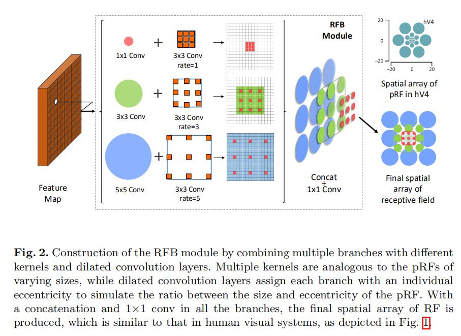
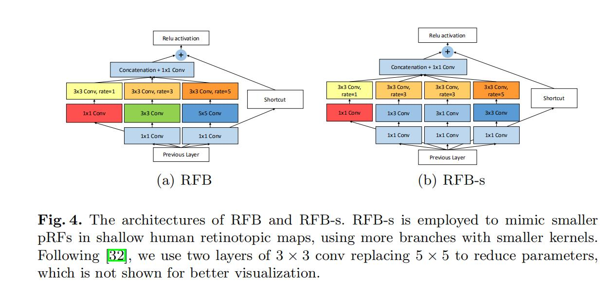
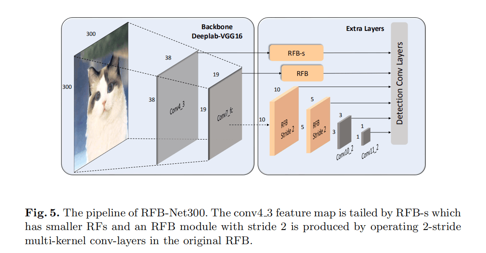
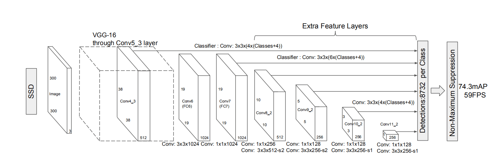
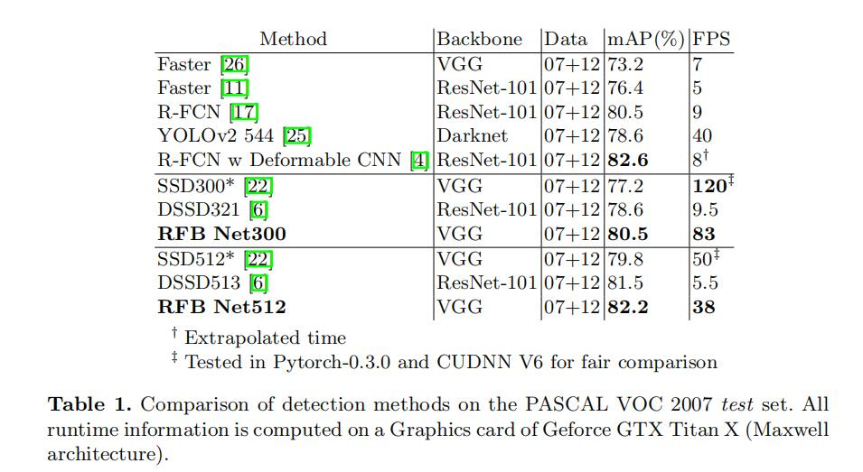

# Receptive Field Block Net for Accurate and Fast Object Detection

**paper:**[REBNet](https://arxiv.org/abs/1711.07767) `CVPR2017`

**github：**[RFBNetGithub](https://archive.nyu.edu/handle/2451/33887)

## DataSet
- PASCAL VOC
- MS COCO

## Abstract
Current top-performing object detectors depend on deep CNN backbones, such as ResNet-101 and Inception, benefiting from their powerful feature representations but suffering from high computational costs. Conversely, some lightweight model based detectors fulfil real time processing, while their accuracies are often criticized. In this paper, we explore an alternative to build a fast and accurate detector by strengthening lightweight features using a hand-crafted mechanism. Inspired by the structure of Receptive Fields (RFs) in human visual systems, we propose a novel RF Block (RFB) module, which takes the relationship between the size and eccentricity of RFs into account, to enhance the feature discriminability and robustness. We further assemble RFB to the top of SSD, constructing the RFB Net detector. To evaluate its effectiveness, experiments are conducted on two major benchmarks and the results show that RFB Net is able to reach the performance of advanced very deep detectors while keeping the real-time speed.
现在最好的对象检测器依赖于深层的卷积神经网络，比如ResNet-101、Inception，主要得益于他们的有效的特征表现力，但是却花费了高昂的计算代价。相反，比如一些实现实时检测的轻量级的模型，他们的精度却不是很好。在这篇paper中，我们提出了一个选择来构建一个快速并且精确的检测器，通过一个手工制作的加强轻量级特征。受人类视觉系统的感受野结构的启发，我们提出了一个奇特的感受野块（RFB）模型，他可以考虑到感受野的大小（size）和离心率（eccentricity）的关系，来增强特征的辨别力和鲁棒性。我们更在SSD的顶层使用RFB，构建RFB网络检测器。为了评估网络的有效性，我们在啷个主要的结构中进行了实验，结果表示RFB网络可以达到最好的表现力而且保持了实时的检测速度。

## Contribution

- We propose the RFB module to simulate the configuration in terms of the size and eccentricity of RFs in human visual systems, aiming to enhance deep features of lightweight CNN networks.
提出一个RFB模型，模拟人类视觉系统中的感受野的大小和离心率，旨在利用轻量级的卷积神经网络增强深度特征。

- We present the RFB Net based detector, and by simply replacing the top convolution layers of SSD with RFB, it shows significant performance gain while still keeping the computational cost under control.
我们提出一个基于RFB网络的检测器，仅仅把SSD的上面的几层卷积层用RFB代替，就会有很好的变现并且计算量可以控制。

- We show that RFB Net achieves state-of-the-art results on the Pascal VOC and MS COCO at a real time processing speed, and demonstrate the generalization ability of RFB by linking it to MobileNet.
RFB网络在Pascal VOC和COCO数据集上实现了最好的效果，并且速度很快。

## RFB结构

RFB的结结构如图所示，RFB使用不同尺寸卷积核的卷积层构成多分支结构，然后使用空洞卷积（dilated convolution）来控制离心率，主要增加感受野，其中不同的rate表示不同dilated卷积层的参数，最后把不同的分支特征concat整合在一起。

## RFB组成部分
RFB主要有两个组成部分：
- 不同尺寸卷积核的多分支卷积层 （Multi-branch convolution layer）
- 后续的空洞池化或卷积层（Dilated pooling or convolution layer）

**Multi-branch convolution layer：**
首先每一个分支连接一个1×1的卷积层来降低特征图的通道数，之后会跟着一个n×n的卷积层，比如图4中，在1×1卷积层之后有三个分支：1×1、3×3、5×5的卷积。而图4中的RFB-s是RFB的另一种结构，RFB-s相比于RFB主要有两个改进，一方面用3×3卷积层代替5×5卷积层，另一方面用1×3和3×1卷积层代替3×3卷积层，主要目的应该是为了减少计算量。

**Dilated pooling or convolution layer：**
这个结构主要生成具有高分辨率的特征图，在保持相同数目的参数时捕获具有更多上下文区域的信息。（空洞卷积的概念）

##  RFB Net Detection Architecture

使用的主干网络是在LSVRCCLS-LOC数据集上预训练的VGG16模型，主干为SSD网络。首先在SSD的conv4_3和conv7_fc在接预测层之前分别接RFB-s和RFB结构，主干中的高两层也是用RFB代替，其结构如图5所示。

## result

上图的表一中是PASCAL VOC2007 test-set数据集上的测试结果，训练集基于2007和2012的trainval。RFB Net300在mAP和FPS方面效果都不错。

## 总结
基于SSD的one-stage方法，模拟人类视觉系统中的感受野的概念，提出RFB的概念模拟人类视觉的感受野加强网络的特征提取能力，然后将RFB应用到SSD上去。

