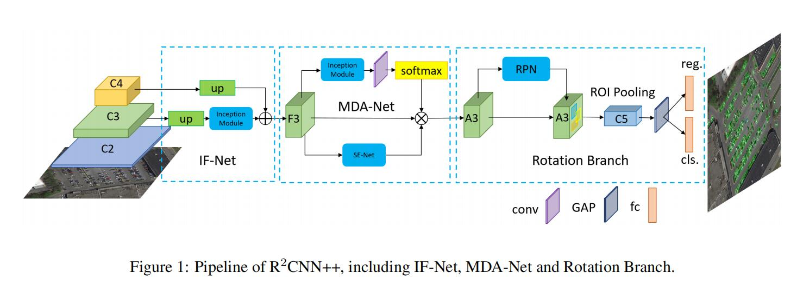
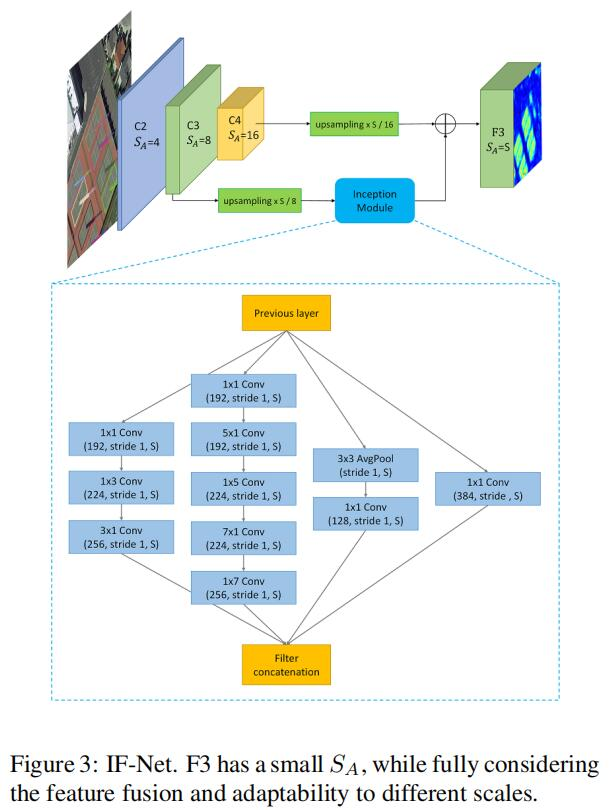
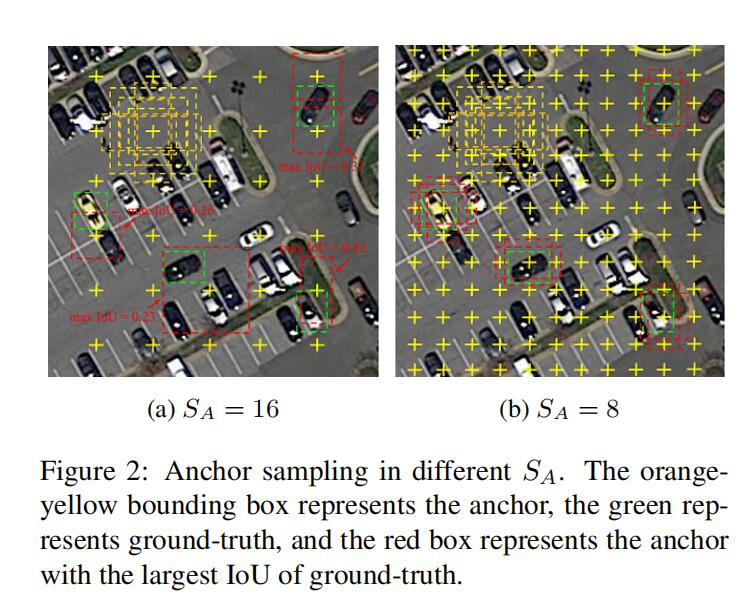
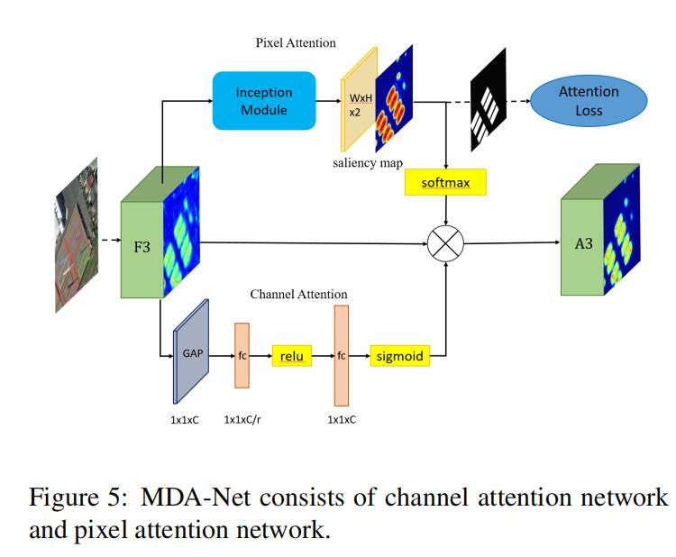
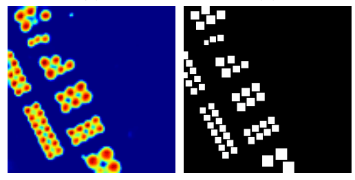
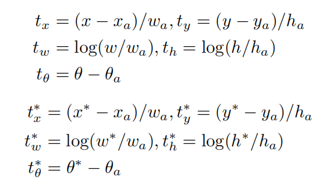
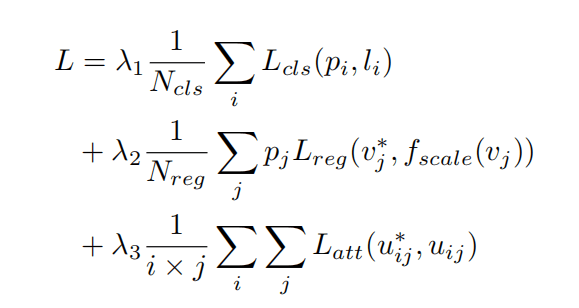
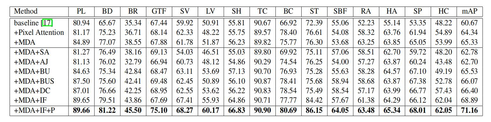

# RRCNN++: Multi-Dimensional Attention Based Rotation Invariant Detector with Robust Anchor Strategy

**paper:**[RRCNN++](https://arxiv.org/abs/1811.07126) `CVPR2018`

**github:**[url](https://github.com/DetectionTeamUCAS/R2CNN-Plus-Plus_Tensorflow)

## Abstract
Object detection plays a vital role in natural scene and aerial scene and is full of challenges. Although many advanced algorithms have succeeded in the natural scene, the progress in the aerial scene has been slow due to the complexity of the aerial image and the large degree of freedom of remote sensing objects in scale, orientation, and density. In this paper, a novel multi-category rotation detector is proposed, which can efficiently detect small objects, arbitrary direction objects, and dense objects in complex remote sensing images. Specifically, the proposed model adopts a targeted feature fusion strategy called inception fusion network, which fully considers factors such as feature fusion, anchor sampling, and receptive field to improve the ability to handle small objects. Then we combine the pixel attention network and the channel attention network to weaken the noise information and highlight the objects feature. Finally, the rotational object detection algorithm is realized by redefining the rotating bounding box. Experiments on public datasets including DOTA, NWPU VHR-10 demonstrate that the proposed algorithm significantly outperforms state-of-the-art methods
对象检测在自然图像和遥感图像中扮演着重要的角色，而且充满挑战。尽管已经有先进的算法成功处理自然图像，但是在遥感图像的进度却很慢，因为遥感图像的复杂性和遥感图像中的物体的比例、方向和密集度都有着很大的自由度。在这篇论文中，一个新奇的多类别旋转检测器被提出，它可以高效地检测在复杂的遥感影像中的小的物体、任意方向的物体和密集的物体。特别地，这个提出的模型采用特征融合的策略，被称为inception融合网络，它完全考虑了比如特征融合、anchor的采样和感受野的因素来改进提高检测小物体的能力。然后我们结合像素注意力网络和通道注意力网络来削弱噪声信息，并且加强物体的特征。最终，这个旋转的对象检测算法通过重新定义的选中边界框实现了。在公开的数据集上例如DOTA、NWPU VHR-10上已经做了实验，证明提出的算法实现了最好的水平。

## Contribution

-  We design a novel arbitrary-oriented object detection framework suitable for aerial images, which can detect the multi-category object in large-scale complex scenes.
我们设计了一个适合遥感图像的新奇的任意方向对象的检测框架，我们可以在大规模复杂的影响中检测多类别对象。

-  We construct a targeted feature fusion structure, considering the receptive fields gap, feature fusion, and the anchor sampling, which can effectively detect small objects.
我们设计了一个定向的特征融合框架，考虑了感受野、特征融合、anchor的采样，它可以高效地检测小物体。

- A multi-dimensional attention mechanism is adapted to reduce the adverse impact of noise and improve the detection accuracy.
一个多维度的注意力机制被采用来降低噪声的影响并且提高了检测精度。

- Our algorithm achieves state-of-the-art performance in both DOTA and NWPU VHR-10 datasets.
我们的算法在DOTA和 NWPU VHR-10数据集上都实现了最好的表现力。

## Network

网络的结构如上图所示，是一个two-stage方法：在第一阶段IF-Net和MDA-Net后，得到包含更多的特征信息并且更少的噪声信息的更优质的特征图；第二阶段的回归过程引入角度变量，即五变量回归，再加倾斜非极大值抑制，得到最终检测结果。
由上图也可以看出，整体结构一共有三个模块：IF-Net（Inception fusion network）、MDA-Net（multi-dimensional attention network）和Rotation Branch。

### IF-Net（inception fusion network）

IF-Net only uses C3 and C4 as inputs because their semantic information and location information are balanced and the contributions of other feature maps are not visible.
相比于FPN，IF-Net仅仅使用C3和C4层的特征作为输入，因为他们在语义信息和位置信息之间达到了平衡，而且其它层的特征图并没有什么用。
通道一：C4上采样S/16，anchor的步长由原来的16变成S。（S是期望的anchor步长）
通道二：C3同样上采样到相同的anchor步长，由原来的8变成S，然后C3再经过inception结构增大感受野和语义信息，inception结构中包含不同尺寸的卷积核有助于适应对象形状的多样性。
最后，通道一和通道二执行element-wise addition操作得到F3。

anchor的步长S，较小时，效果较好，但是训练速度较慢，S较大时，训练速度快，但是性能有所下降，论文中设置S为6。
除了设置步长，还设置base anchor size为256；anchor scales为1/16，1/8，1/4，1/2，1，2；anchor ratios 为1:1，1;2，1;3，1:4，1:5，1:6，1:7，1:8，1:9；

### MDA-Net（multi-dimensional attention network）
包含像素注意力网络和空间注意力网络。

下面的分支是使用SENet作为通道注意力网络，value of reduction ratio is 16。
上面的分支是像素注意力网络，即空间注意力，特征图经过Inception模块之后得到W×H×2的两通道的显著图，显著图分别代表前景和背景的得分。经过Softmax之后，显著图像素值变为0到1之间，相当于空间分布权重，削弱噪声。经过softmax选出来一个通道与F3相乘，得到新的特征图A3。
两通道的显著图由有监督的学习得到，通过标注，很容易得到二值图，作为显著图的标注，用二值图和显著图之间的交叉熵损失作为空间注意力损失。

### Rotation Branch

边界框回归的定义的方法如下：

Variables x, xa, and x* are for the predicted box, anchor box, and ground-truth box, respectively。θ∈[−π/2, 0)

使用R-NMS作为后处理过程，并且针对数据集中不同类别设置不同阈值。

## Loss Function

函数fscale用于控制所预测的坐标偏移的动态变化（增加数值稳定性），使得预测结果更加准确。
pi代表类别预测概率，li代表类别标注；
v*j代表坐标角度标注，vj代表预测的坐标角度参数；

u*ij和uij分别代表二值标注和预测显著图的像素值。

## Result

