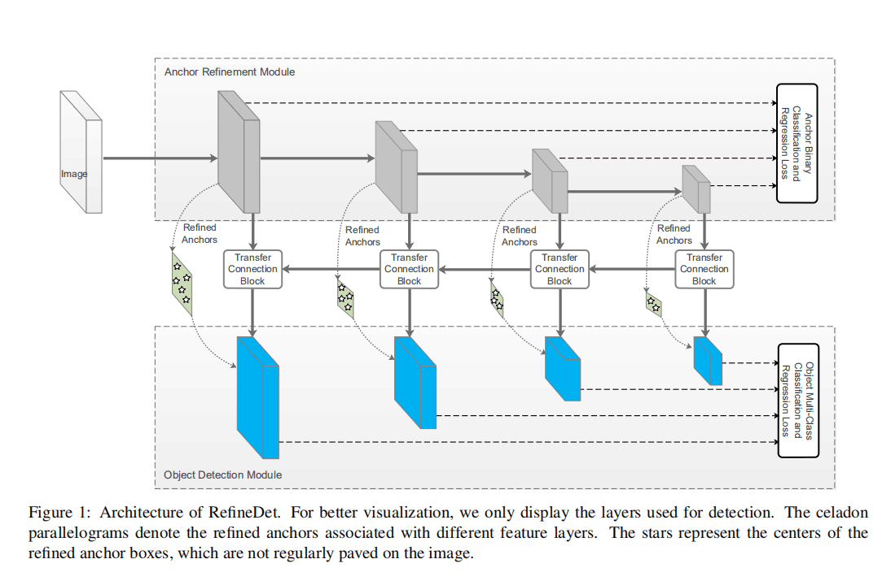
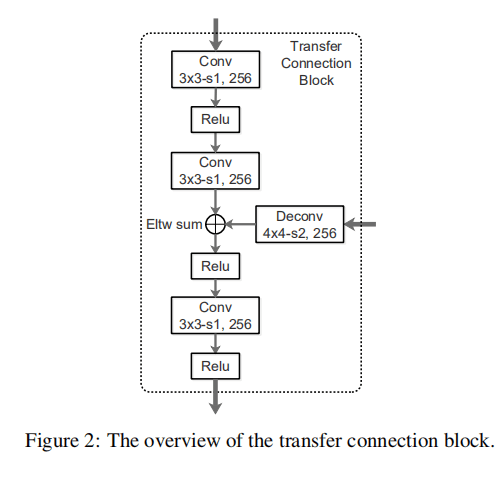
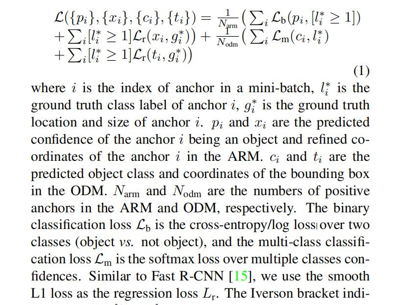
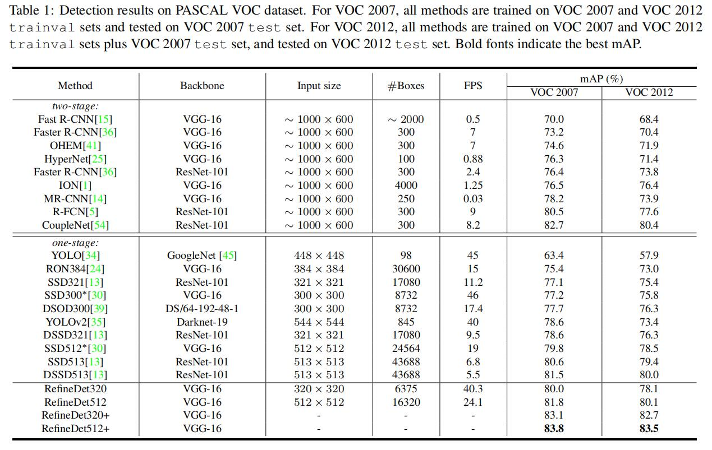

# Single-Shot Refinement Neural Network for Object Detection

**paper:**[Single-Shot Refinement Neural Network for Object Detection](https://arxiv.org/abs/1711.06897) `CVPR2017`

## DataSet
- PASCAL VOC
- MS COCO

## Abstract
For object detection, the two-stage approach (e.g., Faster R-CNN) has been achieving the highest accuracy, whereas the one-stage approach (e.g., SSD) has the advantage of high efficiency. To inherit the merits of both while overcoming their disadvantages, in this paper, we propose a novel single-shot based detector, called RefineDet, that achieves better accuracy than two-stage methods and maintains comparable efficiency of one-stage methods. RefineDet consists of two inter-connected modules, namely, the anchor refinement module and the object detection module. Specifically, the former aims to (1) filter out negative anchors to reduce search space for the classifier, and (2) coarsely adjust the locations and sizes of anchors to provide better initialization for the subsequent regressor. The latter module takes the refined anchors as the input from the former to further improve the regression and predict multi-class label. Meanwhile, we design a transfer connection block to transfer the features in the anchor refinement module to predict locations, sizes and class labels of objects in the object detection module. The multi-task loss function enables us to train the whole network in an end-to-end way. Extensive experiments on PASCAL VOC 2007, PASCAL VOC 2012, and MS COCO demonstrate that RefineDet achieves state-of-the-art detection accuracy with high efficiency.
翻译：对于对象检测，两阶段的方法（例如faster rcnn）已经实现了最高的检测精度，一阶段的方法（例如SSD）已经实现了最好的检测效率。为了继承它们二者的有点并且克服它们的缺点，我们提出了一种新的单次目标探测器，叫做RefineDet，它比two-stage方法更精准，同时保持了one-stage方法的效率。 RefineDet包含两个相互连接的模块，即anchor refinement module和object detection module。具体来说，前一个主要实现（1）过滤掉negative anchors，以减少分类器的搜索空间，（2）粗略调整anchors的位置和大小，为后续的回归提供更好的初始化。后一个模块将从前一个模块中提取的refined anchors作为输入，进一步改善回归和预测多级标签。同时，我们设计transfer connection block来传输ARM的特征，用于ODM中预测目标的位置，大小和类别标签。Multi-task loss function使我们能够以端到端的方式训练整个网络。 PASCAL VOC 2007，PASCAL VOC 2012和MS COCO的实验，证明了RefineDet实现了state-of-the-art的检测精度和高效率。

## Contribution
- 提出了一个新颖的一阶段框架用于目标检测，由两个相互连接的模块组成，即ARM和ODM。性能比两阶段方法更好，同时保持一阶段方法的高效率。
- 为确保有效性，设计了TCB来传输ARM的特征，来处理更具挑战性的任务，即预测ODM中准确的对象位置、大小和类别标签。
- 实现了最新的state-of-the-art通用目标检测（PASCAL VOC 2007，PASCAL VOC 2012和MS COCO）

该网络的结构图如下图所示：

RefineDet的两个模型：
- ARM（anchor refinement module）:
主要是识别和删除negative anchors，用来减少分类器的搜索空间；并且粗略调整anchors的位置和大小，为后续的ODM模块提供更好的初始化回归。我看他的网络结构，应该类似于RPN网络，用来先提取候选框，不过在RPN中，只是输入单层特征，利用单层的特征产生proposals，而在该模型中，是利用了多层特征图，网络结构中可以看到用了4层，每层都会生成refined anchors box。

- ODM（object detection module）:
该模型主要采用ARM产生的refined anchors 作为输入，进一步改善回归和预测多类别标签。该网络与SSD极其类似，都是首先在多层特征图上进行预测，然后将这个结果进行融合，进行multi-class classification 和regression。不过不同的地方在于ODM中输入的anchors是了利用ARM得到的refined anchors，而在SSD是利用默认的anchors。

RefineDet的三个核心组件：
- TCB（transfer connection block）:
用TCB将ARM中的特征图转换到ODM中，这样ODM就可以共享ARM的特征。其中TCB的另一个功能是整合高层次的特征图，融合到低层次中，这个过程就跟FPN网络模型一致，从上而下逐渐由高层次的特征图和对应层次的从下而上的低层次特征图进行融合，而高层次的特征图与低层次的特征图size不一致，所以首先将高层次的特征图进行deconvolution，将其扩大到一致，然后再以element-wise的方式对他们进行求和。其TCB的模块实现如图所示。

- Two-Step Cascade Regression :
作者提出一个两步级联回归策略回归对象位置和大小。即先用ARM调整anchors的位置和大小，为ODM中回归提供更好的初始化。然后ODM利用ARM生成的refined anchors作为输入，进一步检测和回归。

- Negative Anchor Filtering :
在训练时，针对ARM中的anchor，如果negative confidence大于一个阈值θ（θ=0.99，经验值），则在ODM训练时就会舍弃它。

### 损失
损失函数主要包含ARM和ODM两方面：在ARM部分包含binary classification损失Lb和回归损失Lr；同理在ODM部分包含multi-class classification损失Lm和回归损失Lr。损失函数如下：

其中[li* ≥ 1]lr可以在计算回归损失时忽略negative anchor。

# result

在VOC下的检测结果如下图所示，表格中最后两行在算法名称后面多了+，表示采用multi scale test，因此效果会更优一些。

