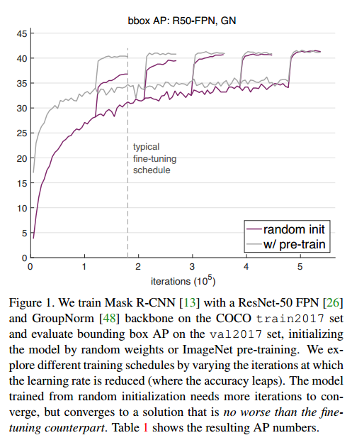
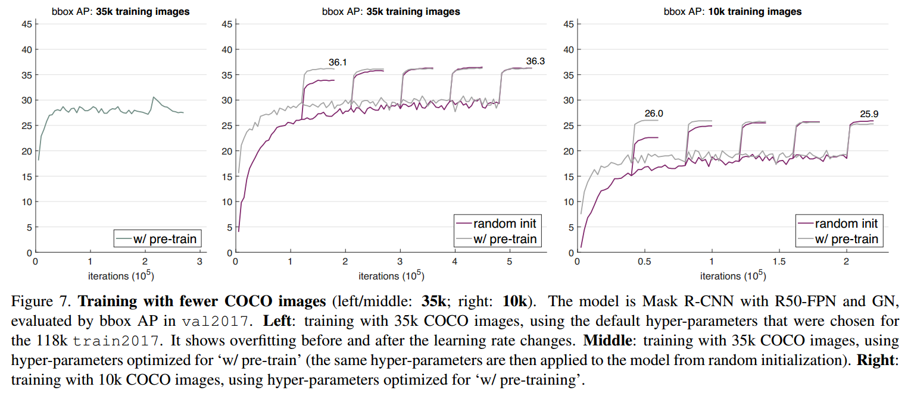
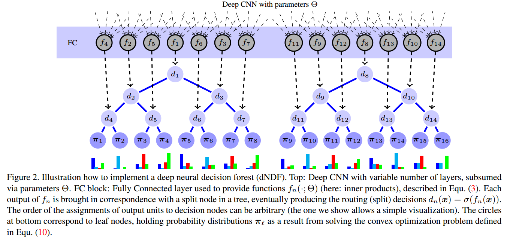
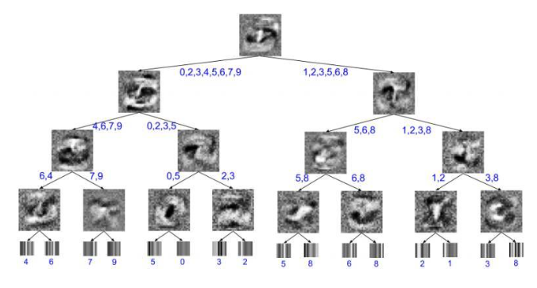
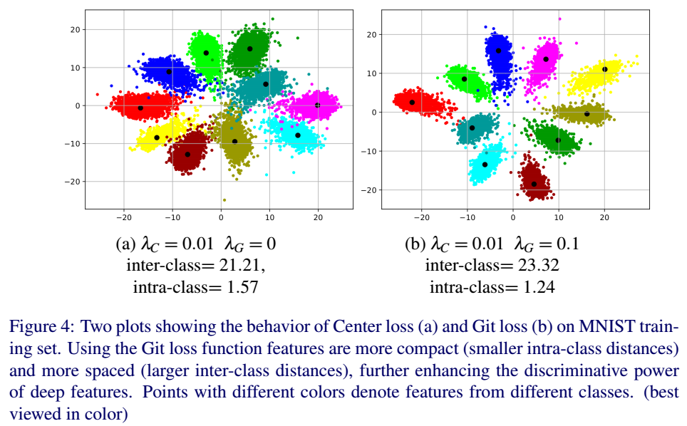
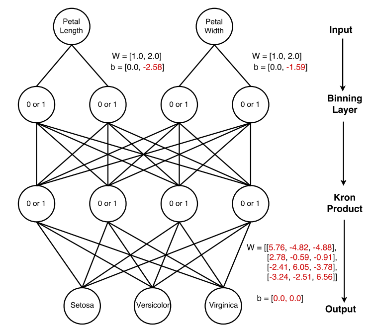
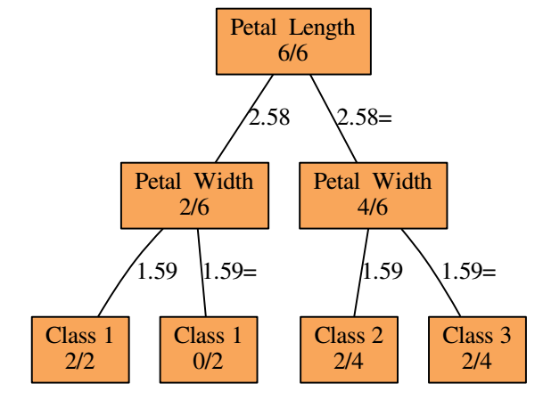

# Rethinking ImageNet Pre-training

**Paper**:[Rethinking ImageNet Pre-training](http://arxiv.org/pdf/1811.10104v1)

**code**:-

**Author**:Kaiming He、 Ross Girshick 、Piotr Dollar 、Facebook AI Research (FAIR) 

**time**:2018

## Abstract

We report competitive results on object detection and instance segmentation on the COCO dataset using standard models trained **from random initialization**.The results are no worse than their ImageNet pre-training counterparts even when using the hyper-parameters of the baseline system (Mask R-CNN) that were optimized for fine -tuning pre-trained models, with the sole exception of increasing the number of training iterations so the randomly initialized models may converge.Training from random initialization is surprisingly robust; our results hold even when: (i) Using only 10% of the training data, (ii) for deeper and wider models, and (iii) for multiple tasks and metrics.Experiments show that ImageNet pre-training speeds up convergence early in training, but does not necessarily provide regularization or improve final target task accuracy.To push the envelope we demonstrate 50.9 AP on COCO object detection without using any external data--a result on par with the top COCO 2017 competition results that used ImageNet pre-training.These observations challenge the conventional wisdom of ImageNet pre-training for dependent tasks and we expect these discoveries will encourage people to rethink the current de facto paradigm of ' pre-training and fine -tuning' in computer vision.

**翻译**：我们使用随机初始化训练的标准模型报告在COCO数据集上的物体检测和物体分割的竞争结果。即使使用baseline model的超参数，结果也不比它们的ImageNet预训练对应物差（Mask R-CNN）针对精细调整预训练模型进行了优化，唯一的例外是增加训练迭代次数，因此随机初始化模型可以收敛。随机初始化训练非常强大;我们的结果即使在以下情况下仍然存在：（i）仅使用10％的训练数据，（ii）用于更深和更宽的模型，以及（iii）用于多个任务和指标。实验表明在ImageNet预训练速度能加速训练时候的收敛速度，但不一定提供正则化或提高最终在目标任务上的准确性。为了突破这个范围，我们在不使用任何外部数据的情况下在COCO对象检测上达到了50.9 AP  - 这个结果与2017年COCO相同使用ImageNet预训练的最好的竞赛结果差不多。这些结论挑战了ImageNet与训练对于依赖性任务的传统智慧，我们期望这些发现将鼓励人们重新思考计算机视觉中的“pre-training and fine-tuneing”范式。

## Contribution

- 采用基于ImageNet的预训练模型参数可以加快模型的收敛速度，尤其是在训练初期，而基于随机初始化网络结构参数训练模型时在采用合适的归一化方式且迭代足够多的次数后也能够达到相同的效果

- 采用基于ImageNet的预训练模型参数训练得到的模型泛化能力不如基于随机初始化网络结构训练得到的模型，前者更容易出现过拟合，因此需要选择合适的超参数训练模型，从而尽可能减少过拟合风险（前提是数据量足够大，比如10K以上的COCO数据集）

  

- 当迁移任务的目标对空间位置信息比较敏感时（比如目标检测、人体关键点检测任务），采用基于ImageNet的预训练模型并不会有太大的帮助

## Summary

# Deep Neural Decision  Forests

**paper**:[Deep neural decision forests](https://www.cv-foundation.org/openaccess/content_iccv_2015/papers/Kontschieder_Deep_Neural_Decision_ICCV_2015_paper.pdf)

**code**:

**Author**:

**time:**ICCV2015

## Abstract

We present Deep Neural Decision Forests – a novel approach that unifies classification trees with the representation learning  known from deep convolutional networks, by training them in an end-to-end manner. To combine these two worlds, we introduce a stochastic and differentiable decision tree model, which steers the representation learning usually conducted in the initial layers of a (deep) convolutional network. Our model differs from conventional deep networks because a decision forest provides the final predictions and it differs from conventional decision forests since we propose a principled, joint and global optimization of split and leaf node parameters. We show experimental results on benchmark machine learning datasets like MNIST and ImageNet and find onpar or superior results when compared to state-of-the-art deep models. Most remarkably, we obtain Top5-Errors of only 7.84%/6.38% on ImageNet validation data when integrating our forests in a single-crop, single/seven model GoogLeNet architecture, respectively. Thus, even without any form of training data set augmentation we are improving on the 6.67% error obtained by the best GoogLeNet architecture (7 models, 144 crops). 

**翻译**:我们提出了深度神经决策森林--一个新的方法可以通过端到端的训练将分类树和深度卷积卷积网络中的表征学习功能统一起来。为了把这两个方法结合起来，我们引入了一个随机可微分的决策树模型，控制一般在（深度）卷积网络的初始层进行的表征学习。我们的模型不同于传统的深度网络，因为决策森林进行最后的预测，它与传统的决策森林不同，因为我们提出了分裂节点和叶子节点参数的联合全局优化原则。我们展示了在类似MNIST和ImageNet的benchmark上的实验结果，并与最先进的深度模型进行比较，发现了优于它们的结果。最值得注意的是，当我们在ImageNet验证数据上获得的Top5误差仅为7.84%/6.38%。因此即使没有任何形式的训练数据增强，我们也在最佳的GoogleNet架构(7种模型，144 crops）上得到6.67%的误差。

## Contribution

论文提出将分类树模型和深度神经网络的特征学习相结合进行端到端训练的深度学习方法。该方法使用决策森林(decision forest)作为最终的预测模型，提出了一套完整的、联合的、全局的深度学习参数优化方法。在手写数据库MNIST和图像分类数据库ImageNet的实验中都取得了超越当前最好方法的结果。

## Summary

和年龄估计的deep regression forest不同的是，这是针对分类任务的决策森林，DRF正是受这篇论文的启发，将分类转化为回归，这也是年龄任务的特点。

# Distilling a Neural Network Into a Soft Decision Tree

**paper**:[Distilling a neural network into a soft decision tree](https://arxiv.org/abs/1711.09784)

**code**:

**Author**:Geoffrey Hinton 、Nicholas Frosst、Google Brain Team

**time:**2017

## Abstract

Deep neural networks have proved to be a very effective way to perform classification tasks. They excel when the input data is high dimensional, the relationship between the input and the output is complicated, and the number of labeled training examples is large [Szegedy et al., 2015, Wu et al., 2016, Jozefowicz et al., 2016, Graves et al., 2013]. But it is hard to explain why a learned network makes a particular classification decision on a particular test case. This is due to their reliance on distributed hierarchical representations. If we could take the knowledge acquired by the neural net and express the same knowledge in a model that relies on hierarchical decisions instead, explaining a particular decision would be much easier. We describe a way of using a trained neural net to create a type of soft decision tree that generalizes better than one learned directly from the training data. 

**翻译**：深度神经网络已经被证明是执行分类任务非常有效的方法，当输入数据是高维、输入和输出之间的关系很复杂、标记的训练样本数量很大时，表现优异。但很难解释为什么学习型网络会针对特定测试用例做出特定的分类觉得。这是因为它们依赖分布式层次表示(distributed hierarchical representations)。如果我们可以获取神经网络获得的知识并在依赖层级决策的模型中表现同样的知识，那么解释特定决策将更容易。我们描述了一种使用训练的神经网络来创建一种**软决策树**的方法，该决策树比直接从训练数据中学习有更强的泛化能力。

解释：上图为MNIST上训练的深度为4的软决策树的可视化图。内部节点处的图像是已学习的过滤器，而叶子处的图像是对已学习的类别概率分布的可视化。每片叶子最终最可能的分类，以及每个边缘的可能分类都被注释了。以最右边的内部节点为例，可以看到，在树的层级上，潜在的分类只有3或8，因此，学习的过滤器只是简单地学会区分这两个数字。其结果是一个查找连接3的末端的两个区域的过滤器，输出一个8。

## Contribution

针对深度神经网络无法解释其具体决策的问题，提出`软决策树`（Soft decision tree)，相较于从训练数据中直接学习的决策树，软决策树的泛化能力更强，并通过层级决策模型把DNN所习得的知识表达出来。

## Summary

这篇论文和Deep neural decision forest不一样的是，这篇论文的重点是蒸馏(distillation)，从DNN蒸馏出DT(decision tree)，决策树去distilling 神经网络中的 knowledge，然后拿决策树去解释神经网络，而上一篇论文是将DNN和DT结合起来；上一篇论文是通过卷积神经网络得到原始数据的新特征放入决策树，本文是直接拿原始数据放入决策树。

# Git Loss for Deep Face Recognition

**paper**:[Git Loss for Deep Face Recognition](https://arxiv.org/abs/1807.08512)

**code**:https://github.com/kjanjua26/Git-Loss-For-Deep-Face-Recognition

**Author**:[Alessandro Calefati](https://arxiv.org/search/cs?searchtype=author&query=Calefati%2C+A), [Muhammad Kamran Janjua](https://arxiv.org/search/cs?searchtype=author&query=Janjua%2C+M+K), [Shah Nawaz](https://arxiv.org/search/cs?searchtype=author&query=Nawaz%2C+S), [Ignazio Gallo](https://arxiv.org/search/cs?searchtype=author&query=Gallo%2C+I)

**time:**2018

 ## Abstract

Convolutional Neural Networks (CNNs) have been widely used in computer vision tasks, such as face recognition and verification, and have achieved state-of-the-art results due to their ability to capture discriminative deep features. Conventionally, CNNs have been trained with softmax as supervision signal to penalize the classification loss. In order to further enhance discriminative capability of deep features, we introduce a joint supervision signal, Git loss, which leverages on softmax and center loss functions. The aim of our loss function is to minimize the intra-class variations as well as maximize the inter-class distances. Such minimization and maximization of deep features is considered ideal for face recognition task. We perform experiments on two popular face recognition benchmarks datasets and show that our proposed loss function achieves maximum separability between deep face features of different identities and achieves state-of-the-art accuracy on two major face recognition benchmark datasets: Labeled Faces in the Wild (LFW) and YouTube Faces (YTF). However, it should be noted that the major objective of Git loss is to achieve maximum separability between deep features of divergent identities. The code has also been made publicly available .

**翻译**：卷积神经网络（CNN）已被广泛用于计算机视觉任务，例如人脸识别和验证，并且由于其捕获有辨别力的深层特征的能力而已经获得了最先进的结果。传统上，CNN已经用softmax作为监督信号进行训练以惩罚分类损失。为了进一步增强深度特征的判别能力，我们引入了一个联合监督信号Git loss，它利用softmax和center loss函数。我们的损失函数的目标是最小化类内距离以及最大化类间距离。这种深度特征的最小化和最大化被认为是面部识别任务的理想选择。我们在两个流行的人脸识别benchmark上进行实验，并表明我们提出的损失函数实现了不同身份的深面特征之间的最大可分离性，并在两个主要的人脸识别基准数据集上实现了最先进的准确度：LFW和YouTube Faces（YTF）。但是，应该指出的是，Git loss的主要目标是在不同身份的深层特征之间实现最大可分离性。该代码也已公开发布。

## Contribution

- A novel loss function which leverages on softmax and center loss to provide segregative abilities to deep architectures and enhance the discrimination of deep features tofurther improve the face recognition task
-  Easy implementation of the proposed loss function with standard CNN architectures.Our network is end-to-end trainable and can be directly optimized by fairly standard optimizers such as Stochastic Gradient Descent (SGD).
- We validate our ideas and compare Git loss against different supervision signals. We evaluate the proposed loss function on available datasets, and demonstrate state-ofthe-art results. 

## Summary

在center loss的基础上增加了额外的约束，使学习到的特征比center loss具有更大的类间距离和更小的类内距离。

# Bag of Tricks for Image Classification with Convolutional Neural Networks

**paper**:[Bag of Tricks for Image Classification with Convolutional Neural Networks](http://arxiv.org/abs/1812.01187v1)

**code**:-

**Author**:

**time**:2018

## Abstract

Much of the recent progress made in image classification research can be credited to training procedure refinements, such as changes in data augmentations and optimization methods. In the literature, however, most refinements are either briefly mentioned as implementation details or only visible in source code. In this paper, we will examine a collection of such refinements and empirically evaluate their impact on the final model accuracy through ablation study. We will show that, by combining these refinements together, we are able to improve various CNN models significantly. For example,we raise ResNet-50's top-1 validation accuracy from 75.3% to 79.29% on ImageNet. We will also demonstrate that improvement on image classification accuracy leads to better transfer learning performance in other application domains such as object detection and semantic segmentation.

**翻译**：近期图像分类领域取得的许多进展可以归功于训练过程的改进，比如图像增强的和优化方法的改进。然而在现在的文献中，大多数的改进要么是在实现细节中简单的提及，或者仅在源码中可见。在这篇论文中，我们将研究这些改进的方法，并通过消融研究凭经验评估它们对最终模型准确性的影响，我们将展示，通过将这些改进结合在一起，能够显著改进各种CNN模型，比如，我们在ImageNet上将ResNet-50的top-1验证集准确率从75.3%提高到79.29%。我们还将证明，图像分类准确率的提高可以在其他应用领域比如对象检测和语义分割中实现更好的迁移学习性能。

## Contribution

**Some tricks for training:**

- Large-batch training

  - Linear scaling learning rate

    使用大的batch size，可能会减慢训练速度，对于收敛来说，收敛速度随着batch size的增加而变慢，换句话说，对于相同的迭代次数，用大的batch size比小的batch size 训练的模型验证集精度要低一些。He等人选择0.1作为batch_size=256时初始学习率，所以如果对于batch_size=b的，初始学习率可以选择0.1xb/256。

  - Learning rate warmup

    gradual warmup strategy:将学习率从0线性增加到初始学习率，比如，假设我们使用前m个batch的样本来预热，初始学习速率设为η ,那么在第i个batch的时候(0<=i<=m)，学习率为iη /m。

- Low-precision

  神经网络一般使用FP32（float point 32)训练，所有的数据都是以FP32格式存储，然而现在新的硬件可能对更低精度的数据类型增强了算术逻辑单元（也就是说，FP16要比FP32训练更快）尽管具有性能优势，但是精度降低后，范围更窄了，使得结果更可能超出范围，然后扰乱训练进度。建议存储所有参数和激活单元用FP16，并使用FP16计算梯度，同时，所有参数在FP32中都有一个副本用于参数更新，此外，将损失乘以一个标量可以更好的对齐使用FP16的梯度范围。

- Model tweaks

  Model tweak是对网络体系结构的微小调整，例如改变特定卷积层的步长，这种调整通常几乎不会改变计算复杂性，但可能对模型的准确率具有不可忽略的影响。

- Trainging refinement

  - Cosine learning rate decay
  - Label smoothing
  - Knowledge distilling
  - Mix-up training

## Summary

研究了十几个训练卷积神经网络的技巧，这些技巧包括对网络结构、数据预处理、损失函数和学习速率的调整，将所有这些堆叠在一起可以显著提高准确率。

# Deep Neural Decision Trees

**paper**:[[Deep Neural Decision Trees](https://arxiv.org/abs/1806.06988)](http://arxiv.org/abs/1812.01187v1)

**code**:https://github.com/wOOL/DNDT

**Author**:Yongxin Yang, Irene Garcia Morillo, Timothy M. Hospedales

**time**:WHI 2018

## Abstract

Deep neural networks have been proven powerful at processing perceptual data, such as images and audio. However for tabular data, tree-based models are more popular. A nice property of tree-based models is their natural interpretability. In this work, we present Deep Neural Decision Trees (DNDT) – tree models realised by neural networks. A DNDT is intrinsically interpretable, as it is a tree. Yet as it is also a neural network (NN), it can be easily implemented in NN toolkits, and trained with gradient descent rather than greedy splitting. We evaluate DNDT on several tabular datasets, verify its efficacy, and investigate similarities and differences between DNDT and vanilla decision trees. Interestingly, DNDT self-prunes at both split and feature-level. 

**翻译**：已经证明了深度神经网络在处理感知数据（例如图像和音频）方面是强大的。但是对于表格数据，基于树的模型应用更多，基于树的模型的一个很好特性是它们的自然可解释性，在这项工作中，我们提出了深度神经决策树（DNDT）--通过神经网络实现的树模型网络。DNDT本质是可解释的，因为它是一棵树，然而，因为它也是一个神经网络，可以很容易地在NN toolkit中实现，并且使用梯度下降训练而不是贪婪地分裂。我们评估了几个DNDT地表格数据集，验证其功效，并研究DNDT之间地相似性和差异性，有趣地是，DNDT的分裂和特征级别地自我修剪。

红色表示训练时的变量，黑色表示常量

相同的网络用传统决策树展示，分数表示随机选择的6个事例的分类路线。

## Contribution

...还没看完，待续

## Summary

和deep neural decision forest(Deep-NDF)不同的方面有：

1. DNDT不是使用交替优化策略优化结构学习（splitting)和参数学习(score matrix)，相反，直接使用反向传播来学习它们
2. 不会将分割限制为二进制（左或右），因为我们应用可以将节点分成多个（>=2)叶子的可微分的bining functioin
3. 我们专门为可解释性设计了我们的模型，特别是对表格数据的应用，我们可以解释每个输入特征，相比之下，NDF种的模型被设计用于预测性能并应用于原始图像数据，一些设计决策使它们不太适用于表格数据

> 模板
>
> # 标题
>
> **paper**:
>
> **code**:
>
> **Author**:                              
>
> **time**: 
>
> ## Abstract
>
> 
>
> **翻译**:
>
> ## Contribution
>
> ## Summary

