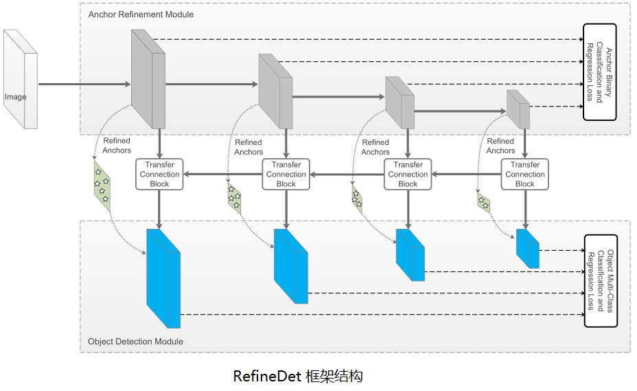
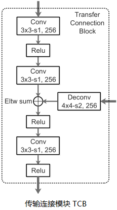
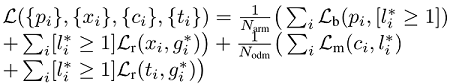
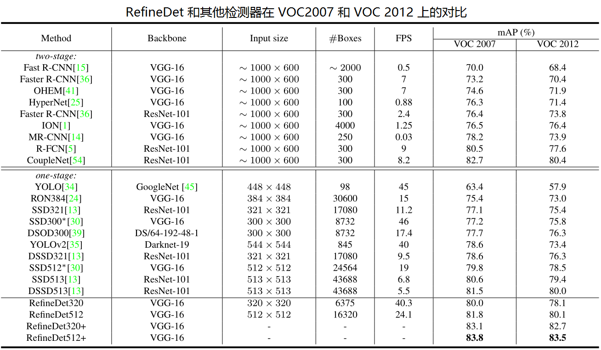
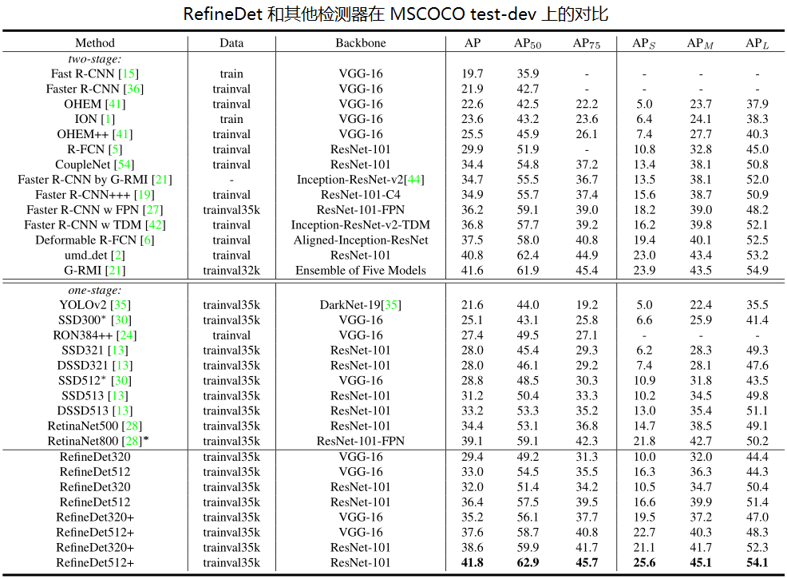
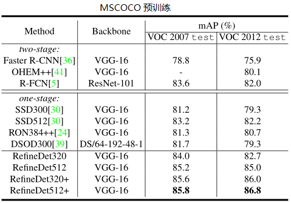
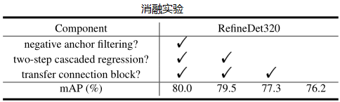

# 目标检测

## RefineDet

  * **论文**: "Single-Shot Refinement Neural Network for Object Detection", CVPR 2018, [paper](https://arxiv.org/pdf/1711.06897) [code](https://github.com/sfzhang15/RefineDet)

  * **摘要**:

    在目标检测领域，两段检测器（如 Faster R-CNN）已经达到最高的精度，然而单段检测器（如 SSD）具有高性能的优势。为了继承两者的优点，同时又克服它们的缺点，本文提出了一种新的单段检测器：RefineDet。它比两段检测器具有更高的精度，并且保持与单段检测器相当的效率。RefineDet 由两个相互连接的模块组成，即锚点精炼模块 (Anchor Refinement Module) 和物体检测模块。具体地说，前者的目的是（1）过滤掉负锚点，以减少分类器的搜索空间；（2）粗调锚点的位置和大小，以便为后续的回归器提供更好的初始化。后一个模块以改进后的锚点作为前者的输入，进一步提升回归效果和预测多类标签。同时，在目标检测模块中，我们设计了一个传递连接块 (transfer connection block) 来传递锚点精炼模块中的特征，以预测目标的位置、大小和类别。多任务损失函数是我们可以端到端地训练整个网络。在 PASCAL VOC 2007, PASCAL VOC 2012, and MS COCO 上的大量实验表明，RefineDet 在高效率的情况下实现了最先进的检测精度。
  
  * **回顾**：

    两类检测器：

    1. 单段检测器（SSD, YOLO-V1/V2/9000/V3, RetinaNet）：密集锚框 (anchor)，快而不准。
    2. 两段检测器（Fast/Faster R-CNN, RFCN, FPN, Mask-RCNN）：稀疏候选框 (Proposal)，准而不快。

    作者认为，两段检测器比单段检测器有三大优势：

    1. 两段式结构中间的采样，启发式地解决了类别不均衡问题。
    2. 两段级联回归的 bounding box 参数更准。
    3. 采用两阶段特征描述物体。(RPN 的共享类别无关特征和 detector 的类别相关特征)

  * **网络框架**：

    RefineDet 是一种改进的单段检测器框架，类似于 SSD，通过分类和回归固定数量的锚框，接以非极大抑制来预测最终输出。RefineDet 增加了两个内联模块：锚框精炼模块（anchor refinement module, ARM）和物品检测模块（object detection module, ODM），并通过传输连接块（TCB）共享特征。

    

    RefineDet 三大核心部分：

    1. 传输连接块（Transfer Connnection Block, TCB）：连接 ARM 和 ODM 以共享特征，使用两个卷积层加工特征（通道减半），融合上下文信息（叠加更高层反卷积特征，类似于 FPN），然后使用一个卷积层融合特征，以保证 ODM 特征的判别能力。

      ```python
      # Transfer Connnection Block
      def TCB(f1, p2):
        t1 = Conv(f1, kernel=3, stride=1, pad=1, reduce_channel=0.5, name='TL1_1')
        t1 = ReLU(t1, name='TL1_1_relu')
        t1 = Conv(t1, kernel=3, stride=1, pad=1, name='TL1_2')
        up = DeConv(p2, kernel=2, stride=2, pad=0, name='P2-up')
        p1 = EltAdd(t1, up, name='Elt1')
        p1 = ReLU(p1, name='Elt_relu')
        p1 = Conv(p1, kernel=3, stride=1, pad=1, name='P1')
        p1 = ReLU(p1, name='P1_relu')
      ```

      

    2. 两段级联回归：首先 ARM 对每个规则的锚框进行初步回归，然后将每个调整后的锚框指定到对应的 ODM 特征，ODM 在更高质量的初始锚框上，进一步精炼。通过两段回归策略，RefineDet 可以比单段检测器获得更好的定位精度，特别是对小目标等比较有挑战的场景。
    
    3. 负锚框过滤：为看提前清除掉明确分出的背景锚框，减缓类别不均衡问题，采用提前清除负锚框的机制。在训练阶段，对于某个调整后的锚框，如果它在 ARM 获得的背景置信分数超过预设阈值（经验阈值 `$\theta=0.99$`），在训练 ODM 时，直接把它丢弃。因此，我们只用调整后的难负锚框和正锚框来训练 ODM。同时在预测时，我们也只考虑背景置信分数小于阈值的锚框。

  * **训练和推理**：

    - 数据扩充：类似于 SSD，随机光学失真，随机扩展、切割和镜像。
    - 主干网络：在 ILSVRC CLS_LOC 数据集上预训练的 VGG16 和 ResNet101。
    - 锚框配置：尺寸 (8,16,32,64) 满足 4 倍步长，长宽比 (0.5, 1.0, 2.0)。
    - 锚框匹配：1. 对于每个标注框，匹配最大的锚框；2. 匹配大于阈值 0.5 的锚框。
    - 难负例挖掘：在 ARM 和 ODM 中，对于负锚框排序并去损失较大者，保证正负比例为 1:3。
    - 损失函数：ARM 二元交叉熵， ODM softmax，smooth-L1 损失。 
      
    - 优化：初始化 VGG：“xavier”，ResNet101：Gaussian。 batch-size=32，初始学习率 0.001
    - 推理：ARM 滤掉简单背景锚框，ODM 输出 top-400，经过 NMS-0.45 输出最终 top-200。

  * **实验**
  
    - 检测准确率上：VGG320 和 VGG512 均超过 80% mAP。
    - 速度上：在 Titan X, CUDA 8.0 和 cuDNN v6 下，分别达到 24.8ms 和 24.1 ms。
    
    从实验结果可以看出，确实实现了论文推崇的又快又好的效果，特别是两阶段回归，提升效果显著。

    

    

    

    
  