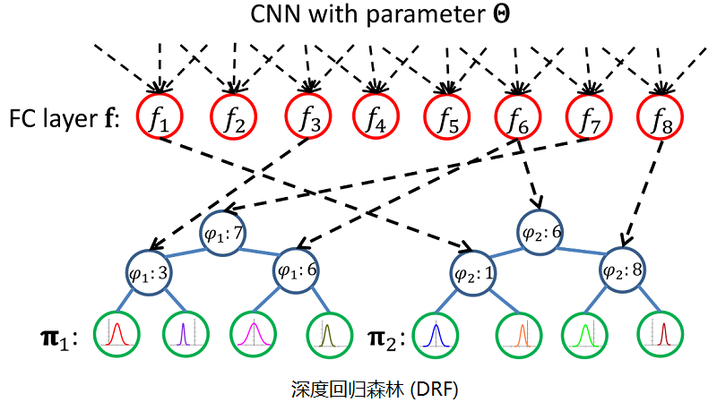

# 人脸检测

## RefindDet

  * **论文**: "Single-Shot Refinement Neural Network for Object Detection", CVPR 2018, [paper](https://arxiv.org/pdf/1711.06897) [code](https://github.com/sfzhang15/RefineDet)

  * **摘要**:

    在目标检测领域，两段检测器（如 Faster R-CNN）已经达到最高的精度，然而单段检测器（如 SSD）具有高性能的优势。为了继承两者的优点，同时又克服它们的缺点，本文提出了一种新的单段检测器：RefineDet。它比两段检测器具有更高的精度，并且保持与单段检测器相当的效率。RefineDet 由两个相互连接的模块组成，即锚点精炼模块 (Anchor Refinement Module) 和物体检测模块。具体地说，前者的目的是（1）过滤掉负锚点，以减少分类器的搜索空间；（2）粗调锚点的位置和大小，以便为后续的回归器提供更好的初始化。后一个模块以改进后的锚点作为前者的输入，进一步提升回归效果和预测多类标签。同时，在目标牵扯模块中，我们设计了一个传递连接块 (transfer connection block) 来传递锚点精炼模块中的特征，以预测目标的位置、大小和类别。多任务损失函数是我们可以端到端地训练整个网络。在 PASCAL VOC 2007, PASCAL VOC 2012, and MS COCO 上的大量实验表明，RefineDet 在高效率的情况下实现了最先进的检测精度。
  
  * **回顾**：

    两类检测器：

    1. 单段检测器（SSD, YOLO-V1/V2/9000/V3, RetinaNet）：密集锚框 (anchor)，快而不准。
    2. 两段检测器（Fast/Faster R-CNN, RFCN, FPN, Mask-RCNN）：稀疏候选框 (Proposal)，准而不快。

    作者认为，两段检测器更准原因有三： `$\alpha + \varphi$`

      $$F(x) = \sum_{a=0}^{A}(x+y)$$

    