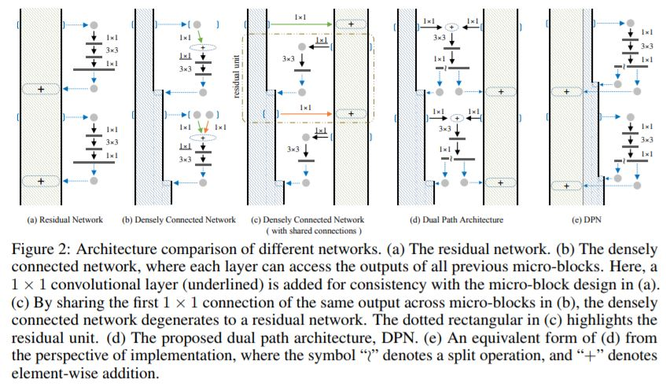
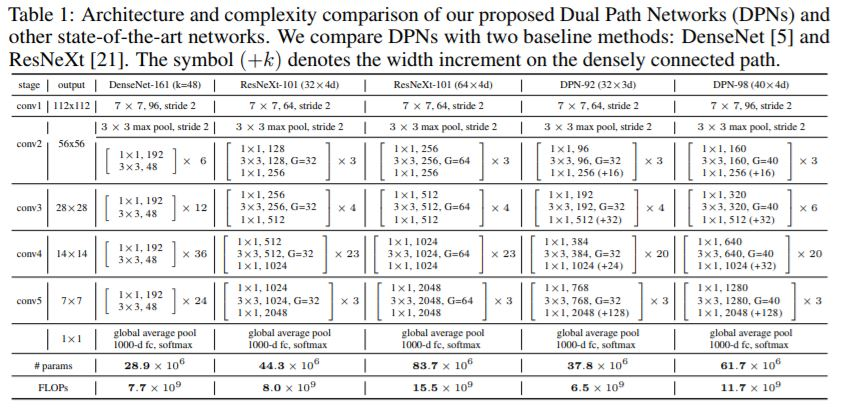
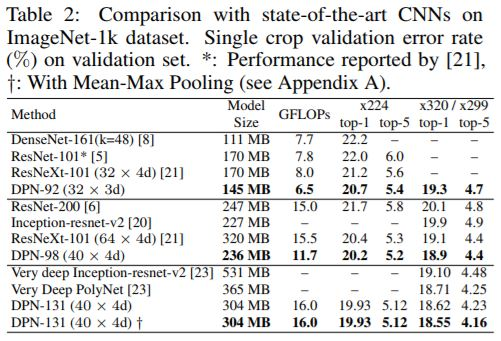

# DPN
[Dual Path Networks](https://arxiv.org/pdf/1707.01629.pdf)

## 目录
- [思想](#思想)
- [结构](#结构)
- [block](#block)
- [结果](#结果)
- [总结](#总结)

### 思想
- [x] [ResNetXt](../ResNetXt/ResNetXt.md)
  - 组卷积，split-transform-merge
- [x] DenseNet
  * Desenly connect

### 结构

### block

### 结果

### 总结
- 作者提出的DPN网络可以理解为在ResNeXt的基础上引入了DenseNet的核心内容，使得模型对特征的利用更加充分。原理方面并不难理解，而且在跑代码过程中也比较容易训练，同时文章中的实验也表明模型在分类和检测的数据集上都有不错的效果。