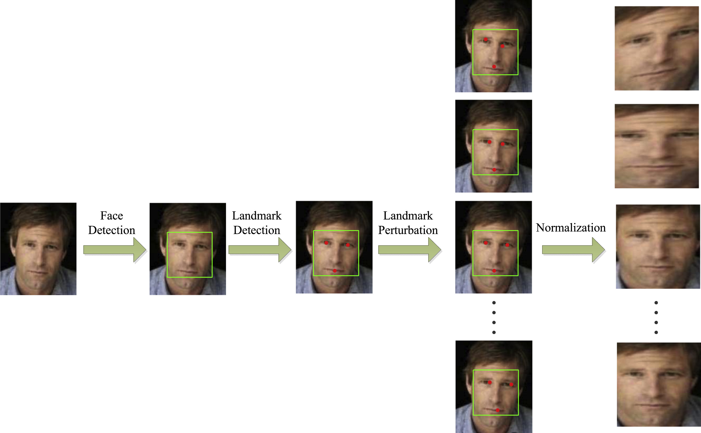
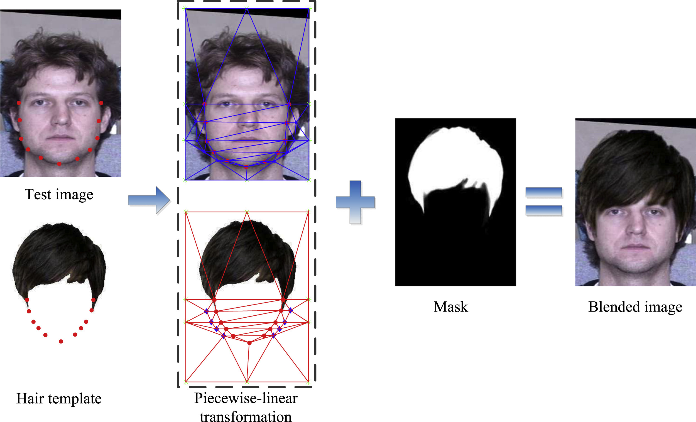
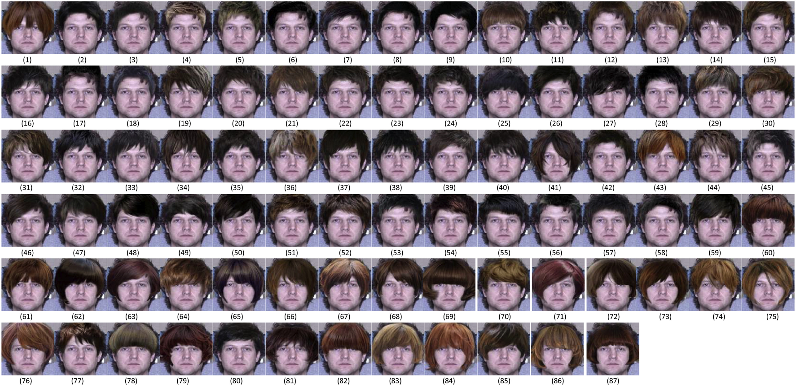
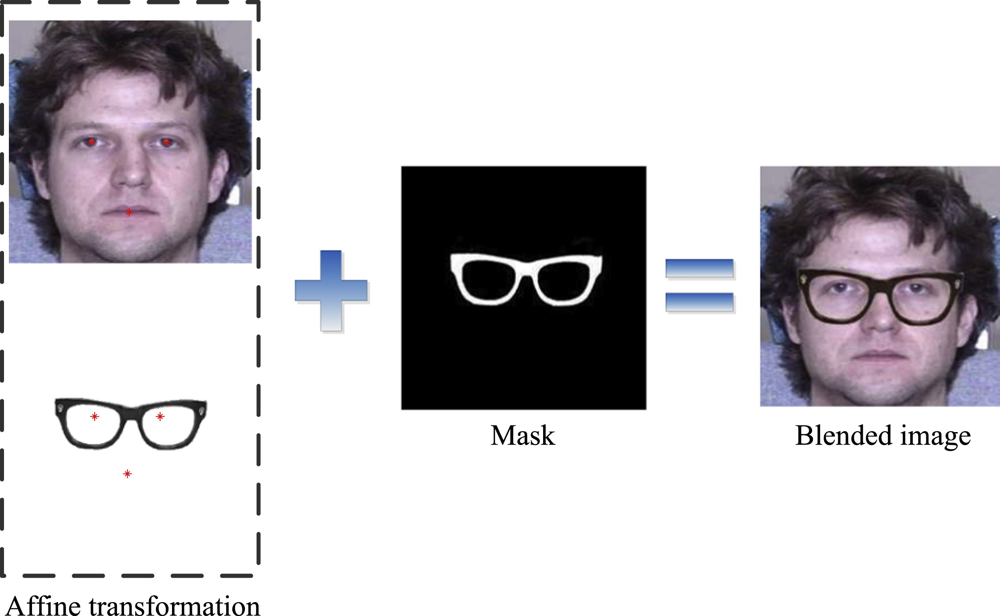
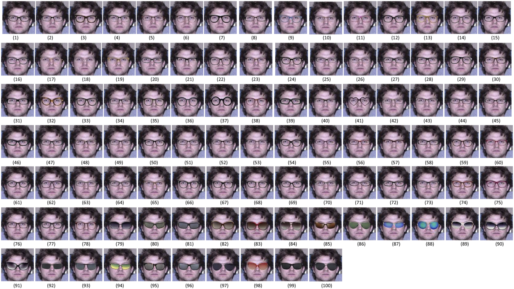
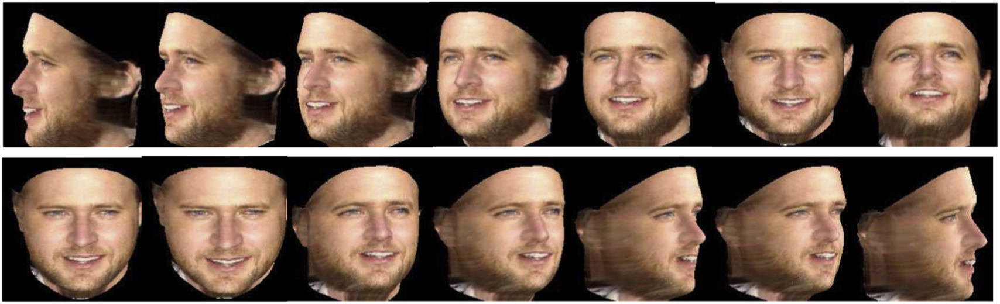
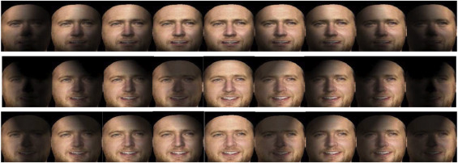

# Data augmentation for face recognition
[paper](./1-s2.0-S0925231216315016-main.pdf)
## 摘要
- In this paper, we propose five data augmentation methods dedicated to face images, including landmark perturbation and four synthesis methods (hairstyles, glasses, poses, illuminations). The proposed methods effectively enlarge the training dataset, which alleviates the impacts of misalignment, pose variance, illumination changes and partial occlusions, as well as the overfitting during training.

## 数据集
- The performance of each data augmentation method is tested on the Multi-PIE database. Furthermore, comparison of these methods are conducted on LFW, YTF and IJB-A databases. Experimental

## Data augmentation
### Landmark perturbation. 
- we use a Gaussian distribution to model the perturbation range. In addition, we adopt other transformations to enrich visual images of each person.
-
 Fig. 1. Examples of landmark misalignment.
-
 Fig. 2. The process of landmark perturbation
### Hairstyles synthesis
- We collected 87 hairstyle templates with various bangs and adopted a hairstyle synthesis method by referencing to [35]. Contrast to [35] which synthesize hairstyles for makeup applications, we synthesized different images to enrich our training dataset.
-
Fig. 3. The process of hairstyle synthesis.
-
### Glasses synthesis
- we collected almost 100 different glasses templates and synthesized glasses for each person in the training dataset. DCNN is adopted to learn the within-class scatter and extract glasses-insensitive feature.
-
Fig. 5. The process of glasses synthesis.
-
Fig. 6. Examples with different synthesized glasses.
### Poses synthesis
- In order to reconstruct a 3D face model from any poses, we make some improvements based on their method, and build a pose-invariant system. Benefitting from the 3D reconstructed model, we can generate variant poses according to non-frontal face image.
-
Fig. 8. Examples of different poses generate by rotating the reconstructed model.

### Illuminations synthesis
- In our condition, we traverse different types of illumination and generate face images with different unilateral illuminations.

Fig. 9. Examples with different illuminations.

## 总结
- 单纯数据增广