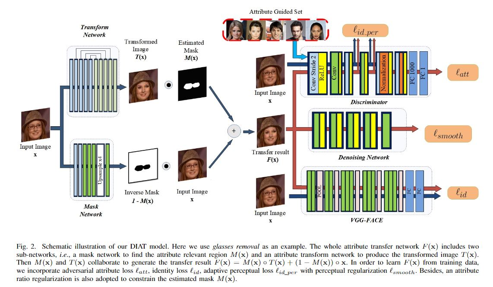

# [Deep Identity-Aware Transfer of Facial Attributes](https://arxiv.org/pdf/1610.05586)

# 目录
- [摘要](#摘要)
- [贡献](#贡献)
- [网络结构](#网络结构)
- [损失](#损失)
- [实验结果](#实验结果)

## 摘要
本文提出了一种面部属性身份感知转移（DIAT）的深度卷积网络模型。给出源输入图像和参考属性，DIAT目的是生成一个拥有参考属性的面部图像，并保持相同或相似的身份。到输入图像。一般来说，我们的模型由一个掩模网络和一个属性转换网络组成，它们协同工作以生成具有参考属性的照片般逼真的面部图像。考虑到参考属性可能仅与图像的某些部分有关，引入掩模网络以避免对属性无关区域的不相关。然后采用估计的掩模来组合输入和变换的图像以产生转移结果。对于变换网络和掩模网络的联合培训，我们结合了对抗属性损失，身份识别自适应感知损失和基于VGG-FACE的身份损失。此外，提出了一种去噪网络，用于感知正则化，以抑制传递结果中的错误图像，同时引入属性比正则化来约束属性相关区域的大小。我们的DIAT可以为几个代表性的面部属性传递任务提供统一的解决方案，例如，表达转移，附件去除，年龄进展和性别转移，并且可以扩展用于其他面部增强任务，例如面部游行。实验结果验证了该方法的有效性。即使对于与身份相关的属性（例如性别），我们的DIAT也可以通过更改属性获得视觉上令人印象深刻的结果，同时保留大多数身份识别功能。

## 贡献
1. 开发了一种新的DIAT模型用于面部属性转移。为了更好地保留属性无关性，我们的模型包括一个掩模网络和分布式变换网络，它们协同产生传递结果，可以从训练数据中共同学习.
2. 对抗属性丢失，自适应感知损失，识别丢失，结合感知正则化和属性比正则化来训练我们的DIAT模型。采用对抗属性丢失来表示转移结果表现出所需的属性，并且在识别身份意识转移​​的鉴别器上定义适应性感知损失，同时提高训练效率。此外，进一步引入感知正则化和属性对正规化以抑制伪像并约束掩模网络.
3. 实验结果验证了我们的身份感知属性转换方法的有效性和有效性。我们的DIAT可以用于转移本地（例如，口），全局（例如，年龄进展）或身份相关（例如，性别）属性，并且可以扩展到面部幻觉。

## 网络结构
整个转移网络包括两个子网络，掩膜子网络用来找属性相关区域，属性转移子网络用来产生转移图像。

### 属性转移网络
10个卷积的U-Net,在效率和重建能力之间有很好的权衡.

### 掩膜网络
5个全卷积，产生一个32X32的区域二进制掩膜，每个后面接一个BN，再接一个4x上采样，二值化获得一个二进制掩膜，最后是一个5x5的高斯卷积。前四个卷积后面加relu，最后一个加sigmoid。

eijk是特征图的值，0-1范围的值

为了能够反向传播

## 损失
### Adversarial attribute loss
对抗属性丢失的目的是使生成的图像的分布与属性分布相匹配，就是找出需要的转移的属性。
为此，我们采用生成对抗网络框架，其中生成器是属性转移网络F（x），鉴别器用于定义对抗属性损失。判别器结构如下。

一开始是：

为了提高训练稳定性，采用改进的Wasser-stein GAN定义损失为

为了简单，G、D损失定义如下：

### Adaptive perceptual loss
引入自适应感知损失以保证转移结果与输入图像保持相同或相似的身份。由于身份是高级语义概念，因此通过强制两个图像在像素域中完全相同来定义身份感知损失是不合适的。相反，我们在鉴别器的特征表示上定义平方误差损失，体现在我们的自适应感知损失。

进一步定义为（第4、5层设计损失）

### Identity Loss
自适应感知损失有助于保持所生成的面部与参考之间的内容相似性。
但是，它不能保证身份本身。

### Perceptual regularization
去噪，尽量保持平滑，DN(y)噪声(一个全卷积的网络学到的)

### Attribute  ratio  regularization
约束属性区域大小，N表示图像大小，p表示特定属性的区域的预期比率,p越大，表示的区域越大

### Objective  function

## 实验结果
### 局部属性迁移

### 全局属性迁移

### 和其他方法对比

### 其他

