[Learning Residual Images for Face Attribute Manipulation](https://arxiv.org/pdf/1612.05363)
===

## 目录
- [摘要](#摘要)
- [简介](#简介)
- [相关工作](#相关工作)
- [数据集](#数据集)
- [实现细节](#实现细节)
- [实验](#实验)
- [讨论](#讨论)
- [总结](#总结)

## 摘要
- 基于GAN做的脸部属性操作，它由两个图像转换网络和一个判别网络组成。
变换网络负责属性操作和双重操作，并且辨别网络用于区分生成的图像和真实图像。
我们还应用双重学习，允许转型网络相互学习。
实验表明残差图像可以有效地学习并用于属性管理。
生成的图像保留在与属性无关的区域中的大部分细节。

- 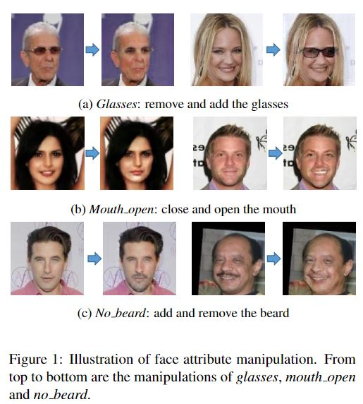

## 简介
- 在本文中，我们提出了一种基于面部属性操作的残差图像学习。方法将GAN模型的生成能力与前馈网络的效率相结合（见图2）。我们将操作操作建模为学习残差图像，该图像被定义为原始输入图像与所需操纵图像之间的差异。与学习整个被操纵图像相比，仅学习残差图像可以通过专注于特定于特定属性的知识来避免冗余的属性无关信息。为了提高操作学习的效率，我们采用两个CNN来模拟两个逆操作（例如，移除眼镜作为原始操作并添加眼镜作为双操纵，图2）并在训练阶段应用双重学习策略。我们的贡献可归纳为以下内容
1. 我们建议学习面部属性操作的残差图像。所提出的方法侧重于特定于属性的面部区域而不是整个面部，其包含许多冗余的无关细节。
2. 我们设计了一种双重学习方案来同时学习两个逆属性操作（一个作为原始操作，另一个作为双操作）。我们证明了双重学习过程有助于生成高质量的图像。
3. 虽然很难定量评估操纵图像，但我们采用标志性检测准确度增益作为度量来定量显示所提出的眼镜去除方法的有效性。

## 相关工作
- 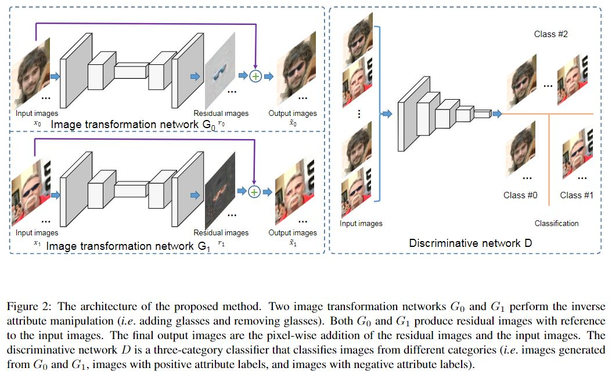
### 1、学习残差图像
- 该方法的体系结构如图2所示。2.对于每个面部属性操作，它包含两个图像变换网络G0和G1以及一个对抗网络D.G0和G1分别模拟了双重操作的原始图像。将参考图像和生成的图像分为三类。以下部分将首先简要介绍生成对抗网络，然后详细描述所提出的方法。
### 2、生成对抗网络
- 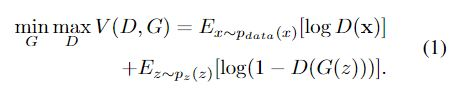
### 3、图像转移网络
- 我们的方法的动机是面部属性操作通常只需要对属性特定的面部区域进行适度修改，而其他部分保持不变。例如，当从脸部图像中取出一副眼镜时，只有眼镜的区域应该与脸部皮肤或眼睛重新放置，而不应该涉及其他脸部，例如嘴，鼻子和头发的变化。因此，我们将操作建模为学习针对属性特定区域的残差图像。如图2所示，图像变换网络G0和G1用于模拟操作及其双重操作。
给定具有负属性值的输入图像x0和具有正属性值的输入图像x1，学习网络G0和G1应用操作变换以产生残差图像r0和r1。
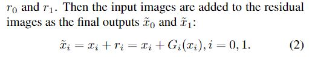
  为了使残差图像稀疏，我们将L-1范数正则化应用为 
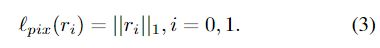
### 4、判别网络 
- 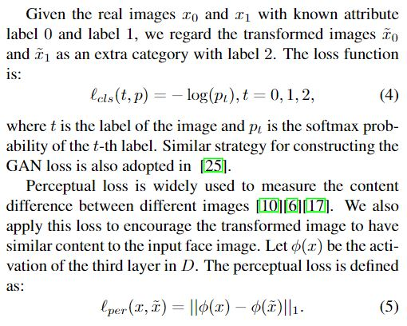
- 
### 5、双重学习
- 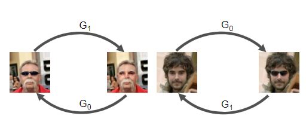
- 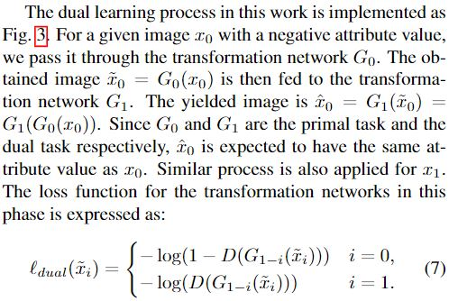
### 6、损失函数
- 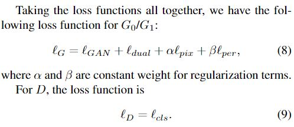

## 数据集
- 我们在实验中采用了两个数据集，CelebA数据集[21]和LFW数据集[9]。CelebA数据集包含超过200K的名人图像，每个图像具有40个二进制属性。我们挑选了其中的6个，即.glasses，mouth_open，smile，no_beard，young和male来评估所提出的方法。CelebA数据集中对齐图像的中心部分被裁剪并缩放到128x128。尽管数据集中存在大量图像，但属性标签具有高度偏差。因此，对于每个属性，随机选择来自属性 - 正类的1,000个图像和来自属性 - 负类的1,000个图像用于测试。从其余图像中，我们选择属于少数类的所有图像和来自大多数的相同数量的图像做一个平衡的数据集.LFW数据集仅仅用来测试我们产生图像的方法.注意CelebA数据集没有专门为训练转移网络的ground truth。

## 实现细节
- 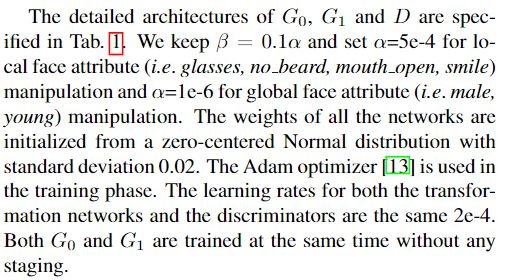
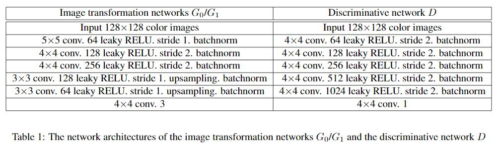

## 实验
- 详见论文

## 讨论
- large pose效果不好

## 总结
- 在这项工作中，我们提出了一种基于GAN的方法来解决面部属性操作的任务。我们在框架中采用残差图像学习和双重学习。这些策略允许图像转换网络专注于属性特定区域并相互学习。实验表明，所提出的方法可以成功地操作人脸图像，同时在属性无关区域保持最大细节不变。