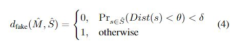

# [Look at Boundary A Boundary-Aware Face Alignment Algorithm](https://arxiv.org/pdf/1805.10483)

运行速度：60ms on TITAN X GPU。

## 摘要
我们提出了一种新的边缘感知面部对齐算法，利用边缘线作为人脸的几何结构，以帮助进行面部landmark定位。与传统的基于热力图的方法和基于回归的方法不同，我们的方法从边缘线导出面部landmark，消除了landmark定义中的模糊性。这项工作探讨了三个问题：1。为什么要使用边缘？2.怎样使用边缘？3.边缘估计和landmark定位之间的关系是什么？我们的边缘感知面部对齐算法在300-W Fullset上实现了3.49％的平均误差，其大大优于state-of-the-art的方法。我们的方法还可以轻松地整合来自其他数据集的信息。通过利用300 W数据集的边缘信息，我们的方法实现了3.92％的平均误差，COFW数据集的失败率为0.39％，AFLW-Full数据集的平均误差为1.25％。此外，我们提出了一个新的数据集WFLW，以统一不同因素的训练和测试，包括姿势，表情，照明，化妆，遮挡和模糊。

在这项工作中，我们使用13条边界线代表面部结构。每个面部边界线可以从多个数据集的足够数量的面部地标内插，这不会因注释方案的不一致而消失。

## 贡献
- 人脸关键点在各个数据集间歧义性，定义不一致问题。文章通过捕捉对于人脸更通用的边缘线信息，将其作为人脸到关键点的中间媒介，使得不同数据集即使存在关键点差异，仍然可以相互辅助训练。
- 复杂情况下关键点检测精度问题。本文首先通过消息传递结合对抗学习得到高精度的边缘线检测结果，再将边缘线信息多语义层次地融合到关键点检测中，使得算法在复杂情况下的鲁棒性大幅提升。

文章还提出了新的人脸关键点检测数据集Wider Facial Landmarks in-the-wild (WFLW)，包含10,000张带有98个关键点和6个人脸属性标注的人脸图像数据，包括姿势，表情，照明，化妆，遮挡和模糊的变换，旨在帮助学界更有针对性的评估关键点算法在各种条件下的鲁棒性。

## 边缘感知人脸对齐框架

- a.基于hourglass的边缘热力图估计器（Boundary heatmap estimator），用来估计边缘热力图，引入消息传递来处理遮挡。
- b.边界感知关键点回归器（Boundary-aware landmarks regressor），用来产生关键点的最终预测。引入边缘热力图融合方案，将边缘信息纳入回归问题的特征学习中。
- c.引入对抗学习，边缘有效性鉴别器（Boundary effectiveness discriminator），区分真、假边缘热力图，用于进一步改善边缘热力图的质量。

### Boundary-aware landmarks regressor
#### Ground Truth Heatmap
假设数据集中一共有L个landmark点，S={sl}l=1L。对于这L个关键点，又可以划分为K个子集，也即K个边缘，Si⊂S,i=1,...,K,对于每一个子集Si，通过差值获得更加浓密的边缘曲线，这样生成了Bi,然后Bi通过距离变换生成distance map Di,然后由Di生成Mi，也即GT ,3σ作用在Di上面使得更关注与边缘区域。

#### 边缘和landmark融合
输入图像（I）和heatmap（M）融合

特征图（F）和heatmap（M）融合

### Boundary heatmap estimator
MSE损失函数

为了解决遮挡问题，引入图网络的消息传递（message passing）

在不同的边缘map间进行消息传递(一共K张map),在不同的预测stack间产生的map间又进行了纵向的message passing。

### Boundary effectiveness discriminator 
MSE损失使边缘看起来模糊不清。好的边缘有利于landmark点的预测，不好的边缘则不利于landmark点的预测，所以作者通过landmark点预测的好坏来判断边缘质量的好坏。对于预测出来的M&#772;，对应的关键点的集合是S&#772;,gt 的distance map是Dist，dfake的定义就是 

θ是一个阈值，δ是一个概率阈值，意思是说某一张边缘图预测出来的对应的关键点在Dist图上的值，也即距离边缘的距离响应小于θ的概率小于δ，就判断生成的质量不咋地。这个时候在最小化式5的对抗损失的时候，就变成了最小化D(G(I)).反之如果边缘的距离响应θ的概率大于δ就说明生成的边缘可以以假乱真，这个时候在最小化式5的对抗损失的时候，就变成了最大化化D(G(I)) 

M是gt,然而G(I)是生成的heatmap

算法流程

## 实验结果
在300-W库上的性能评估结果，大幅超过了所有主流方法。

在WFLW库上的性能评估结果，同样大幅超过了所有主流方法。

为验证边缘信息在特征点检测上的通用有效性，作者将300-W上提取的边缘热图信息直接用于COFW-29和AFLW库上，请注意他们原始标注的点数是不同的，以往这样的库是难以统一利用起来的。
在COFW-29和AFLW库上的性能评估结果，同样超过了所有主流方法。

在COFW-68 testset上的CED曲线，精度优势异常明显！

