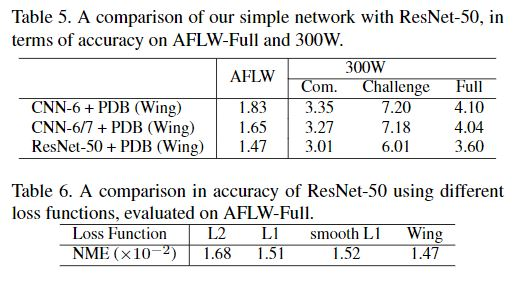

# [Wing Loss for Robust Facial Landmark Localisation with Convolutional Neural Networks](http://openaccess.thecvf.com/content_cvpr_2018/papers/Feng_Wing_Loss_for_CVPR_2018_paper.pdf)

## 摘要
我们提出了一个新的损失函数，即Wing loss，用于利用卷积神经网络（CNN）进行鲁棒的面部关键点定位。我们首先比较和分析不同的损失函数，包括L2，L1和平滑的L1。对这些损失函数的分析表明，对于基于CNN的本地化模型的培训，应该更加关注中小范围的错误。为此，我们设计了一个分段式损失函数。新的损失通过从L1损失切换到修正的对数函数来放大来自间隔（-w，w）的误差的影响。

为了解决训练集中具有较大的旋转的样本代表性不足的问题，我们提出了一种简单而有效的提升策略，称为基于姿势的数据平衡。特别是，我们通过复制少数训练样本并通过注入随机图像旋转，边界框平移和其他数据增强方法来干扰数据不平衡问题。最后，提出的方法被扩展为创建用于强健面部关键点定位的两阶段框架。在AFLW和300W上获得的实验结果证明了Wing loss损失函数的优点，并且证明了所提出的方法优于最先进的方法。

## 贡献

据我们所知，大多数现有的使用深度学习的面部关键点定位方法都基于L2损失。然而，L2损失函数对异常(离群)值很敏感，这与已知的Fast R-CNN算法[22]中的边界框回归问题有关。拉希德等人。也注意到这个问题，并使用平滑的L1损失而不是L2 [45]。为了进一步解决这个问题，我们提出了一个新的损失函数，即Wing loss（图1），用于稳健的面部关键点定位。我们的工作主要贡献包括：

- 对可能用于基于回归的CNN面部关键点点定位的不同损失函数进行系统分析，这是我们了解的第一个与关键点定位问题相关的研究。我们在经验上和理论上比较了L1，L2和平滑的L1损失函数，发现L1和平滑的L1表现比广泛使用的L2损失好得多。
- 一种新颖的损失函数，即Wing loss，旨在提高深层神经网络对中小误差的训练能力。
- 数据增强策略，即基于姿势的数据平衡，用于补偿训练集中具有较大的旋转的样本发生的低频率。
- 提升性能的两阶段面部关键点定位框架。

## 相关工作
- 网络架构：提出Wing loss
- 处理姿态变化：将挑战视为培训数据不平衡问题，并提倡基于姿势的数据平衡策略来解决此问题。
- 级联网络：我们使用基于CNN的两阶段地标性本地化框架。第一个CNN是非常简单的一个，可以很快地执行粗糙的面部关键点定位。第一个网络的目标是减轻不准确的人脸检测和人脸旋转造成的困难。然后第二个CNN用于执行完整的关键点定位。

## 基于CNN的面部关键点定位
为了实证分析不同的损失函数，我们使用一个简单的CNN架构（以下称为CNN6）来进行面部关键点定位，以实现模型训练和测试的高速度。该网络的输入64x64x3是彩色图像，输出是L个关键点2D坐标的2L实数向量([x1...xL,y1...yL]T)。如图2所示，我们的CNN-6有五个3x3卷积层，一个完全连接的层和一个输出层。在每个卷积和完全连接层之后，标准Relu层用于非线性激活。在每个卷积层之后的最大池化用于将特征图大小缩减为一半。

## Wing loss
### 分析不同损失函数

s表示GT，s'=Φ(I)表示预测的关键点向量

对于&fnof;(x)，L1损失使用L1(x)=|x|,L2损失使用L2(x)=1/2*x2,平滑的L1损失：

3个baseline以及对比结果

*CED累计误差分布曲线*

### 提出的Wing loss
在上一节中分析的所有损失函数对于large errors表现良好。这表明神经网络的训练应该更多地关注具有中小误差的样本。
L1、L2损失梯度是1、|x|，相应最优步长|x|、1。优化的更新都将由large errors支配，所以很难纠正较小errors的那部分。

对小errors的那部分影响，可以替换损失函数，比如ln(x)，梯度是1/x，最优步长是x2。当混合来自多个点的贡献时，梯度将由小误差控制，但步长由较大误差控制。

w用来限制非线性部分，防止过度补偿小误差的部分，ϵ限制非线性区域的曲率,C=w-w*ln(1+|x|/ϵ)。

## 基于姿势的数据平衡
看做一个数据不均衡的问题：正脸太多，有旋转的脸太少，从而导致模型对有旋转的人脸的关键点检测精度低。 因此，提出一种基于姿态的数据均衡方法——PDB（Pose-based Data Balancing）

PDB方法：首先将 training shapes进行对齐，将对齐后的training shapes进行PCA，用shape eigenvector将original shapes进行投影至一维空间，用来控制姿态变化。整个训练集投影后的系数通过一个直方图来展示，如下图所示：

有了这个直方图，就可以看到哪些姿态的人脸图像多，哪些少，然后通过复制那些占比较少的样本（随机图像旋转，边界框摄动和其他数据增强方法来修改每个重复样本），使得所有样本均衡。

## Two-stage关键点定位方法
为了进一步提升精度，作者采用了级联思想，在文中称之为 Two-stage landmark localisation
level-1 采用的是CNN-6，level-2采用的是CNN-7， CNN-7与CNN-6不同之处在于：
- 加了一个卷积层（relu、maxpooling）
- 输入由64x64x3变成128x128x3
- 第一个卷积层卷积核64个

level-1输出的landmark有两个作用：
- 移除人脸角度；
- 矫正bounding box 为level-2 提供更好的输入

## 实验结果
AFLW

300-W

运行时间

