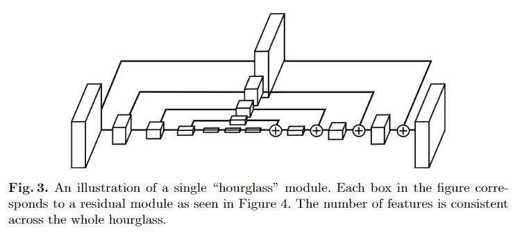

# [Stacked Hourglass Networks for Human Pose Estimation](https://arxiv.org/pdf/1603.06937)

## 摘要
这项工作引入了一个新的卷积网络架构，用于人体姿势估计的任务。特征在所有尺度上进行处理并整合以最佳地捕获与身体相关的各种空间关系。我们展示了如何将重复的自下而上，自上而下的处理与中间监督结合使用，对于提高网络性能至关重要。我们将架构称为“stacked hourglass”网络，该网络基于汇集和上采样的成功步骤，这些网络用于生成一组预测。在FLIC和MPII基准测试中实现了最先进的结果，超越了所有最近的方法。

## 网络结构
hourglass的设计是为了捕获多尺度信息

在Hourglass模块中，卷积和max pooling被用来将特征降到一个很低的分辨率，在每一个max pooling步骤中，网络产生分支并在原来提前池化的分辨率下使用更多的卷积，当到达最低的分辨率的时候，网络开始upsample并结合不同尺度下的特征。这里upsample（上采样）采用的方法是最邻近插值，之后再将两个特征集按元素位置相加。
当到达输出分辨率的时候，再接两个1×1的卷积层来进行最后的预测，网络的输出是一组heatmap，对于给定的heatmap，网络预测在每个像素处存在关节的概率。

### Residual Module

### Hourglass Module
一阶Hourglass Module

Max pool代表下采样，Res代表上面介绍的Residual Module，Up Sample代表上采样。多阶的Hourglass Module就是将上图虚线框中的块递归地替换为一阶Hourglass Module，由于作者在实验中使用的是4阶的Hourglass Moudle，所以我们画出了4阶的Hourglass Module的示意图：

整体结构

网络输入的图片分辨率为256×256，在hourglass模块中的最大分辨率为64×64，整个网络最开始要经过一个7×7的步长为2的卷积层，之后再经过一个残差块和Max pooling层使得分辨率从256降到64。

图中的渐变红色块就是加入了中间监督的地方，即在此处使用loss函数，下面讲一下中间监督。

*注意，上面的整体网络结构图中中间监督的地方输出的通道数为16是针对于MPII Human Pose这个数据集，因为该数据集将人体划分为16个关节点*

## Intermediate Supervision（中间监督）
作者在整个网络结构中堆叠了许多hourglass模块，从而使得网络能够不断重复自底向上和自顶向下的过程，作者提到采用这种结构的关键是要使用中间监督来对每一个hourglass模块进行预测，即对中间的heatmaps计算损失。

关于中间监督的位置，作者在文中也进行了讨论。大多数高阶特征仅在较低的分辨率下出现，除非在上采样最后。如果在网络进行上采样后进行监督，则无法在更大的全局上下文中重新评估这些特征；如果我们希望网络能够进行最佳的预测，那么这些预测就不应该在一个局部范围内进行。

由于hourglass模块整合了局部和全局的信息，若想要网络在早期进行预测，则需要它对图片有一个高层次的理解即使只是整个网络的一部分。最终，作者将中间监督设计在如下图所示位置:

在整个网络中，作者共使用了8个hourglass模块，需要注意的是，这些hourglass模块的权重不是共享的，并且所有的模块都基于相同的ground truth添加了损失函数。下面介绍训练过程的细节。

关于中间监督loss的计算，论文中是这么说的：
> Predictions are generated after passing through each hourglass where the network has had an opportunity to process features at both local and global contexts. Subsequent hourglass modules allow these high level features to be processed again to further evaluate and reassess higher order spatial relationships.

所以，每个Hourglass Module的loss是单独计算的，这样使得后面的Hourglass Module能够更好地再评估。

## 训练细节
作者在FLIC和MPII Human Pose数据集上进行了训练与评估。这篇论文只能用于单人姿态检测，但是在一张图片中经常有多个人，解决办法就是只对图片正中心的人物进行训练。将目标人物裁剪到正中心后再将输入图片resize到256×256。为了进行数据增量，作者将图片进行了旋转（+/-30度）、scaling（.75-1.25）。

网络使用RMSprop进行优化，学习率为2.5e-4. 测试的时候使用原图及其翻转的版本进行预测，结果取平均值。网络对于关节点的预测是heatmap的最大激活值。损失函数使用均方误差（Mean Squared Error,MSE）来比较预测的heatmap与ground truth的heatmap（在节点中心周围使用2D高斯分布，标准差为1） 

为了提高高精度阈值的性能，在转换回图像的原始坐标空间之前，预测在其下一个最高邻居的方向上偏移四分之一像素