[CondenseNet: An Efficient DenseNet using Learned Group Convolutions](https://arxiv.org/pdf/1711.09224)

[代码实现](https://github.com/ShichenLiu/CondenseNet)

# 目录
- [摘要](#摘要)
- [简介](#简介)
- [相关工作和背景](#相关工作和背景)
- [CondenseNets](#CondenseNets)
- [实验](#实验)
- [总结](#总结)

## 摘要
 深度神经网络越来越多地用于计算资源有限的移动设备上。在本文中，我们开发了CondenseNet，这是一种具有前所未有效率的新型网络架构。它结合了密集的连通性和称为学习组协调的新模块。密集连接有助于网络中的特征重用，而学习组卷积消除了此特征重用的层之间的连接是多余的。在测试时，我们的模型可以使用标准组卷积来实现，从而允许在实践中进行有效的计算。我们的实验表明，CondenseNets比最先进的压缩网络（如ShuffleNets）更有效。

## 简介
我们提出了一种新的方法来修剪层之间的冗余连接，然后引入更有效的架构。
与先前的修剪方法相比，我们的方法在训练过程中自动学习一个稀疏网络，并产生一个可以使用组卷积有效实现的常规连接模式。
具体来说，我们将一个图层的过滤器分成多个组，并在培训期间逐渐删除与不太重要的特征组的连接。
重要的是，这些新的功能组不是预定义的，而是已经学习的。
由此产生的名为CondenseNet的模型可以在GPU上高效地进行训练，并且在移动设备上具有很高的推理速度。
我们的图像分类实验表明，CondenseNets一直优于其他网络架构。与DenseNets相比，CondenseNets在精度水平相当的情况下仅使用了1/10的计算量。在ImageNet数据集[6]上，拥有2.75亿FLOPs的CondenseNet实现了29％的top-1错误，这与MobileNet的错误相当，后者需要两倍的计算量.

## 相关工作和背景
### 1、相关工作
- (1)、权重剪枝和量化：
细粒度修剪，例如，独立重量修剪[10,27]，通常实现高度稀疏性。
但是，它需要存储大量的指示，并依赖于特殊的硬件/软件加速器。
相比之下，粗粒度修剪方法（例如过滤级别修剪[1,14,29,32]实现了较低程度的稀疏性，但是所得到的网络更加规则，这有利于高效部署。CondenseNets也依赖于修剪技术，但与以前的方法有两点不同：第一，重量修剪是在训练的早期阶段开始的，这比整个过程中的整个过程更加有效和高效。其次，CondenseNets具有比过滤级修剪更高的稀疏度，但产生高效的群体卷积 - 达到稀疏性和规律性之间的平衡。
- (2)、高效的网络结构：最近的一系列研究探索了可以端到端训练的高效卷积网络[16,19,22,46,47,48,49]。在移动设备上部署足够有效的网络的三个例子是MobileNet [16]，ShuffleNet [47]和神经架构搜索（NAS）网络[49]。所有这些网络都使用深度可分离卷积，这大大减少了计算需求，而不会显着降低精度。在大多数深度学习平台中，这些网络的实用性在深度方面是可分离的，但尚未有效地实现。相比之下，CondenseNet使用了普遍支持的群组卷积运算[25]，从而在实践中提高了计算效率。

- (3)、与构造无关的高效推理：以前的几项研究也进行了探索。例如，知识蒸馏 [3,15]训练小型“学生”网络重新生成大型“教师”网络的输出，以减少测试时间成本。动态推理方法[2,7,8,17]适用于每个特定测试示例的推理，跳过单位或甚至整个层以减少计算。我们不在这里探讨这种方法，但是相信能用在CondeseNets

### 2、DenseNet
密集连接的网络（DenseNets; [19]）由多个块组成，每个块由多个层组成。每层产生k个特征，其中称为网络的增长率。DenseNets的区别特性是每层的输入是由同一密集块内的所有前导层生成的所有特征映射的补充。每层执行一系列连续变换，如图1左侧部分所示。第一次变换（BN-ReLU，蓝色）是批量归一化[23]和重新定义的线性单位[35]的组合。这些序列中的第一个卷积层通过使用1x1过滤器减少了通道数量以节省计算成本。输出之后是另一个BN-ReLU转换，然后通过3x3卷积减少到k个输出特征。
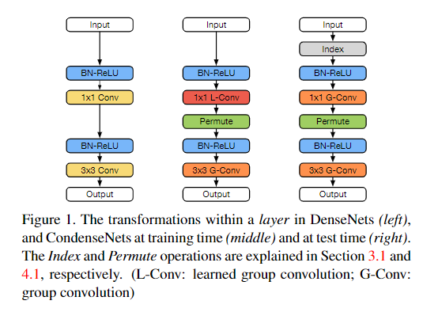

### 3、组卷积
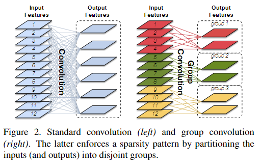

## CondenseNets
群组卷积适用于许多深层神经网络架构[43,46,47]，这些架构以逐层方式连接。对于密集体系结构，可以在3？3卷积层中使用组卷积（见图1，左）。然而，初步实验表明，在1x1卷积层中对群组卷积的适应性导致精度的急剧下降。我们推测这是由于1x1卷积层的输入是由前面层生成的特征图的连接这一事实引起的。因此，它们在两种方式上从典型输入到卷积层不同：1。他们有内在的秩序;2.它们更加多样化。将这些特征硬分配给不相交的组会阻碍网络中特征的有效重用。在执行组卷积之前，我们在每个层中随机置换输入特征图的实验表明，这减少了对精度的负面影响 -但即使随机置换，1x1卷积层中的群组卷积使得DenseNets比具有相等计算成本的较小DenseNets更不准确。
### 1、可学习的组卷积
*注意，提出可学习的组卷积本质是为了解决1x1conv直接使用组卷积产生很大的副作用*
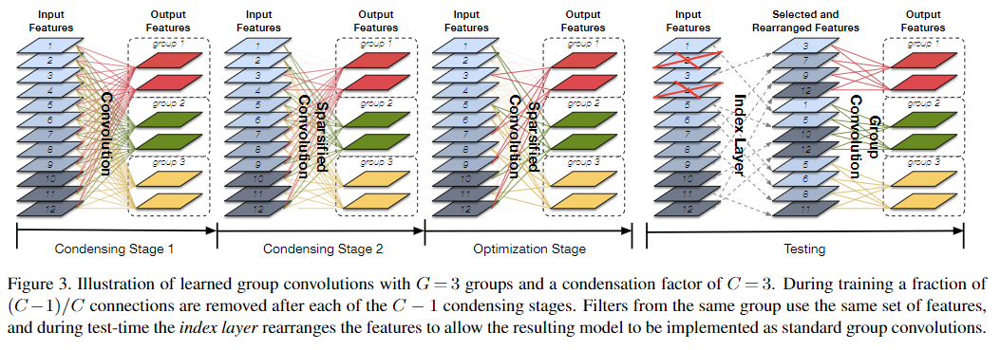
- 卷机组：G组
- 缩合标准：去掉比G内平均值低的feature map
- 组Lasso:为了减少由重量修剪引入的对准确性的负面影响，通常使用L1规则化来诱导稀疏性[29,32]。在CondenseNets中，我们鼓励来自同一组的卷积滤波器使用相同的传入特征子集,我们诱导组级稀疏性。为此，我们在训练期间使用了下面的group Lasso:

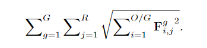
- 缩合因子：C
- 缩合过程：总共C段，第一段是标准卷积，之后C-1段每段丢弃1/C个feature，最后剩下1/C个feature。
- 学习率：余弦学习率，退火

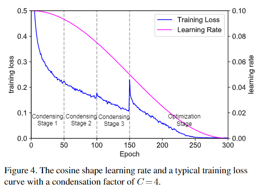
- 索引层：把特征重新排列一下，变成标准的组卷积的形式，便于测试。

### 2、结构设计
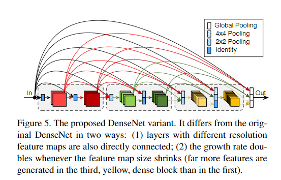

- growth rate由denseNet的k变成2^(m-1)*K0,m是dense块的索引，k0是常数。
- 不同block之间也有连接。

## 实验
### 1、CIFAR上的结果
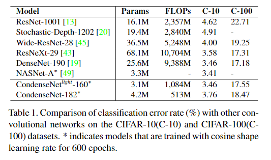
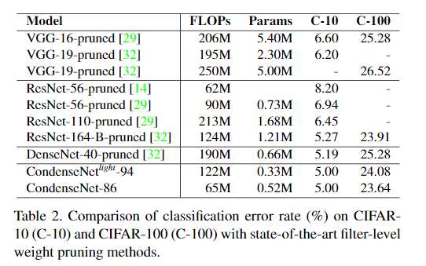

### 2、ImageNet上的结果
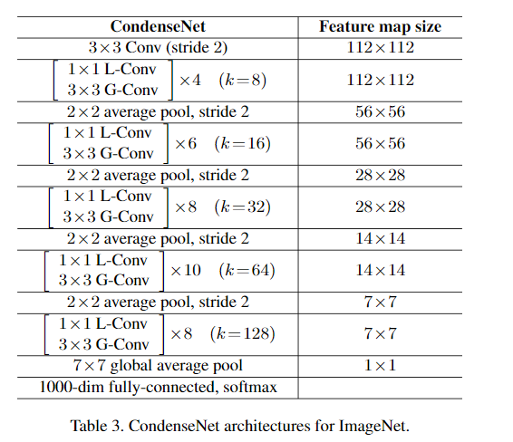
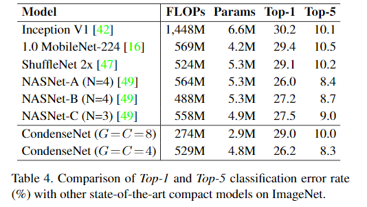
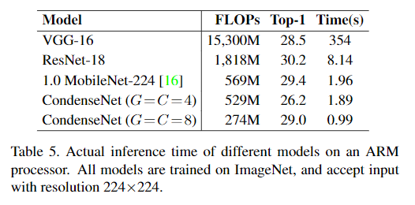
### 3、消融学习
控制变量法
## 总结
在本文中，我们介绍了CondenseNet：一种有效的卷积网络架构，它鼓励通过密集连接进行特征使用，并通过学习组协议重复使用与多余功能相关的剪辑过滤器。为了使推理有效，可以将修剪过的网络转换为具有规则组合的网络，这在大多数深度学习库中都是有效实现的。我们的修剪方法很容易实现，并且仅为训练过程增加了有限的计算成本。在我们的实验中，CondenseNets最近提出了在相同精度下提出的计算效率的MobileNets和ShuffleNets。CondenseNet甚至略微优于通过经验尝试数万个卷积网络架构而发现的网络架构，并且具有更简单的结构。
