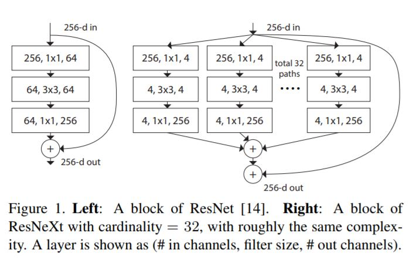
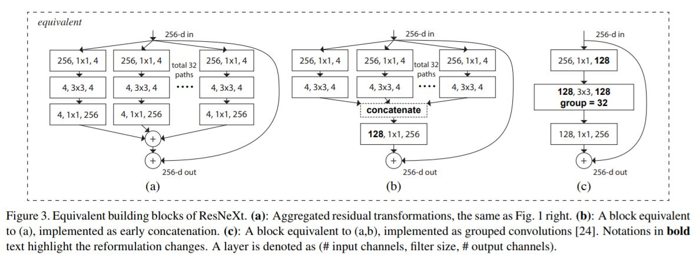
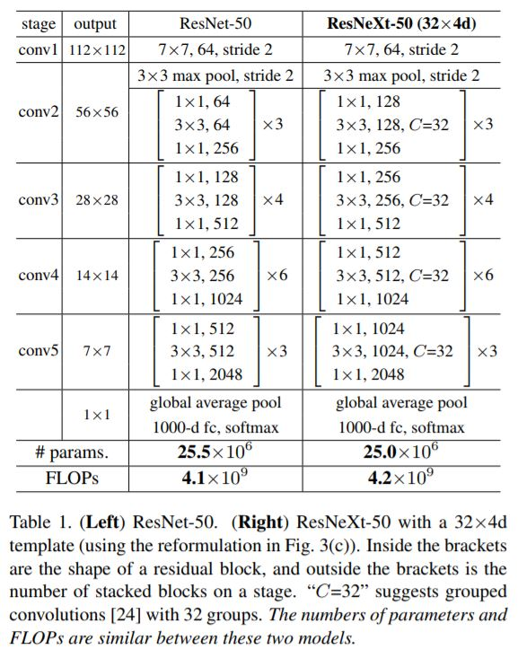
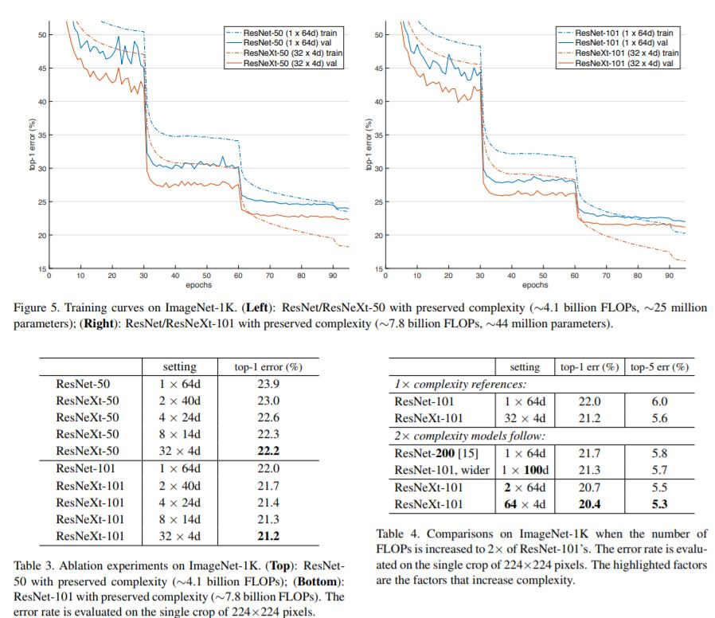

ResNeXt: 
===
[Aggregated Residual Transformations for Deep Neural Networks](https://arxiv.org/pdf/1611.05431.pdf)

[code](https://github.com/facebookresearch/ResNeXt)

目的
---
* 作者提出 ResNeXt 的主要原因在于：传统的要提高模型的准确率，都是加深或加宽网络，但是随着超参数数量的增加（比如channels数，filter size等等），网络设计的难度和计算开销也会增加。因此本文提出的 ResNeXt 结构可以在不增加参数复杂度的前提下提高准确率，同时还减少了超参数的数量。引入了cardinality作为超参，使用同构的结构设计网络结构，减小了网络结构设计的难度（Inception 系列网络有个问题：网络的超参数设定的针对性比较强，当应用在别的数据集上时需要修改许多参数，因此可扩展性一般）

策略
---
* Inception 的 split-transform-merge 思想

结构
---
左边是ResNet的残差块，右边是ResNetXt的基本块，可以看出有32个同构的path

等价结构

block设计原则
----
* 受VGG和ResNet启发：
* If producing spatial maps of the same size, the blocks share the same hyper-parameters(width and filter sizes)
* Each time when the spatial map is downsampled by a factor of 2, the width of the blocks is multiplied by a factor of 2

实验结果：
---
* 增加cardinality比增加深度和宽度更有效
* 降低了复杂度
* Figure3里使用组卷积的结构更加清晰，训练速度更快（三种结构是等价的，最终效果一样）

创新点
---
* 作者的核心创新点就在于提出了 aggregrated transformations（Figure3 a），用一种平行堆叠相同拓扑结构的blocks代替原来 ResNet 的三层卷积的block，在不明显增加参数量级的情况下提升了模型的准确率，同时由于拓扑结构相同，超参数也减少了，便于模型移植。

