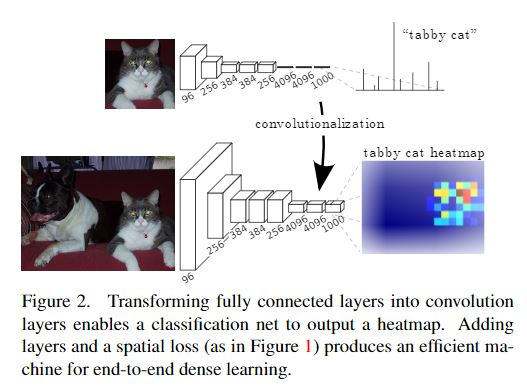

# FCN
[Fully Convolutional Networks for Semantic Segmentation](https://arxiv.org/pdf/1411.4038)

## 目录
- [关键词](#关键词)
- [简介](#简介)
- [全卷积](#全卷积)
- [上采样](#上采样)
- [优势与不足](#优势与不足)

### 关键词
- 语义分割、全卷积、上采样

### 简介
- 传统的基于CNN的分割方法的做法通常是：为了对一个像素分类，使用该像素周围的一个图像块作为CNN的输入用于训练和预测。这种方法有几个缺点：
- (1)、存储开销很大。例如对每个像素使用的图像块的大小为15x15，则所需的存储空间为原来图像的225倍。
- (2)、计算效率低下。相邻的像素块基本上是重复的，针对每个像素块逐个计算卷积，这种计算也有很大程度上的重复。
- (3、)像素块大小的限制了感知区域的大小。通常像素块的大小比整幅图像的大小小很多，只能提取一些局部的特征，从而导致分类的性能受到限制。
- 针对这个问题, UC Berkeley的Jonathan Long等人提出了Fully Convolutional Networks (FCN)用于图像的分割。该网络试图从抽象的特征中恢复出每个像素所属的类别。即从图像级别的分类进一步延伸到像素级别的分类。

### 全卷积 
- 将CNN的全连接层换成卷积层，输出由label变成heatmap

### 上采样
- 获得与输入一样的尺寸，采取skip connection，连接pool3、pool4、pool5，提高精度

### 优势与不足
#### FCN的优势在于： 
- 可以接受任意大小的输入图像（没有全连接层） 
- 更加高效，避免了使用邻域带来的重复计算和空间浪费的问题

#### 其不足也很突出： 
- 得到的结果还不够精细 
- 没有充分考虑像素之间的关系，缺乏空间一致性
