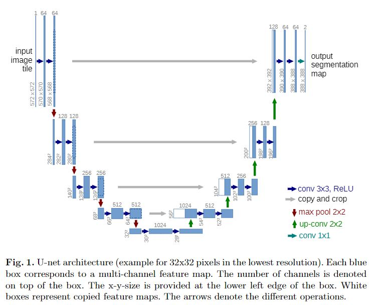
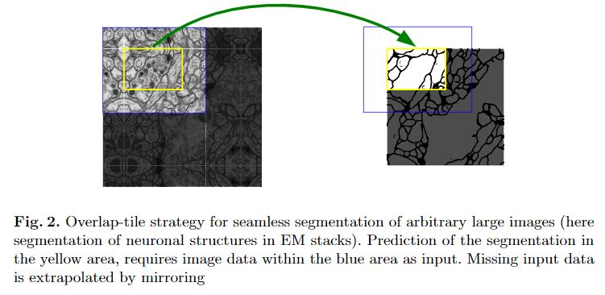
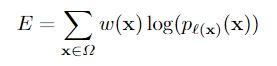
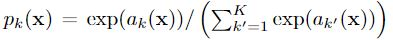
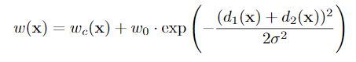

# U-Net
[Convolutional Networks for BiomedicalImage Segmentation](https://arxiv.org/pdf/1505.04597)

## 目录
- [关键词](#关键词)
- [结构](#结构)
- [FCN](#FCN(基础))
- [与FCN的不同](#与FCN的不同)
- [弹性形变的方式增强数据](#弹性形变的方式增强数据)
- [loss](#loss)
- [优点](#优点)

## 关键词
- 语义分割、特征融合
> CNN图像语义分割也就基本上是这个套路：
>> 1. 下采样+上采样：Convlution + Deconvlution／Resize
>> 2. 多尺度特征融合：特征逐点相加／特征channel维度拼接
>> 3. 获得像素级别的segement map：对每一个像素点进行判断类别

## 结构

> 注意特征融合方式：拼接
>> FCN是add，这里是concate，前后叠加在一起

## FCN（基础）
- 修改一个普通的逐层收缩网络（指分类网络），用上采样操作（反卷积）代替网络后部的降采样操作。因此，这些（反卷积）层增加了输出的分辨率。
- 为了使用局部的信息，在网络收缩过程（路径）中产生的高分辨率特征，被连接到了修改后网络的上采样的结果上。
- 在此之后，一个卷积层基于这些信息进行综合，得到更精确的结果。

## 与FCN不同的是
- 网络在上采样部分依然有大量的特征通道，这使得网络可以将空间上下文信息向更高的分辨率层传播。结果是，上采样路径基本对称于下采样路径，并呈现出一个U型。
- 网络不存在任何全连接层，并且，只使用每个卷积的valid部分，例如，分割图只包含这样一些像素点，这些像素点的完整上下文都出现在输入图像中。这种策略允许使用Overlap-tile策略无缝地分割任意大小的图像(参见下图)。

- 为了预测图像边界区域的像素点，我们采用镜像图像的方式补全缺失的环境像素。这个tiling方法在使用网络分割大图像时是非常有用的，因为如果不这么做，GPU显存会限制图像分辨率。

## 弹性形变的方式增强数据
- 为了让模型学到形变不变性，医学图像分割比较多

## loss
- 为将同类别的相互接触的目标分开，提出了使用一种带权重的损失(weighted loss)

- 网络输出的是pixel-wise的softmax

  
- 像素损失权重计算
  
  
 

## 优点
- 数据量小，效果也好