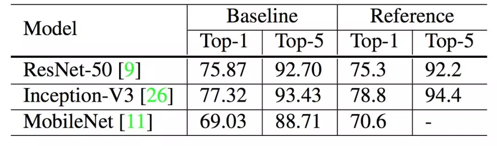

# Bag of Tricks for Image Classification with Convolutional Neural Networks
[paper](https://arxiv.org/pdf/1812.01187.pdf)

## 目录
- [关键词](#关键词)
- [摘要](#摘要)
- [训练过程](#训练过程)
- [高效训练](#高效训练)
- [模型调整](#模型调整)
- [训练方法改进](#训练方法改进)
- [迁移学习](#迁移学习)

## 关键词
- 微调、训练技巧

## 摘要
- 展示通过组合不同的微调方法，可以显著地改善多种 CNN 模型。例如，我们将 ImageNet 上训练的 ResNet-50 的 top-1 验证准确率从 75.3% 提升到 79.29。本研究还表明，图像分类准确率的提高可以在其他应用领域（如目标检测和语义分割）中实现更好的迁移学习性能。

## 训练过程
- 目前我们基本上都用小批量 SGD 或其变体训练神经网络，Algorithm 1 展示了 SGD 的模版过程（感兴趣的可以查阅原论文）。利用广泛使用的 ResNet 实现作为我们的基线，训练过程主要分为以下六个步骤：
  1. 随机采样一张图片，并解码为 32 位的原始像素浮点值，每一个像素值的取值范围为 [0, 255]。
  2. 随机以 [3/4, 4/3] 为长宽比、[8%, 100%] 为比例裁减矩形区域，然后再缩放为 224*224 的方图。
  3. 以 0.5 的概率随机水平翻转图像。
  4. 从均匀分布 [0.6, 1.4] 中抽取系数，并用于缩放色调和明亮度等。
  5. 从正态分布 N (0, 0.1) 中采样一个系数，以添加 PCA 噪声。
  6. 图像分别通过减去（123.68, 116.779, 103.939），并除以（58.393, 57.12, 57.375）而获得经归一化的 RGB 三通道。

经过六步后就可以训练并验证了，以下展示了基线模型的准确率：

*表2 文献中实现的验证准确率与我们基线模型的验证准确率，注意 Inception V3 的输入图像大小是 299*299。*

## 高效训练
随着 GPU 等硬件的流行，很多与性能相关的权衡取舍或最优选择都已经发生了改变。在这一章节中，我们研究了能利用低精度和大批量训练优势的多种技术，它们都不会损害模型的准确率，甚至有一些技术还能同时提升准确率与训练速度。

### 1、大批量训练
对于凸优化问题，随着批量的增加，收敛速度会降低。人们已经知道神经网络会有类似的实证结果。换句话说，对于相同数量的 epoch，大批量训练的模型与使用较小批量训练的模型相比，验证准确率会降低。因此有很多方法与技巧都旨在解决这个问题：

- 线性扩展学习率：较大的批量会减少梯度的噪声，从而可以增加学习率来加快收敛。
- 学习率预热：在预热这一启发式方法中，我们在最初使用较小的学习率，然后在训练过程变得稳定时换回初始学习率。
- Zero γ：注意 ResNet 块的最后一层可以是批归一化层（BN）。在 zero γ启发式方法中，我们对所有残差块末端的 BN 层初始化γ=0。因此，所有的残差块仅返回输入值，这相当于网络拥有更少的层，在初始阶段更容易训练。
- 无偏衰减：无偏衰减启发式方法仅应用权重衰减到卷积层和全连接层的权重，其它如 BN 中的γ和β都不进行衰减。
.webp)

*表 4：ResNet-50 上每种有效训练启发式的准确率效果。*
### 2、低精度训练
然而，新硬件可能具有增强的算术逻辑单元以用于较低精度的数据类型。尽管具备性能优势，但是精度降低具有较窄的取值范围，因此有可能出现超出范围而扰乱训练进度的情况。
.webp)

*表 3：ResNet-50 在基线（BS = 256 与 FP32）和更高效硬件设置（BS = 1024 与 FP16）之间的训练时间和验证准确率的比较。*

## 模型调整
.webp)

*图 1：ResNet-50 的架构。图中说明了卷积层的卷积核大小、输出通道大小和步幅大小（默认值为 1），池化层也类似。*
.webp)

*图 2：三个 ResNet 变体。ResNet-B 修改 ResNet 的下采样模块。ResNet-C 进一步修改输入主干。在此基础上，ResNet-D 再次修改了下采样块。*
.webp)

*表 5：将 ResNet-50 与三种模型变体进行模型大小（参数数量）、FLOPs 和 ImageNet 验证准确率（top-1、top-5）的比较。*

## 训练方法改进
### 1、余弦学习率衰减
Loshchilov 等人 [18] 提出余弦退火策略，其简化版本是按照余弦函数将学习速率从初始值降低到 0。假设批次总数为 T（忽略预热阶段），然后在批次 t，学习率η_t 计算如下：
.webp)

*其中η是初始学习率，我们将此方案称为「余弦」衰减。*
.webp)

*图 3：可视化带有预热方案的学习率变化。顶部：批量大小为 1024 的余弦衰减和按迭代步衰减方案。底部：关于两个方案的 top-1 验证准确率曲线。*
### 2、标签平滑
标签平滑的想法首先被提出用于训练 Inception-v2 [26]。它将真实概率的构造改成：
.webp)

*其中ε是一个小常数，K 是标签总数量。*
.webp)

*图 4：ImageNet 上标签平滑效果的可视化。顶部：当增加ε时，目标类别与其它类别之间的理论差距减小。下图：最大预测与其它类别平均值之间差距的经验分布。很明显，通过标签平滑，分布中心处于理论值并具有较少的极端值。*
### 3、知识蒸馏
在知识蒸馏 [10] 中，我们使用教师模型来帮助训练当前模型（被称为学生模型）。教师模型通常是具有更高准确率的预训练模型，因此通过模仿，学生模型能够在保持模型复杂性相同的同时提高其自身的准确率。一个例子是使用 ResNet-152 作为教师模型来帮助训练 ResNet-50。
### 4、混合训练
在混合训练（mixup）中，每次我们随机抽样两个样本 (x_i,y_i) 和 (x_j,y_j)。然后我们通过这两个样本的加权线性插值构建一个新的样本：
.webp)

*其中 λ∈[0,1] 是从 Beta(α, α) 分布提取的随机数。在混合训练中，我们只使用新的样本 (x hat, y hat)。*
### 5、实验结果
.webp)

*表 6：通过堆叠训练改进方法，得到的 ImageNet 验证准确率。基线模型为第 3 节所描述的。*

## 迁移学习
### 1、目标检测
.webp)

*表 8：在 Pascal VOC 上评估各种预训练基础网络的 Faster-RCNN 性能。*

### 2、语义分割
.webp)

*表 9：在 ADE20K 上评估各种基础网络的 FCN 性能。*