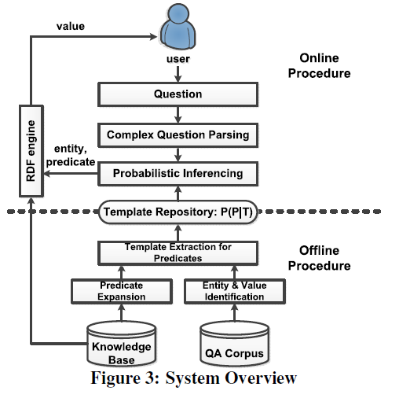

# KBQA: Learning Question Answering over QA Corpora and Knowledge Bases
[论文地址](https://www.researchgate.net/publication/315137155_KBQA_learning_question_answering_over_QA_corpora_and_knowledge_bases)`VLDB 2017 会议`

## Abstract 

​	问答系统已经成为人类访问十亿级知识图谱的流行方式，它回答的是自然语言问题。 与网页搜索不同，KBQA给出精确的答案，可以理解自然语言问题，并且将其映射到知识库里面产生结构化查询语句。然而，面临的挑战是，人类对一个问题有很多问法，以前的方法由于表示有它们的局限性：给予规则的方法只能理解一小部分固定问题，而基于关键词或同义词的方法不能完全理解这些问题。这篇文章设计了一种新的问题表示：模板，上十亿级规模的知识库和百万级的QA库。例如询问一个城市的人口，我们学习到的模板有：What’s the population of $city, How many people are there in $city。我们为2782个实体学习了2700万个模板。基于这些模板，KBQA系统可以有效支持二元性问题和组合的二元性问题。此外，我们在RDF知识中扩展了谓词，其中知识库的覆盖率提高了57倍

## Detail

​	我们研究了两个主流的解决方案。

​	第一个是基于模板/规则的方法。这个方法用模板表示句子，语义解析往往通过人工标记来实现。这种方法的优点是它的结果是用户可控的，这使得它更适用于工业用途。缺点是严重依赖人工，成本太高，昂贵的人力成本使得它无法处理多样性的问题。

​	另一个是基于神经网络的方法。最近这种做法很受欢迎，它们通过embedding的方式来表示一个问题，并从QA语料库中学习出它的语义解析。这种方法的优点是embedding是灵活的，所以它可以理解各种各样的问题。缺点是基于神经网络的方法通常具有较差的解释性，此外，结果是不可控的，所以他们并不适用于工业应用。

​	我们提出一种新的方法兼备这两种方法的优点。用模板表示自然语言问题，但不是手动标记，而是从QA语料库自动学习模板，从2782个意图学习了2700万个模板。系统体系结构如下：

​	离线过程：学习出模板到属性的映射

​	在线过程：一个问题进来，系统首先将其解析和分解为一组二元事实型问题。对于每个二元事实型问题，系统使用概率推断来寻找它的值。这个推断是基于给定模板的属性分布来得到的。接下来，我们对这个问题进行形式化定义。给定问题q，问答系统的目标是寻找具有最大概率的答案v。我们提出了一个生成模型来解释如何为一个问题找到它的答案。我们认为使用概率推断的方法来做KBQA是非常合理的。首先，一些问题的意图是模糊的。其次，大多数知识库都是不完整的。最后，QA语料库中的答案也可能是错误的。

​	整个生成模型过程如下：

​	首先识别出问句中对应知识库中的实体d，然后根据d的概率分布生成模板t。由于属性只和模板有关，所以推断出这个属性的模板，最后根据实体和属性，查找知识库得到对应的值。通过这种方法，我们完成了从一个自然语言问题到生成答案的整个过程。这个过程可以建模为一个概率图模型。基于这个生成模型，可以得到一个联合概率分布，进而用来解决给定其他变量求最大v的条件概率问题。

​	KBQA的另一个难点就是回答复杂问题。在面对复杂问题时，我们采用了分治算法。首先，系统把问题分解为一系列的二元事实型问题，然后系统依次回答每个问题。每个问题的答案都是一个概率，我们通过动态规划算法找到最优分解.

## Result

​	在很多benchmarks上用到了我们的KBQA。图为QALD-5的结果。结果表明，KBQA具有最高的准确度。由于KBQA只回答二元事实型问题，因此召回率相对较低。如果我们只考虑二元事实型问答，召回率能上升到0.67。

​	即使在一个不以二元事实型问题为主的数据集中（如WEBQUESTIONS，QALD-3），KBQA也可以作为混合问答系统的一个完美组件。

​	我们这样构建混合问题系统：一个问题过来，首先提交给我们的KBQA系统。如果KBQA系统不能回答，这意味着这个问题很可能不是二元事实型问题。然后，我们再将这个问题提交给baseline系统。

