# Spatial and Channel-wise Attention

**paper:**[Spatial and Channel-wise Attention ](https://arxiv.org/abs/1611.05594)`CVPR2017`

## Abstract

视觉注意已成功应用于结构预测任务，例如图像标注和问答系统。现有的视觉注意力模型通常是空间的，即注意力被建模为空间概率，其重新加权输入图像的CNN的最后一个卷积层特征图。然而，我们认为这种空间注意力并不一定符合注意机制 —— 一种动态特征提取器，它结合了上下文信息，因为CNN特征是自然的分布在空间、通道和多层中的。在本文中，我们介绍了一种新的卷积神经网络
被称为SCA-CNN，融合了 CNN中的Spatial和Channelwise。在图像标注的任务中，SCA-CNN动态调制多层特征映射中的句子生成上下文，编码视觉注意力的位置和内容。我们在三个基准图像标注数据集上评估建议的SCA-CNN架构：Flickr8K，Flickr30K和MSCOCO。观察到SCA-CNN明显优于最先进的基于视觉注意力的图像标注方法。

## Attention detail

本文主要介绍用channel 和spatial attention结合的方式来做图像标注，在之前的研究中使用的attention模型仅仅通过空间attention权重对conv layer输出的最后的feature map进行了加权。

整个网络的流程可以分为CNN网络将输入图像encode成feature map和LSTM网络将feature map decode成词序列这两步：1.一张待描述的图像输入给CNN网络，在CNN网络的多个层的feature map经过channel wise attention 函数得到权重 βl。然后这个βl和Vl相乘就得到中间结果的feature map。接下来feature map经过spatial attention函数得到权重 αl。这个αl和前面生成的feature map相乘得到最终的Xl。2、CNN网络的输出以及已经预测得到的部分描述作为LSTM网络的输入，得到描述句子的下一个单词。

 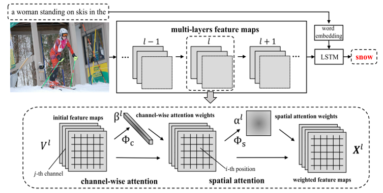

**channel attention**

channel以每个feature map为单位，对每个channel都配一个权重值，因此这个权重值应该是一个向量,β的每个值表示feature map的每个通道的权重，与Vl进行channel-wise乘积

**spacial attention**

Spacial以每个像素点为单位，对feature map的每个像素点都配一个权重值，因此这个权重值应该是一个矩阵,α的每个值表示feature map中每个点的权重（一共WH=m个点）

在进行预测第t个单词的时候，通过将t-1时刻的hidden layer状态 、C-S attention的输出 和t-1时刻的词向量共同输入进LSTM，对t时刻的hidden layer状态 进行预测.再将t时刻的hidden state 与t-1时刻的word embedding结合起来进行MLP，输出为一个字典大小的向量，最后进行softmax选出最大概率对应的word。

本文主要有两个创新点：将空间和通道注意力结合、在多层特征上加注意力权重。作者针对这两个创新点做了实验，高层的feature map的生成是依赖低层的feature map的，比如你要预测cake，那么只有低层卷积核提取到更多cake边缘特征，高层才能更好地抽象出cake。所以对multi-layer的feature map做attention。总体上multi-layer的效果确实比单层的效果要好一些，但是同时层数过多的话也容易引起过拟合。

## Result

最后是SCA-CNN算法和其他image caption图像标注算法的实验对比，其中Deep VS m-RNN Google
NIC都是结合CNN和RNN的端到端网络；Soft-Attention和Hard-Attention是spatial attention模型；emb-gLSTM和ATT是semantic attention模型。

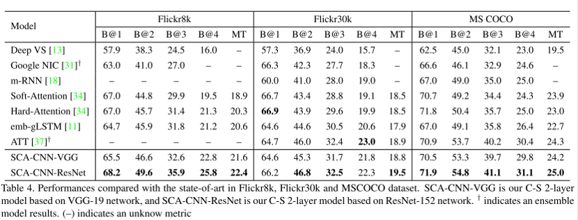

# Squeeze and Excitation Networks

**paper:**[Squeeze-and-Excitation Networks](<https://arxiv.org/abs/1709.01507> )`CVPR2018`

**code**:[SENet](https://github.com/hujie-frank/SENet)

## Abstract

卷积神经网络建立在卷积运算的基础上，通过融合局部感受野内的空间信息和通道信息来提取信息特征。为了提高网络的表示能力，许多现有的工作已经显示出增强空间编码的好处。在这项工作中，我们专注于通道，并提出了一种新颖的架构单元，我们称之为“Squeeze-and-Excitation”（SE）块，通过显式地建模通道之间的相互依赖关系，自适应地重新校准通道式的特征响应。通过将这些块堆叠在一起，我们证明了我们可以构建SENet架构，在具有挑战性的数据集中可以进行泛化地非常好。关键的是，我们发现SE块以微小的计算成本为现有的最先进的深层架构产生了显著的性能改进。SENets是我们ILSVRC 2017分类提交的基础，它赢得了第一名，并将`top-5`错误率显著减少到2.251%，相对于2016年的获胜成绩取得了25%的相对改进。

## Attention detail

SENet 是2017在ImageNet冠军，是一个子结构，可以嵌到其他分类或检测模型中。SENet的核心思想在于通过网络根据loss去学习特征权重，使得有效的feature map权重大，效果小的feature map权重小。当然，SE block嵌在原有的一些分类网络中不可避免地增加了一些参数和计算量。对输入特征先做一个Global Average Pooling（Squeeze过程），输出的1x1xC数据再经过两级全连接（Excitation过程），最后用sigmoid限制到[0，1]的范围，把这个值作为scale乘到C个通道上，作为下一级的输入数据。这种结构的原理是想通过控制scale的大小，增强重要的特征，削弱不重要的特征，从而让提取的特征指向性关注性更强。

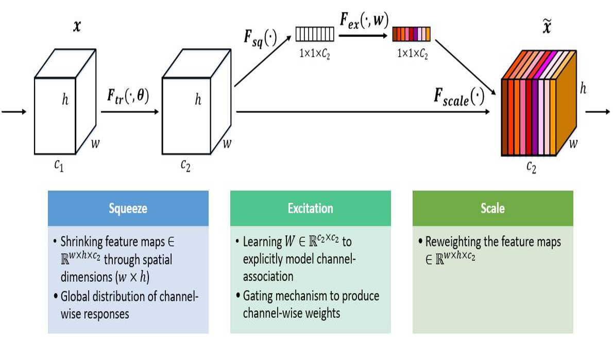

先是Squeeze部分。作者用了Global Average Pooling，将空间上所有点的信息都平均成了一个值。这么做是因为最终的scale是对整个通道作用的，这就得基于通道的整体信息来计算scale。另外要利用的是通道间的相关性，用GAP屏蔽掉空间上的分布信息能让scale的计算更加准确。

Excitation用2个全连接来实现 ，第一个全连接把C个通道压缩成了C/r个通道来降低计算量（后跟RELU），第二个全连接再恢复回C个通道（后跟Sigmoid），r是指压缩的比例r=16时整体性能和计算量最平衡,用了两个全连接，具有更多的非线性，可以更好地拟合通道间复杂的相关性；极大地减少了参数量和计算量。然后通过一个 Sigmoid 的门获得 0~1 之间的权重，最后通过一个 Scale 的操作来将归一化后的权重加权到每个通道的特征上。增强重要的特征，削弱不重要的特征。

 为什么要加全连接层呢？这是为了利用通道间的相关性来训练出真正的scale。一次mini-batch个样本的squeeze输出并不代表通道真实要调整的scale值，真实的scale要基于全部数据集来训练得出，而不是基于单个batch，所以后面要加个全连接层来进行训练。

## Experiment

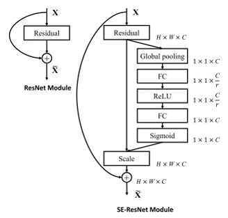

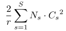

SE-ResNet，ResNet和SENet的组合，这种结构scale放到了直连相加之前。

模型的参数有增加，主要是两个全连接层的参数量，以ResNet为例 S个stage，每个Stage包含N个重复的residual block公式，增加的参数和通道数C关系很大，而网络越到高层，其feature map的channel个数越多，因此大部分增加的参数都是在高层。同时作者通过实验发现即便去掉最后一个stage的SE block，对模型的影响也非常小（<0.1% top-1 error），因此如果对参数量的限制要求很高，可以这么做，具体在哪些stage哪些block中添加SE block都是自由定义的。

r : reduction ratio

S : number of stages 

Cs : dimension of the output channels

Ns : repeated block number for stage s

## Result

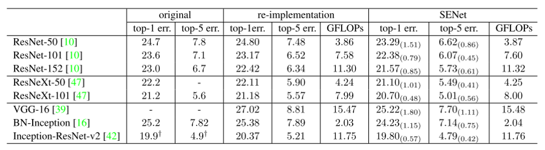

# Bottleneck Attention Module

**paper:**[BAM: Bottleneck Attention Module](<https://arxiv.org/abs/1807.06514> )`BMVC2018`

**code**:[BAM](<https://github.com/Jongchan/attention-module>)

## Abstract

深度神经网络的最新进展已经通过架构研究开发出来，以获得更强的代表能力。在这项工作中，我们关注一般深度神经网络中注意力的影响。我们提出了一个简单的有效注意模块，名为瓶颈注意模块（BAM），可以与任何前馈卷积神经网络集成。我们的模块沿着两个独立的路径，即通道和空间推荐注意力图。我们将模块置于模型的每个瓶颈中，其中发生特征映射的下采样。我们的模块通过多个参数在瓶颈上构建层次关注，并且可以与前馈模型一起以端到端的方式进行训练。我们通过对CIFAR-100，ImageNet-1K，VOC 2007和MS COCO基准的广泛实验来验证我们的BAM。我们的实验表明，各种模型在分类和检测性能方面均得到了一致的改进，证明了BAM的广泛适用性。

## Attention detail

瓶颈注意模块，可以与任何卷积神经网络集成，BAM位于网络的每个瓶颈。多个BAM构建了一个层次关注，类似于人类感知过程。BAM在早期阶段去除低级特征，例如背景纹理特征。然后逐渐关注确切的目标，进行一个较高级的语义分析。

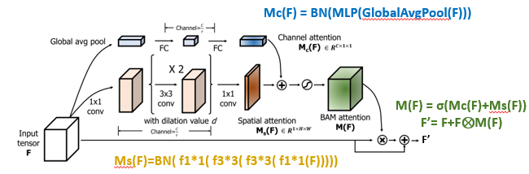

给定一个feature map F, 分别经过通道和空间attention 计算得到BAM attention M(F), 通道：通过全局平均池化 C×1×1，为了节省参数开销，将通道压缩至C/r，其中超参r是缩减比率。添加批量标准化（BN）层以归一化每维度的比例。空间：1×1卷积压缩通道至C/r（相同压缩比r）空洞卷积关注更多上下文信息，有利于构建更有效的空间映射。最后用1x1卷积得到1xHxW的空间权重，两个attention扩张至CxHxW然后相加,sigmoid ,空洞值d r超参 we set {d = 4, r =16}

## Result

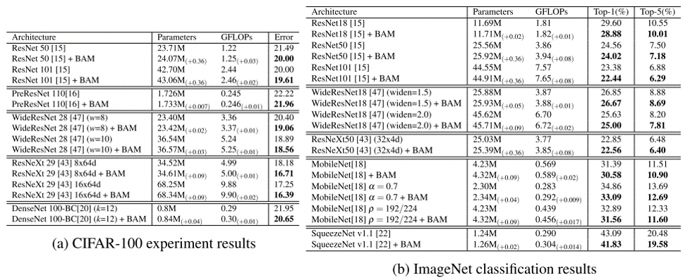

# Convolutional Block Attention Module

**paper:**[Convolutional Block Attention Module](<https://arxiv.org/abs/1807.06521>)`ECCV2018`

**code**:[CBAM](<https://github.com/Jongchan/attention-module>)

## Abstract

我们提出了卷积块注意模块（CBAM），这是一个简单的用于前馈卷积神经网络的有效注意模块。给出一个中间特征映射，我们的模块依次沿着两个独立的维度，通道和空间推断注意图，然后将注意图倍增到用于自适应特征细化的输入特征映射。因为CBAM是一个轻量级的通用模块，它可以无缝地集成到任何CNN架构中，开销可以忽略不计，并且可以与基本CNN一起进行端到端的跟踪。我们通过ImageNet-1K，MS~COCO检测和VOC~2007检测数据集的大量实验验证了我们的CBAM。我们的实验表明，各种模型的分类和检测性能得到了不断的改进，证明了CBAM的广泛适用性。

## Attention detail

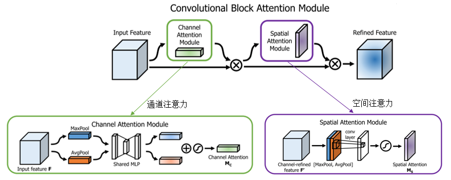

**channel**

同时使用平均池化和最大池化操作来聚合特征映射的空间信息,送到一个共享网络, 压缩输入特征图的空间维数,逐元素求和合并,以产生我们的通道注意力图 Mc

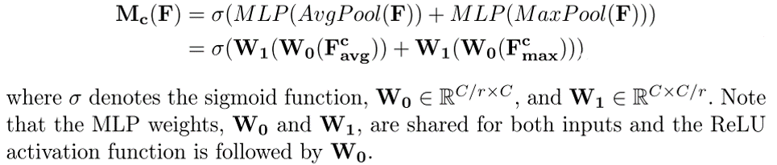

**spacial**

还是使用average pooling和max pooling对输入feature map进行压缩操作，只不过这里的压缩变成了通道层面上的压缩，连接起来，用7*7卷积生成空间注意力图谱

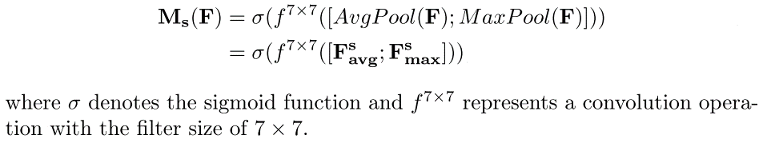

CBAM集成网络很好的学习目标对象区域中的信息并从中聚合特征。通过实验发现串联两个attention模块的效果要优于并联。通道attention放在前面要优于空间attention模块放在前面。

## Result

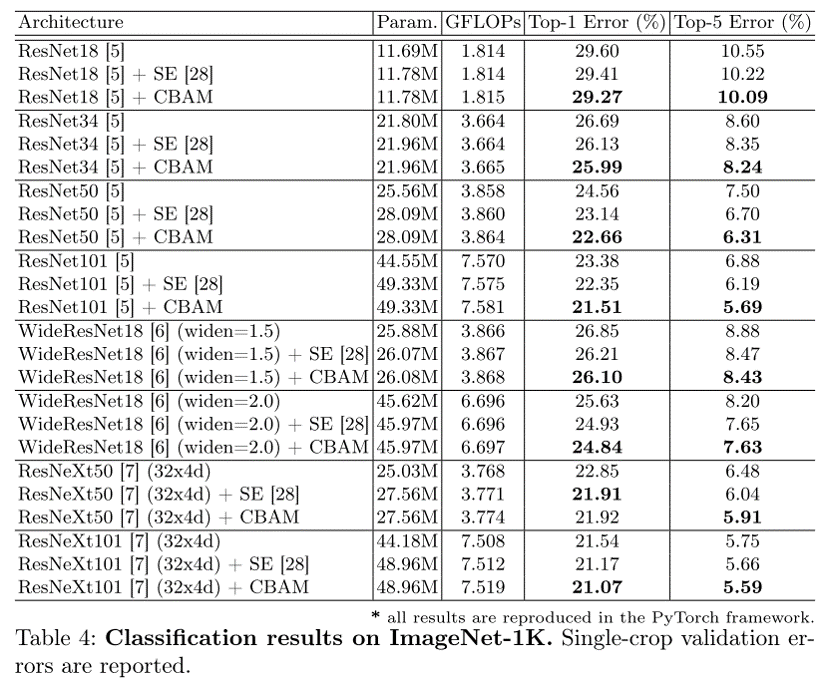

**Network Visualization with Grad-CAM**
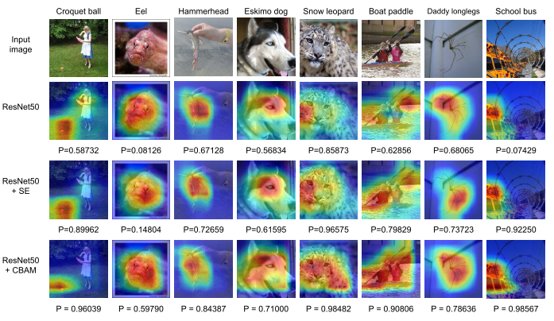

