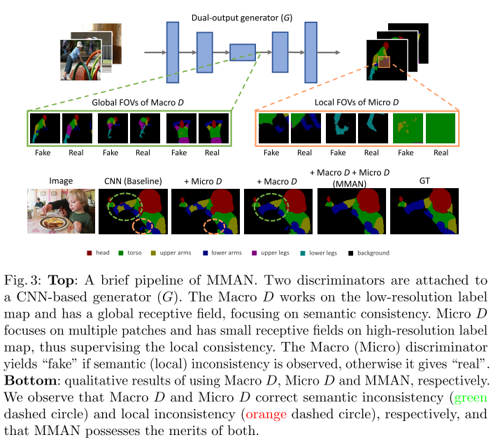
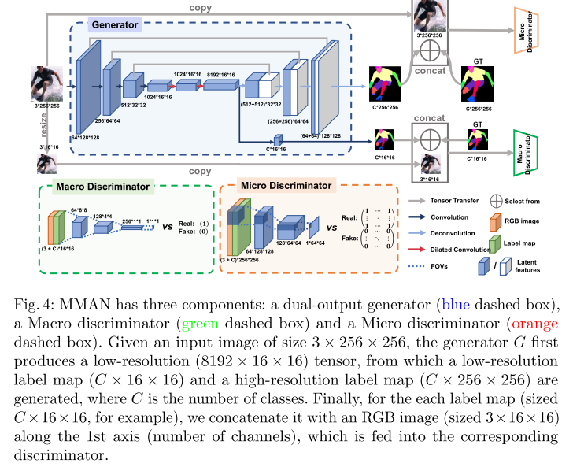
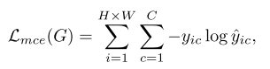
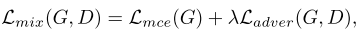
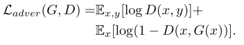
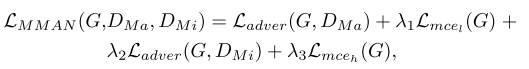
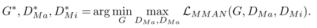
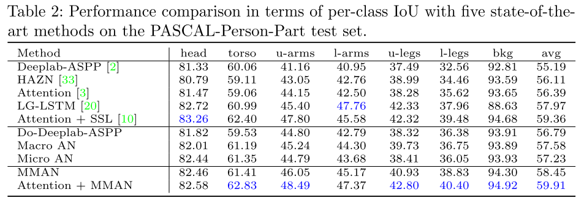

# MMAN

**paper:**[Macro-Micro Adversarial Network for Human Parsing](<https://arxiv.org/abs/1807.08260>)`ECCV (2018)`

**code：**[MMAN](https://github.com/RoyalVane/MMAN)

**translate**：[MMAN](https://www.cnblogs.com/tay007/p/9541014.html)

## Abstract

在人体解析中，像素级的分类损失在其低级局部不一致性和高级语义不一致性方面存在缺陷，对抗性网络的引入使用单个鉴别器来解决这两个问题。然而，这两种类型的解析不一致是由不同的机制产生的，因此单个鉴别器很难解决两个问题。本文提出了宏观-微观对抗网络（MMAN），他有两个鉴别器，一个鉴别器Macro D作用于低分辨率标签图并且惩罚语义不一致性，例如错位的身体部位。另一个鉴别器Micro D专注于高分辨率标签映射的多个像素块，以解决局部不一致性，例如图片模糊和裂口，对比传统的对抗性网络，MMAN不止明确地强制实现了局部和语义的一致性，而且避免了处理高分辨率图像时对抗性网络的收敛性差的问题。在我们的实验中，我们验证了两个鉴别器在提高人体解析准确性方面时相互补充的，与现有技术相比，所提出的框架能够产生有竞争力的解析性能，即分别在LIP和PASCAL-Person-Part上的mIoU = 46.81％和59.91％。在相对较小的数据集PPSS上，我们的预训练模型展示了令人印象深刻的泛化能力。该代码可在https://github.com/RoyalVane/MMAN上公开获取。

## Contributions

基于CNN架构，通常使用像素级分类损失。尽管提供了有效的基线，但是针对每像素类别预测设计的像素级分类损失具有两个缺点。首先，逐像素分类损失可能导致局部不一致，例如图片的裂口和模糊。原因在于它仅在不明确考虑相邻像素之间的相关性的情况下惩罚每个像素上的错误预测。其次，逐像素分类丢失可能导致整个分割图中的语义不一致，例如不合理的人体姿势和身体部位的不正确的空间关系。逐像素分类丢失没有明确地考虑语义一致性，因此可能无法很好地捕获长远的依赖性。

为了解决不一致性问题，可采用**条件随机场（CRF）**CRF通常在非常有限的范围内处理不一致性，并且由于初始分割结果差，甚至可能产生更差的标记图。最近的一项工作提出使用对抗性网络，对抗性损失通过联合配置许多标签变量来评估标签图是否是真的，他可以增强高级别的一致性，但不能通过成对项或像素分类损失来实现。现在，越来越多的论文采用了交叉熵损失与对抗性损失结合起来的方法。生成器很难在高分辨率图像上欺骗鉴别器，单一的鉴别器总是反向传播一个最大的对抗损失，使得训练不平衡，导致收敛性差。

- 本文提出MMAN，Macro AN和Micro AN分别关注语义和局部不一致，并以互补的方式工作以提高解析质量。

- 框架中的两个鉴别器在具有**小视场**（FOVs）的标签图上实现了局部和全局监督，这避免了由高分辨率图像引起的不良收敛问题。

- 本文提出的对抗网络在LIP和PASCAL-Person-Part数据集上实现了极具竞争力的mIoU，并且可以在相对较小的数据集PPSS上得到很好的推广。

  

## Macro-Micro Adversarial Network

MMAN架构如图，包含三个部分：双输出生成器（蓝色框），宏观鉴别器（绿色框），微观鉴别器（橙色框）

**训练目标**

传统的像素分类损失为：

</src>

yic表示第i个像素为c类的真实概率，yic^表示预测概率，为了执行空间一致性，我们将逐像素分类损失与对抗性损失结合为：

</src>

</src>

最终输出为：

</src>

其中Lmcel（G）给出了低分辨率输出和小尺寸目标标签图之间的交叉熵损失，而Lmceh（G）是指高分辨率输出和原始真值之间的交叉熵损失label map。 类似地，L adver（G，DMa）是关注低分辨率map的对抗性损失，Ladver（G，DMi）基于高分辨率图。超参数λ1，λ2和λ3控制四个损失的相对重要性。 MMAN的训练任务是：

</src>

**双输出生成器**

利用DeepNet-ASPP框架和ResNet-101模型在ImageNet数据集上预先训练作为baseline.使用级联上采样层来扩充Deeplab-ASPP结构。对于双输出，使用原始大小的真实标签图监控顶层的交叉熵损失，因为她可以保留视觉细节，使用调整大小的标签图监控底层的交叉熵损失，缩小的标签图更加关注粗粒度的人体结构。在类通道上，将标签图和对应大小的RGB	图像连接起来，作为判别器的强条件。

**宏观判别器**

DMa旨在引导生成器产生逼真的标签图，具有高级人体特征，DMa在G的底层，并聚焦在整体低分辨率标签图上，它由4个卷积层组成，内核大小为4×4，步长为2。每个卷积层后跟一个实例范数层和一个LeakyRelu函数。 给定来自G的输出标签图，DMa将其下采样到1×1以实现全局监督，DMa的输出是语义一致性的置信度得分。

**微观判别器**

DMi旨在强制标签图中的局部一致性， 与在（缩小的）标签图上具有全局感受野的DMa不同，DMi仅在图像块的尺度上惩罚局部误差。DMi的内核大小为4×4，步幅为2。Micro D具有3个卷积层的浅层结构，每个卷积层后跟一个实例范数层和一个LeakyRelu函数。DMi的目的是对高分辨率图像中的每个22×22块是否真实或虚假进行分类，这适合于增强局部一致性。在标签图上以卷积方式运行DMi后，将从每个感受野中获得多个响应。 最终平均所有响应以提供DMi的最终输出。

**讨论**

- **Macro D和Micro D的功能专业化**。Macro D作用于低分辨率标签图，保留了语义级人体结构，同时滤除了像素级细节。Macro D专注于全局不一致。
- **Macro D和Micro D的功能互补**。监督早期深层中的分类损失可以为后面的顶层提供良好的粗粒度初始化。相应地，减少顶层的损失可以通过细粒度的视觉细节来弥补粗略的语义特征。
- **小视场避免了收敛性差的问题。**避免了使用大的FOV作为实际输入，从而有效降低了高分辨率引起的收敛风险。
- **效率**。与单一的对抗网络相比，MMAN通过两个参数较少的浅层判别器实现了对整个图像的监控。它还拥有判别器的小视场。

## Experiment

