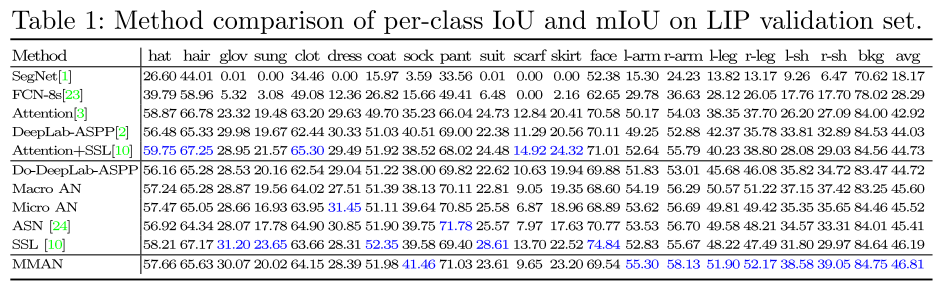

# MMAN

**paper:**[Macro-Micro Adversarial Network for Human Parsing](<https://arxiv.org/abs/1807.08260>)`ECCV (2018)`

**code：**[MMAN](https://github.com/RoyalVane/MMAN)

**translate**：[MMAN](https://www.cnblogs.com/tay007/p/9541014.html)

## Abstract

在人体解析中，像素级的分类损失在其低级局部不一致性和高级语义不一致性方面存在缺陷，对抗性网络的引入使用单个鉴别器来解决这两个问题。然而，这两种类型的解析不一致是由不同的机制产生的，因此单个鉴别器很难解决两个问题。本文提出了宏观-微观对抗网络（MMAN），他有两个鉴别器，一个鉴别器Macro D作用于低分辨率标签图并且惩罚语义不一致性，例如错位的身体部位。另一个鉴别器Micro D专注于高分辨率标签映射的多个像素块，以解决局部不一致性，例如图片模糊和裂口，对比传统的对抗性网络，MMAN不止明确地强制实现了局部和语义的一致性，而且避免了处理高分辨率图像时对抗性网络的收敛性差的问题。在我们的实验中，我们验证了两个鉴别器在提高人体解析准确性方面时相互补充的，与现有技术相比，所提出的框架能够产生有竞争力的解析性能，即分别在LIP和PASCAL-Person-Part上的mIoU = 46.81％和59.91％。在相对较小的数据集PPSS上，我们的预训练模型展示了令人印象深刻的泛化能力。该代码可在https://github.com/RoyalVane/MMAN上公开获取。

## Contributions

基于CNN架构，通常使用像素级分类损失。尽管提供了有效的基线，但是针对每像素类别预测设计的像素级分类损失具有两个缺点。首先，逐像素分类损失可能导致局部不一致，例如图片的裂口和模糊。原因在于它仅在不明确考虑相邻像素之间的相关性的情况下惩罚每个像素上的错误预测。其次，逐像素分类丢失可能导致整个分割图中的语义不一致，例如不合理的人体姿势和身体部位的不正确的空间关系。逐像素分类丢失没有明确地考虑语义一致性，因此可能无法很好地捕获长远的依赖性。

为了解决不一致性问题，可采用**条件随机场（CRF）**CRF通常在非常有限的范围内处理不一致性，并且由于初始分割结果差，甚至可能产生更差的标记图。最近的一项工作提出使用对抗性网络，对抗性损失通过联合配置许多标签变量来评估标签图是否是真的，他可以增强高级别的一致性，但不能通过成对项或像素分类损失来实现。现在，越来越多的论文采用了交叉熵损失与对抗性损失结合起来的方法。生成器很难在高分辨率图像上欺骗鉴别器，单一的鉴别器总是反向传播一个最大的对抗损失，使得训练不平衡，导致收敛性差。

- 本文提出MMAN，Macro AN和Micro AN分别关注语义和局部不一致，并以互补的方式工作以提高解析质量。

- 框架中的两个鉴别器在具有**小视场**（FOVs）的标签图上实现了局部和全局监督，这避免了由高分辨率图像引起的不良收敛问题。

- 本文提出的对抗网络在LIP和PASCAL-Person-Part数据集上实现了极具竞争力的mIoU，并且可以在相对较小的数据集PPSS上得到很好的推广。

  

## Macro-Micro Adversarial Network

MMAN架构如图，包含三个部分：双输出生成器（蓝色框），宏观鉴别器（绿色框），微观鉴别器（橙色框）

**训练目标**

传统的像素分类损失为：

</src>

yic表示第i个像素为c类的真实概率，yic^表示预测概率，为了执行空间一致性，我们将逐像素分类损失与对抗性损失结合为：

</src>

</src>

最终输出为：

</src>

其中Lmcel（G）给出了低分辨率输出和小尺寸目标标签图之间的交叉熵损失，而Lmceh（G）是指高分辨率输出和原始真值之间的交叉熵损失label map。 类似地，L adver（G，DMa）是关注低分辨率map的对抗性损失，Ladver（G，DMi）基于高分辨率图。超参数λ1，λ2和λ3控制四个损失的相对重要性。 MMAN的训练任务是：

</src>

**双输出生成器**

利用DeepNet-ASPP框架和ResNet-101模型在ImageNet数据集上预先训练作为baseline.使用级联上采样层来扩充Deeplab-ASPP结构。对于双输出，使用原始大小的真实标签图监控顶层的交叉熵损失，因为她可以保留视觉细节，使用调整大小的标签图监控底层的交叉熵损失，缩小的标签图更加关注粗粒度的人体结构。在类通道上，将标签图和对应大小的RGB	图像连接起来，作为判别器的强条件。

**宏观判别器**

DMa旨在引导生成器产生逼真的标签图，具有高级人体特征，DMa在G的底层，并聚焦在整体低分辨率标签图上，它由4个卷积层组成，内核大小为4×4，步长为2。每个卷积层后跟一个实例范数层和一个LeakyRelu函数。 给定来自G的输出标签图，DMa将其下采样到1×1以实现全局监督，DMa的输出是语义一致性的置信度得分。

**微观判别器**

DMi旨在强制标签图中的局部一致性， 与在（缩小的）标签图上具有全局感受野的DMa不同，DMi仅在图像块的尺度上惩罚局部误差。DMi的内核大小为4×4，步幅为2。Micro D具有3个卷积层的浅层结构，每个卷积层后跟一个实例范数层和一个LeakyRelu函数。DMi的目的是对高分辨率图像中的每个22×22块是否真实或虚假进行分类，这适合于增强局部一致性。在标签图上以卷积方式运行DMi后，将从每个感受野中获得多个响应。 最终平均所有响应以提供DMi的最终输出。

**讨论**

- **Macro D和Micro D的功能专业化**。Macro D作用于低分辨率标签图，保留了语义级人体结构，同时滤除了像素级细节。Macro D专注于全局不一致。
- **Macro D和Micro D的功能互补**。监督早期深层中的分类损失可以为后面的顶层提供良好的粗粒度初始化。相应地，减少顶层的损失可以通过细粒度的视觉细节来弥补粗略的语义特征。
- **小视场避免了收敛性差的问题。**避免了使用大的FOV作为实际输入，从而有效降低了高分辨率引起的收敛风险。
- **效率**。与单一的对抗网络相比，MMAN通过两个参数较少的浅层判别器实现了对整个图像的监控。它还拥有判别器的小视场。

## Experiment

# Devil in the Details: Towards Accurate Single and Multiple Human Parsing

paper: [Devil in the Details: Towards Accurate Single and Multiple Human Parsing](https://arxiv.org/abs/1809.05996) 

code: [CE2P-pytorch](https://github.com/liutinglt/CE2P)

trans: [Devil in the Details](http://tongtianta.site/paper/5983)

## Abstract

人类解析因其广泛的应用潜力而备受关注。然而，目前尚不清楚如何以高效优雅的方式开发出精确的人体解析系统。在本文中，我们确定了几个有用的属性，包括特征分辨率，全局上下文信息和边缘细节，并执行严格的分析，以揭示如何利用它们来利用人类解析任务。这些有用属性的优点最终导致简单而有效的带有边缘感知的上下文嵌入（CE2P）框架，用于单人解析。我们的CE2P是端到端的可训练的，可以很容易地用于进行多种人工解析。利用CE2P的优势，我们在所有三个人类解析基准测试中取得了第一名。在没有任何技巧的情况下，我们在LIP，CIHP和MHP v2.0中达到了56.50％（mIoU），45.31％APp和33.34％APp0.5，其表现优于现有技术超过2.06％ ，3.81％和1.87％。我们希望我们的CE2P将成为一个坚实的基线，并有助于简化未来单/多人解析的研究。

## Contributions

•我们分析了几种属性对人类解析的有效性，并揭示了如何利用它们来实现人类解析任务。

•我们通过利用有用的属性以简单有效的方式进行人工解析，设计了一个简单而有效的CE2P框架。

•我们的CE2P为所有三个人类解析基准测试带来了显着的性能提升，大大超过了当前最先进的方法。

## Context Embedding with Edge Perceiving

上下文嵌入边缘感知：在CE2P中，我们分析了几个关键模块的有效性，这些模块是从以前最先进的语义分割模型中激发出来的，并揭示了它们如何协同工作以完成单个人类解析任务。

**CE2P关键模块**

> 整体框架由上下文嵌入模块、高分辨率嵌入模块、边缘感知模块组成。

**上下文嵌入模块**全局上下文信息可用于区分细粒度类别。例如，左右鞋在外观上具有相对高的相似性。为了区分左右鞋，全局信息（如腿和身体的方向）提供了有效的上下文。众所周知，特征金字塔是捕获上下文信息的有效方式。借鉴之前的PSP工作，我们利用金字塔池模块来整合全局表示。我们对从ResNet-101中提取的特征执行四次平均合并操作，以生成尺寸分别为1×1,2×2,3×3,6×6的多尺度上下文特征。这些上下文特征被上采样以通过双线性插值与原始特征图保持相同的大小，其进一步与原始特征连接。然后，采用1×1卷积来减少信道并更好地整合多尺度上下文信息。最后，上下文嵌入模块的输出作为全局上下文先验被馈入下面的高分辨率模块。

**高分辨率嵌入模块**在人类解析中，存在若干要分割的小对象，例如，袜子，鞋子，太阳镜和手套。因此，最终像素级分类的高分辨率特征对于生成准确的预测至关重要。为了恢复丢失的细节，我们采用了一种简单而有效的方法，它嵌入来自中间层的低级视觉特征，作为高级语义特征的补充。我们利用conv2中的功能捕获高分辨率细节。全局上下文特征通过因子4采用双线性插值进行上采样，并在通道减少1×1卷积后与局部特征连接。最后，我们对级联特征进行两次顺序1×1卷积，以更好地融合局部和全局上下文特征。以这种方式，高分辨率模块的输出同时获得高级语义和高分辨率空间信息。

**边缘感知模块**该模块旨在学习轮廓的表示，以进一步锐化并重新确定预测。我们引入了三个分支来检测多尺度语义边缘。如图1所示，对conv2，conv3和conv4进行1×1卷积以生成语义边缘的2通道分数图。然后，执行1×1卷积以获得融合边缘图。边缘分支的那些中间特征（其可以捕获对象边界的有用特征）被上采样并与来自高分辨率的特征连接。最后，在级联特征图上执行1×1卷积以预测像素级人体部分。

我们的CE2P由三个模块组成，以端到端的方式学习。CE2P的输出包括两个解析结果和边缘预测。损失为：

1.edge边缘模块检测到的边缘图与二值边标签图之间的加权交叉熵损失函数。2.parse高分辨率模块的解析结果与解析标签之间的交叉熵损失。3.从边缘感知分支预测的最终结果与解析标签的交叉熵损失。

## Mutiple Human Parsing

多重人体解析

在CE2P和Mask R-CNN上设计了一个名为M-CE2P的框架，利用Bg,Bl1,Bl2三个分支来从全局视图到本地视图预测。全局解析Bg应用于整张图像上，该分支得输出被用作对以下本地解析的补充，当多人遮挡时，全局解析分支可以提供上下文信息。使用实例掩码进行局部解析Bl1，我们提出针对人类级局部解析的两阶段分支，使用Mask R-CNN来提取图像中所有人物补丁，并调整他们以适应CE2P的输入大小。然后将所有人级子图像送到CE2P中训练用于局部视图。在推理阶段，通过Mask RCNN提取具有单个人类输入图像实例的子图像，并进一步送到训练模型中进行解析预测，通过双线性插值将预测的置信度图调整为原始大小，用于整个图像上的预测。

Bl2考虑到从真实实例掩码获得的人类实例更接近真实单个人类图像，我们引入分支Bl2来训练模型，其中包含从真实实例生成的数据面具。这个分支与Bl1非常相似，唯一的区别是我们在训练阶段用真实实况边界框的指南获得人物补丁。使用Bl2，可以进一步提高局部解析的性能。最后，由三个分支生成的预测通过元素求和来融合，以获得最终的实例不可知的解析结果。预测的与实例无关的解析结果进一步馈入以下过程以进行实例级解析。

