# FCN

**paper:**[Fully Convolutional Networks for Semantic Segmentation](<https://arxiv.org/abs/1411.4038>)`CVPR (2015)`

**code：**[fcn](https://github.com/shelhamer/fcn.berkeleyvision.org)

**translate**：[fcn](https://www.jianshu.com/p/91c5db272725)

## Abstract

卷积网络在特征分层领域是非常强大的视觉模型。我们证明了经过端到端、像素到像素训练的卷积网络超过语义分割中最先进的技术。我们的核心观点是建立“全卷积”网络，输入任意尺寸，经过有效的推理和学习产生相应尺寸的输出。我们定义并指定全卷积网络的空间，解释它们在空间范围内dense prediction任务(预测每个像素所属的类别)和获取与先验模型联系的应用。我们改编当前的分类网络(AlexNet ,the VGG net, and GoogLeNet)到完全卷积网络和通过微调传递它们的学习表现到分割任务中。然后我们定义了一个跳跃式的架构，结合来自深、粗层的语义信息和来自浅、细层的表征信息来产生准确和精细的分割。我们的完全卷积网络成为了在PASCAL VOC最出色的分割方式（在2012年相对62.2%的平均IU提高了20%），NYUDv2，和SIFT Flow,对一个典型图像推理只需要花费不到0.2秒的时间。

## Contributions

**卷积化**

分类网络通常会在最后添加全连接层，会将原来的二维图片（矩阵）压缩成一维，从而训练出一维标量作为分类标签。而图像语义分割需要输出分割图（二维），因此将全连接层换成卷积层。

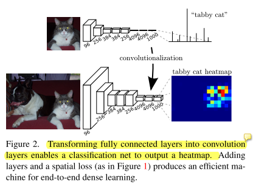</src>

**上采样**

一般的卷积神经网络使用池化层来压缩输出图片大小，而我们需要得到的是跟原图一样大小的分割图，因此，需要对最后一层进行上采样（反卷积 Deconvolution）。

caffe中，使用 **im2col**来将图片转为矩阵，使用**GEMM**来计算卷积（矩阵相乘），虽然转置卷积核卷积层一样可以训练参数，但是实际实验中并没有啥提升于是转置卷积层学习率置零了。

**跳跃结构**

直接将全卷积后的结果上采样后得到的结果很粗糙，所以，将不同池化层的结果进行上采样，结合这些结果来优化输出。pool4后面添加1x1卷积，产生附加的类别预测，将输出和在fc7经过2X上采样后的预测融合，最后用stride=16的上采样将预测变为原图像大小。把这种网结构称为FCN-16s。继续融合pool3和一个融合了 pool4和conv7的2X上采样预测，建立FCN-8s网络，融合完性能显著提升。

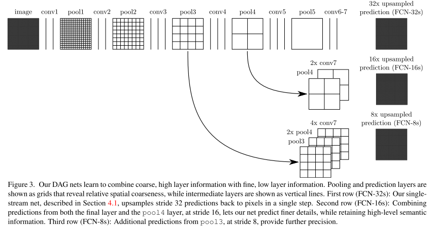

如上图所示，对原图像进行卷积conv1、pool1后原图像缩小为1/2；之后对图像进行第二次conv2、pool2后图像缩小为1/4；接着继续对图像进行第三次卷积操作conv3、pool3缩小为原图像的1/8，此时保留pool3的featureMap；接着继续对图像进行第四次卷积操作conv4、pool4，缩小为原图像的1/16，保留pool4的featureMap；最后对图像进行第五次卷积操作conv5、pool5，缩小为原图像的1/32，然后把原来CNN操作中的全连接变成卷积操作conv6、conv7，图像的featureMap数量改变但是图像大小依然为原图的1/32,此时进行32倍的上采样可以得到原图大小,这个时候得到的结果就是叫做FCN-32s.

这个时候可以看出,FCN-32s结果明显非常平滑,不精细. 针对这个问题,作者采用了combining what and where的方法,具体来说,就是在FCN-32s的基础上进行fine tuning,把pool4层和conv7的2倍上采样结果相加之后进行一个16倍的上采样,得到的结果是FCN-16s.

之后在FCN-16s的基础上进行fine tuning,把pool3层和2倍上采样的pool4层和4倍上采样的conv7层加起来,进行一个8倍的上采样,得到的结果就是FCN-8s.

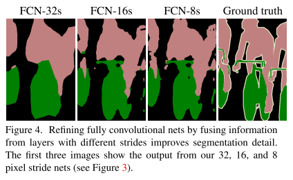</src>

## Experiment

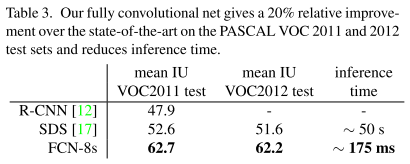</src>

**sth good**: [FCN解析1](https://blog.csdn.net/qq_36269513/article/details/80420363)

​		  [FCN解析2](https://zhuanlan.zhihu.com/p/22976342)

# SegNet

paper:[SegNet: A Deep Convolutional Encoder-Decoder Architecture for Image Segmentation](https://arxiv.org/abs/1511.00561)`TPAMI 2015`

## Abstract

我们展示了一种新奇的有实践意义的深度全卷积神经网络结构，用于逐个像素的语义分割，并命名为SegNet.核心的可训练的分割引擎包含一个编码网络，和一个对应的解码网络，并跟随着一个像素级别的分类层.编码器网络的架构在拓扑上与VGG16网络中的13个卷积层相同.解码网络的角色是映射低分辨率的编码后的特征图到输入分辨率的特征图.具体地，解码器使用在相应编码器的最大池化步骤中计算的池化索引来执行非线性上采样.这消除了上采样的学习需要.上采样后的图是稀疏的，然后与可训练的滤波器卷积以产生密集的特征图.我们把我们提出的架构和广泛采用的FCN架构和众所周知的DeepLab-LargeFOV、DeconvNet架构做了比较，这种比较揭示了实现良好分割性能所涉及的内存与准确度之间的权衡。
SegNet的主要动机是场景理解应用.因此，它在设计的时候保证在预测期间，内存和计算时间上保证效率.在可训练参数的数量上和其他计算架构相比也显得更小，并且可以使用随机梯度下降进行端到端的训练.我们还在道路场景和SUN RGB-D室内场景分割任务中执行了SegNet和其他架构的受控基准测试.这些定量的评估表明，SegNet在和其他架构的比较上，提供了有竞争力的推断时间和最高效的推理内存.我们也提供了一个Caffe实现和一个web样例：<http://mi.eng.cam.ac.uk/projects/segnet/>.

## Architecture

encoder-decoder结构，encoder由VGG16的前13层卷积层组成，每个encoder层对应一个decoder层，最终解码器输出被送到多级soft max分类器，每个像素输出类概率

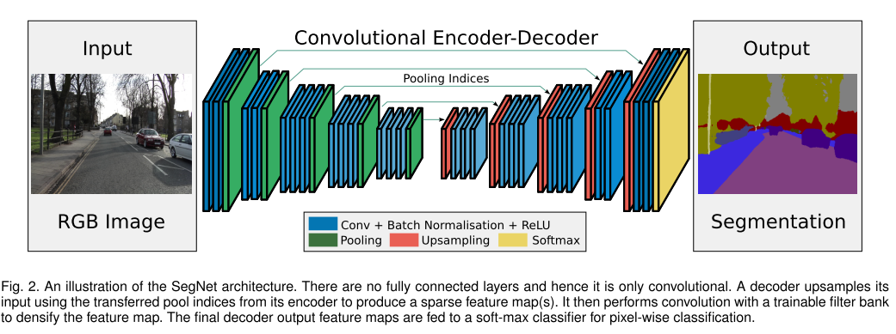

最大池化可以实现在输入图像上进行小的空间位移时保持平移不变性。**连续的下采样导致了在输出的特征图上，每一个像素都重叠着着大量的输入图像中的空间信息**。对于图像分类任务，多层最大池化和下采样由于平移不变性可以获得较好的鲁棒性，但导致了特征图大小和空间信息的损失。**图像分割任务中边界划分至关重要，而这么多有损边界细节的图像表示方法显然不利于分割**。因此，在进行下采样之前，**在编码器特征映射中获取和存储边界信息是十分重要的**。如果推理过程中的内存不受约束，则所有编码器特征映射(在下采样后)都可以存储。在实际应用中，情况通常不是这样，因此我们提出了一种更有效的方法来存储这些信息。它只存储最大池化索引，即存储每个池化窗口中最大特征值的位置，用于每个编码器特征映射。

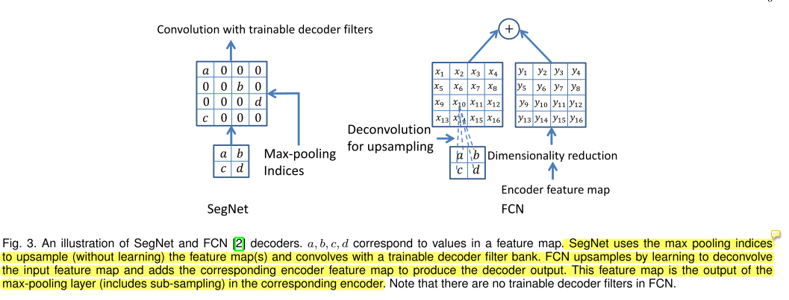

对比SegNet和FCN实现Decoder的过程。SegNet保留pooling时的位置信息，upsampling时直接将数据放在原先的位置,其他位置补0，而FCN采用transposed convolutions+双线性插值，每一个像素都是运算后的结果。

**论文对解码器变种进行了详细分析和实验证明**

### BENCHMARKING

使用两个数据集来训练和测试SegNet：CamVid road scene segmentation（对自动驾驶有实际意义）和SUN RGB-D indoor scene segmentation（对AR有实际意义）

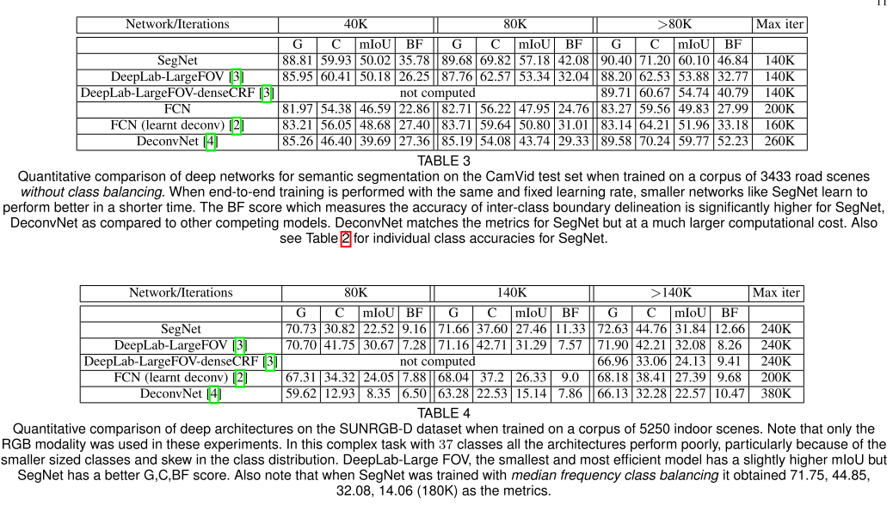

### Result

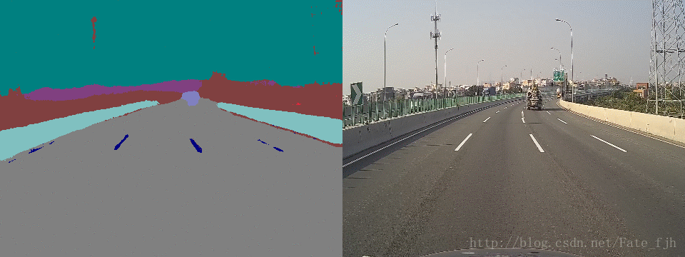

sth good: [segnet解析](http://hellodfan.com/2017/11/10/%E8%AF%AD%E4%B9%89%E5%88%86%E5%89%B2%E8%AE%BA%E6%96%87-SegNet/)

translate: [segnet翻译](https://blog.csdn.net/u014451076/article/details/70741629)

# Attention to Scale

**paper:**[Attention to Scale: Scale-aware Semantic Image Segmentation](<https://arxiv.org/abs/1511.03339> )`CVPR2016`

## Abstract

在完全卷积神经网络（FCN）中结合多尺度特征一直是实现语义图像分割的最先进性能的关键因素。提取多尺度特征的一种常用方法是将多个已调整大小的输入图像馈送到共享深度网络，然后合并所得到的特征以进行按像素分类。在这项工作中，我们提出了一种注意机制，可以学习对每个像素位置的多尺度特征进行轻微加权。我们采用最先进的语义图像分割模型，与多尺度输入图像和注意模型共同训练。所提出的注意模型不仅优于平均和最大池化，而且允许我们诊断地可视化在不同位置和尺度上特征的重要性。此外，我们表明，在合并多尺度特征时，为每个尺度的输出添加额外的监督对于实现卓越的性能至关重要。我们通过对三个具有挑战性的数据集进行了大量实验来证明我们的模型的有效性，包括PASCAL-Person-Part，PASCAL VOC 2012和MS-COCO 2014的子集。

## Contributions

 将注意力机制用到多分辨率输入的语义分割网络中。 

1.首先，多尺度的特征是提升语义图像分割性能的一个关键因素。
2.提取多尺度的特征主要有两种网络结构：
  第一种是：skip-net，第二种是：share-net

(1)skip-net的特点是取网络中多个中间层的特征并合并成一个特征，以实现多尺度的特征；
(2)share-net的特点是对输入图像进行尺度上的变换，得到不同尺度的输入图像，然后分别输入给网络，这样能够得到不同尺度的输入图像的特征，以形成多尺度的特征。
3.论文采用的是share-net的方式来得到多尺度的特征，在采用share-net方式提取多尺度特征时，需要考虑到一个问题，就是如何对多个尺度输入图像得到的特征进行融合？
(1)多尺度输入图像的特征的融合目前主要有两种方式，一种是max pooling；一种是average pooling(取平均)；

(2)本篇论文提出对多尺度输入图像特征进行加权求和进行融合

#  DeepLab v1

**paper:**[DeepLabv1: Semantic image segmentation with deep convolutional nets and fully connected CRFs](<https://arxiv.org/abs/1606.00915> )`ICLR 2015`

**translate:**[deeplab v1](https://blog.csdn.net/Hanging_Gardens/article/details/78368078)

## Abstract

DCNNs近期在高级视觉任务中表现出非常好的性能，比如图像分类和目标跟踪。本文联合DCNNs和概率图模型来解决像素级分类任务,也就是语义图像分割。我们发现DCNNs最后一层的响应不能充分地用于定位精确的目标分割。这是因为存在使得DCNNs擅长高级任务的非常不变性属性。我们通过一个全连接的CRF结合DCNNs最后层的响应来克服深度网络中差的定位属性。定性的讲，我们的”DeepLab”系统能够以超过先前方法的精度来定位分割边界。定量的讲，我们的方法在PASCAL VOC2012语义图像分割任务上测试的平均IOU达到71.6%。我们展示了如何能有效地得到这些结果:注意网络的再利用；从小波社区引入”孔洞”算法，该算法在现代GPU上能以每秒8帧的速度处理神经网络响应的密集计算.

## Contributions

(1)速度: 由于“atrous”算法和感受野尺寸的减小，我们的密集DCNN以8 fps的速度运行，而完全连接的CRF的平均场推理需要0.5秒 
(2)精度: PASCAL语义分割挑战最现先进结果，超过了Mostajabi等人的方法的7.2％ 
(3)简单性: 我们的系统由两个相当完善的DCNN和CRF模块组成。

## Architecture

1.**采用空洞算法的高效密集滑动窗口特征提取**

由于普通下采样（最大池化）方法导致分辨率下降，局部信息丢失，想去掉池化，但是池化能使每个像素都有较大的感受野并且减少图像尺寸，因此引入空洞卷积，不进行下采样又能保证大的感受野。

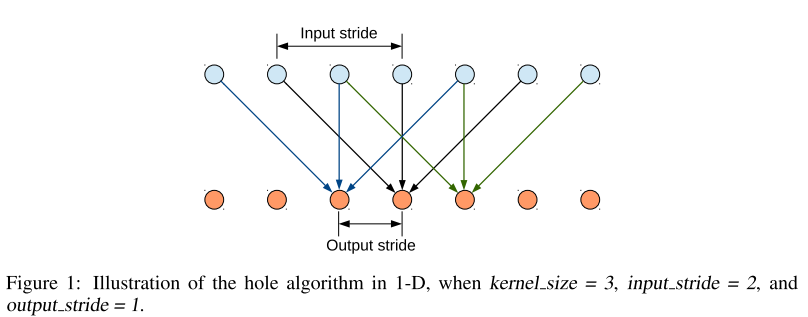

[花样卷积示意](https://github.com/vdumoulin/conv_arithmetic)

空洞卷积 3x3 kernel dilation rate=2

</src>

VGG论文将7x7卷积改为3个3x3小卷积，这样做的主要目的是在保证具有相同感知野的条件下，提升了网络的深度，在一定程度上提升了神经网络的效果，同时减少了参数量。

2.**Dense CRF**：详细的边界恢复

- CRF在传统图像处理上主要做平滑处理。
- 但对于CNN来说，short-range CRFs可能会起到反作用，因为我们的目标是恢复局部信息，而不是进一步平滑图像。
- 引入fully connected CRF来解决这个问题，考虑全局的信息。

3.**多尺度预测**：将前四个最大池化层中的每一个输入图像和输出附加到一个两层MLP，特征图连接到主网络的最后一层特征图，这四个预测结果与最终模型输出拼接（concatenate）到一起，相当于多了128*5=640个channel。通过640个通道增强了馈送到分类层的聚合特征图，我们只调整新添加的权重，保留其他网络参数学习到的值。

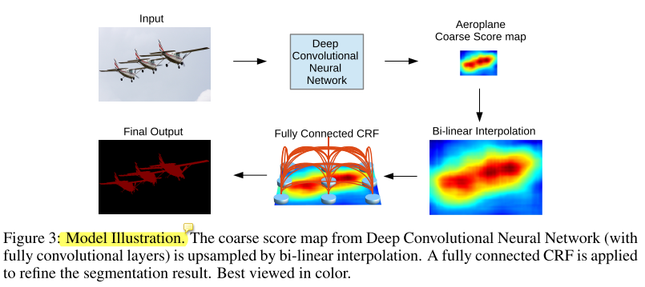

4.**网络结构**

对VGG进行改进：将全连接层通过卷积层来实现；将原VGG5个最大池化中的后两个池化层stride从2变为1，相当于只进行了8倍下采样；将后两个最大池化层后的卷积层改为空洞卷积。

为了减少计算量、控制视野域，对于VGG中的第一个全连接层7x7的卷积，用3x3 或4x4代替，计算时间减少2-3倍。损失使用交叉熵之和，训练数据label对原始ground truth进行下采样8倍，预测数据label对预测结果进行双线性上采样8倍，得到预测结果。

## Experiment

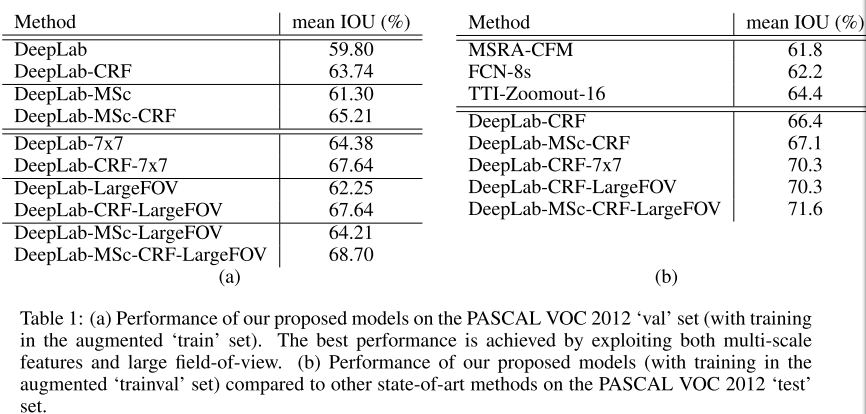

sth: [deeplab v1](https://blog.csdn.net/u011974639/article/details/79134409#t6)

# DeepLab V2

**paper:**[DeepLab: Semantic Image Segmentation with Deep Convolutional Nets, Atrous Convolution, and Fully Connected CRFs](<https://arxiv.org/abs/1606.00915> )`TPAMI2017`

**translate:**

## Abstract

在这项工作中，我们通过深度学习解决了图像语义分割任务，并做了三个主要贡献，实验证明了他具有实质性的实用价值。首先，我们用上采样滤波器或空洞卷积（ **atrous convolution作为密集预测任务中的强大工具**） 突出显示卷积。 Atrous卷积允许我们明确地控制在深度卷积神经网络中计算的特征响应的分辨率。它还使我们能够有效地扩大其领域 在不增加参数数量或计算量的情况下，过滤器的视图可以包含更多的上下文。第二，我们提出了一个**空洞空间金字塔池（ASPP）以多尺度的信息得到更强健的分割结果 **。 SPP并行的采用多个采样率的空洞卷积层来探测，从而以多尺度捕获对象以及图像上下文。第三，我们通过结合DCNN和概率图形的方法来改进对象边界的定位。 DCNN中通常的最大池和下采样的组合实现了平移不变性，但却对定位精度有一定的影响。我们通过将最终DCNN层的响应与完全连接的CRF相结合来克服这个问题，定性和定量显示都提高了定位性能。我们的建议 “DeepLab”系统在PASCAL VOC-2012语义图像分割任务中设置了新的最新技术水平，达到了79.7％的mIOU测试集，并将结果推进到其他三个数据集：PASCAL-Context，PASCAL-Person-Part和Cityscapes。

## Contributions

将DCNN应用在语义分割上，主要有三个问题：降低特征分辨率、多个尺度上存在对象、由于DCNN的内在不变性 定位精度变低。第一个问题因为DCNN连续的最大池化和下采样组合引起的空间分辨率下降，为了解决这个问题，deeplabv2在最后几个最大池化层中除去下采样，使用空洞卷积以分高的采样密度计算特征映射。第二个问题因为在多尺度上存在物体，解决办法是将一张图缩放不同版本，汇总特征或最终预测map得到结果，但这个增加了计算特征响应，需要大量存储空间，受到空间金字塔池化（SPP）启发，提出了一个类似结构，在给定的输入上以不同采样率的空洞卷积并行采样，相当于以多个比例捕捉图像的上下文，称为空洞空间金字塔池化（ASPP）模块。第三个问题涉及到对象分类要求空间变换不变性，这影响了DCNN的空间定位精度，第一个解决办法是在计算最终分类结果时使用跳跃层，将前面的特征融合到一起。DeepLabv2是用采样全连接的CRF增强模型捕捉细节的能力。

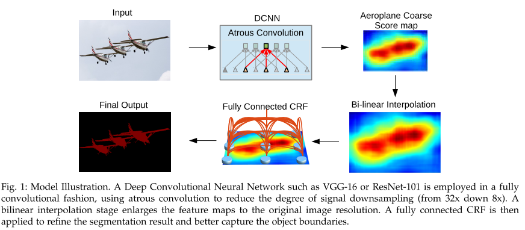

- 输入经过改进的DCNN(带空洞卷积和ASPP模块)得到粗略预测结果，即`Aeroplane Coarse Score map`
- 通过双线性插值扩大到原本大小，即`Bi-linear Interpolation`
- 再通过全连接的CRF细化预测结果，得到最终输出`Final Output`

DeepLabv2的主要优点在于：

速度： DCNN在现代GPU上以8FPS运行，全连接的CRF在CPU上需要0.5s
准确性：在PASCAL VOC2012,PASCAL-Context, PASCALPerson-Part,Cityscapes都获得的优异的结果
简单性：系统是由两个非常成熟的模块级联而成，DCNNs和CRFs

本文DeepLabv2是在DeepLabv1的基础上做了改进，基础层由VGG16换成了更先进的ResNet，添加了多尺度和ASPP模块技术得到了更好的分割结果。

**空洞卷积能在保持计算量和参数量的同时扩大感受野，配合使用金字塔池化方案可以聚合多尺度的上下文信息，可通过空洞卷积控制特征分辨率、配合更先进的DCNN模型、多尺度联合技术、并在DCNN之上集成全连接的CRF可以获取更好的分割结果。**

## Method

**空洞卷积---用于密集特征提取和扩大感受野**

一维情况：

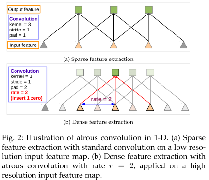</src>

二维情况：

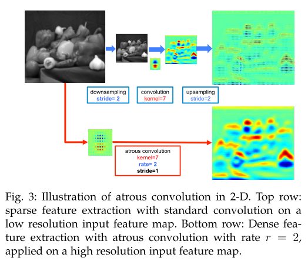</src>

上分支：首先下采样将分辨率降低2倍，做卷积，再上采样得到结果，本质上只是在原图片的1/4内容上做卷积响应。下分支：将全分辨率图像做空洞卷积（采样率为2.核大小与上面卷积核相同），直接得到结果。这样可以计算出整张图片的响应，效果更好。

空洞卷积能够放大滤波器的感受野，速率r引入r−1个零，有效的将感受野从k×k扩展到ke=k+(k−1)(r−1)，而不增加参数和计算量。在DCNN中，常见的做法是混合使用空洞卷积以高的分辨率(理解为采样密度)计算最终的DCNN网络响应。DeepLabv2中使用空洞卷积将特征的密度提升4倍，将输出的特征响应双线性插值上采样8倍恢复到原始的分辨率。

**使用ASPP模块表示多尺度图像**

许多工作证明使用图像的多尺度信息可以提高DCNN分割不同大小物体的精度，我们尝试了两种方法来处理语义分割中尺度变化。

第一种方法是标准的多尺度处理：将放缩输入为不同版本，分别输入到DCNN中，融合得到分数图得到预测结果。这可以显著的提升预测结果，但是这也耗费了大量的计算力和空间。

第二种方法是受到 SPPNet中SPP模块结构的启发。 

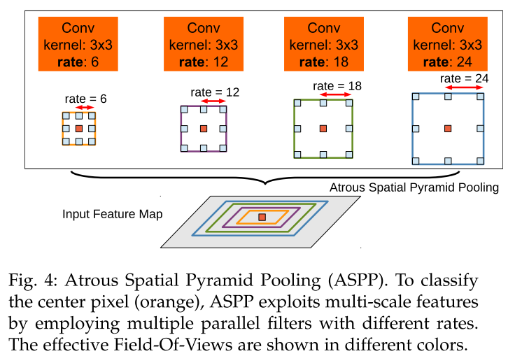

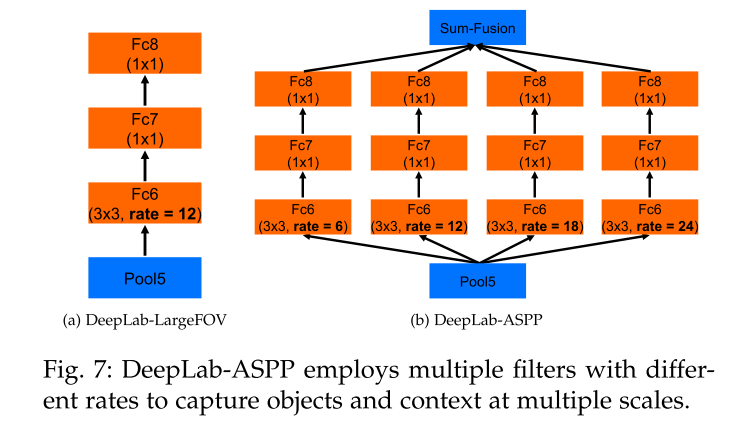

并行采用多个采样率的空洞卷积提取特征。再将特征融合，类似于空间金字塔结构，在同一输入特征图上，并行的使用4个空洞卷积，空洞卷积的配置为r={6,12,18,24}，核大小为3x3，最终将不同卷积层得到的结果融合。

**使用全连接CRF做结构预测用于恢复边界精度**

因为最大池化和下采样组合，DCNN的高层特征具有内在不变性。分类性能和定位准确性之间的折中似乎是固有的。如下图，DCNN可以预测对象存在和粗略的位置，但不能精确的划定其边界,于是将DCNN和全连接的CRF组合到一起。

**先前工作主要两方面**：a.通过将多个卷积层的输出综合来预估边界；b.用超像素来描述，作为一个简单的定位任务。 
**本文观点**：通过全连接条件随机场来作为识别和定位任务的结合，既能准确定位，还能保证一定的准确率。 

**分析：**传统方法，假设空间相邻节点具有相似性，作为一个弱监督的方法去预测边缘相似节点的labels，可有效消除噪声，让分割边缘更加平滑。而DCNN中不是要让特征图更平滑，而是要发掘特征图中的细节，比如边缘部分的分割效果，这时使用short-range CRF反而会带来不好的效果。

**本文使用方法：**在不同特征空间使用两个高斯核函数，第一个bilateral kernel定义所有像素的位置和颜色，第二个核函数只定义像素的位置。 

**作用**：第一个核函数对于位置和颜色相似的像素归为相似的标签；第二个核函数仅保证处理平滑度时保证空间相似性。 
**技巧**：使用高维度过滤器算法可大大加速计算过程。

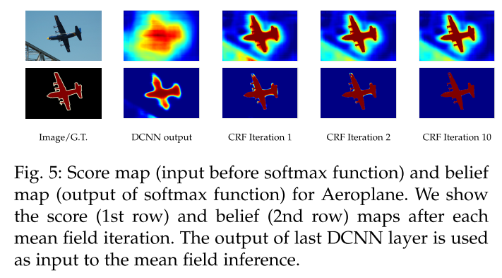

### Experiment

DeepLabv2在PASCAL VOC 2012, PASCAL-Context, PASCALPerson- Part, and Cityscapes四个数据集上做了评估。

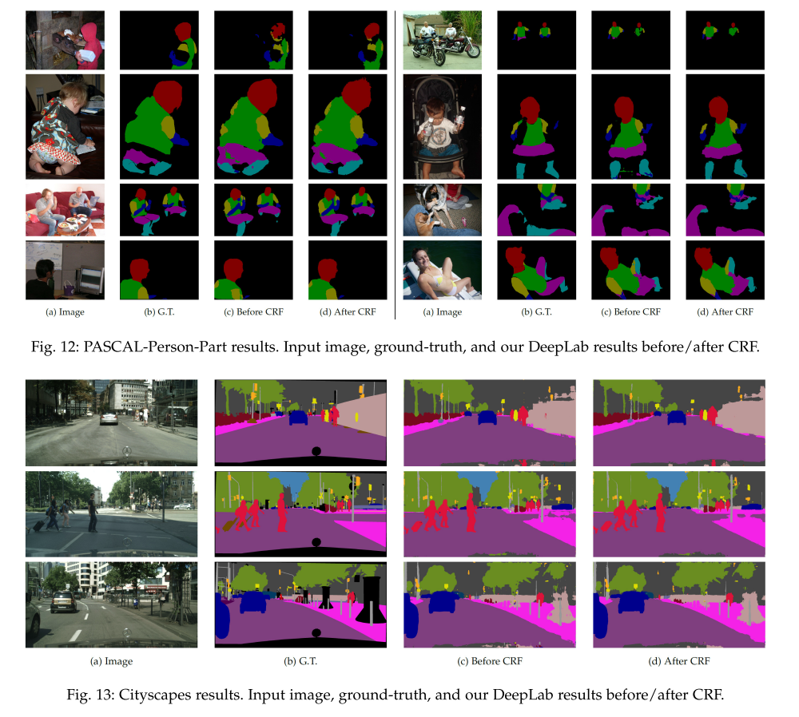

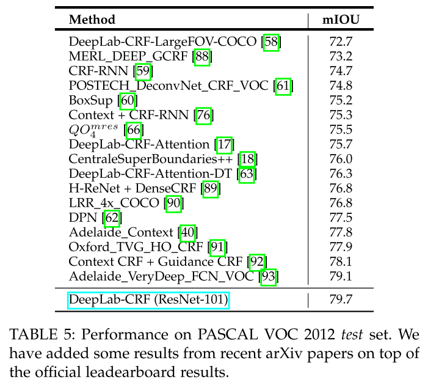

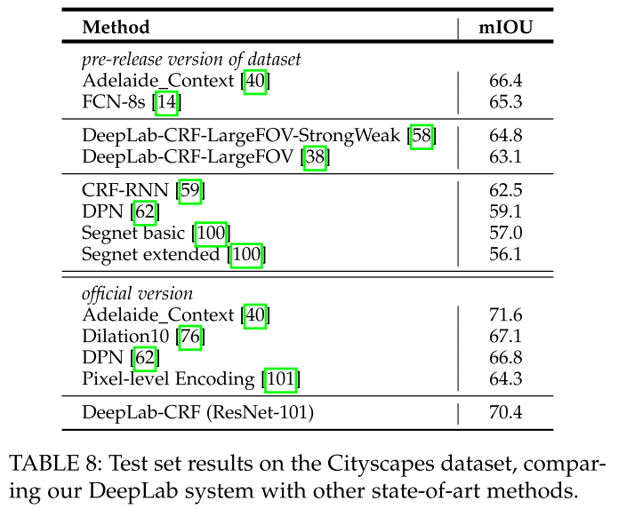

sth good: [deeplabv2](https://blog.csdn.net/u011974639/article/details/79138653)

# DeepLab v3

**paper:** [DeepLabv3:Rethinking Atrous Convolution for Semantic Image Segmentation](https://arxiv.org/abs/1706.05587)  `ECCV2018`

## Abstract

在本文中，我们重新回顾了空洞卷积在语义分割中的应用，这是一种显式调整滤波器感受野和控制网络特征响应分辨率的有力工具。

- 为了解决多尺度分割对象的问题，我们设计了采用级联或并行、多个不同空洞率的空洞卷积模块，以捕获多尺度上下文信息。
- 此外，扩充了先前提出的空洞卷积空间金字塔池化模块，该模块在多尺度上探测卷积特征，可以编码图像级的全局上下文特征，并能进一步提高性能。
- 我们还就实施细节进行了讨论，并分享了我们在训练系统方面的经验。

提出的DeepLab V3比我们以前的DeepLab有了很大的改进，没有经过Dense CRF的后处理，并且在Pascal VOC 2012语义图像分割基准上获得了state-of-art的性能。

## Contributions

语义分割的两大挑战：连续池化操作或卷积操作中的stride导致特征分辨率降低（解决：空洞卷积）、多尺度物体的存在（解决有四种类型）。

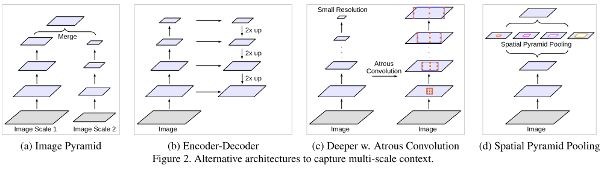

- (a) 图片金字塔，将图片缩放成不同比例，分别输入DCNN，将预测结果融合得到最终输出。这类模型的主要缺点是由于GPU内存，较大/更深的DCNN不方便应用，因此通常在推理阶段应用。
- (b) 编解码结构，将encoder阶段的多尺度特征运用到decoder阶段上来恢复空间分辨率。
- (c) 在原始模型的顶端叠加额外的模块，以捕捉像素间的长距离信息。
- (d) 空间金字塔池化，使用不同采样率和多种视野的卷积核，以捕捉多尺度对象。DeepLabv V2提出了空洞卷积空间金字塔池化(ASPP)，使用不同采样率的并行空洞卷积层才捕获多尺度信息。PSPNet在不同网格尺度上执行空间池化，并在多个语义分割数据集上获得出色的性能。

本文工作：

- 重新讨论了在级联模块和空间金字塔池化的框架下应用空洞卷积，这使得能够有效地扩大滤波器的感受野，将多尺度的上下文结合起来。
- 特别地，提出了具有不同采样率的空洞卷积和BN层模块，并实验了级联或并行方式来部署ASPP模块。
- 讨论了一个重要问题：大采样率的3x3空洞卷积，图像边界处无法捕获远距离信息，会退化为1x1，我们建议在ASPP模块中加入图像级特征。
- 详细介绍了实现的细节，分享了训练模型的经验，还包括一种简单而有效的引导方法，用于处理稀有和精细注释的对象。在Pascal VOC 2012上获得了85.7%的表现，并且我们没有使用CRF后处理。

## Method

**1.空洞卷积应用于密集的特征提取 atrous convolution for dense feature extraction**

**2.深层次的空洞卷积 going deeper  with atous convolution**

首先用级联方式设计了空洞卷积模块，取resnet最后一个block4，把他们级联起来。

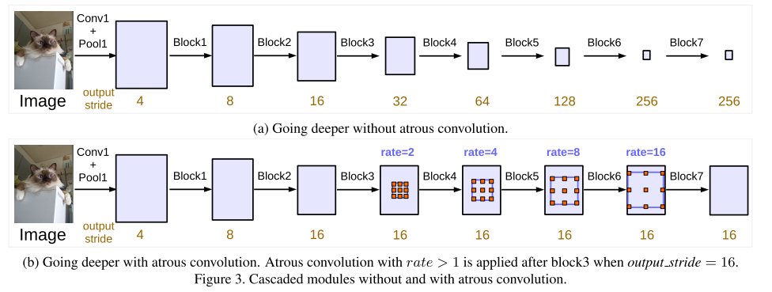

有3个3x3卷积在这些块中除了最后一个块，其余模块中最后的一个卷积步长为2，类似于原来的resnet，引入的stride使得更深的模块更容易捕获长距离的信息，整个图像的特征都可以汇聚在最后一个小分辨率的特征图中。而连续的stride对语义分割有害，会造成细节信息丢失，因此使用不同采样率的空洞卷积。

**3.ASPP atrous spatial pyramid pooling**

deeplabv2提出的ASPP在特征顶层并行应用了四个具有不同采样率的空洞卷积，ASPP灵感来源于空间金字塔池化，表明在不同尺度上采样特征是有效的，V3中加入了**BN**。不同采样率的ASPP能有效地捕捉多尺度信息，但是随着采样率的增加，滤波器的有效权重（权重应用于特征区域，而不是填充0的部分）逐渐变小。在比率值已经接近于特征映射大小的极端情况下，这时的3×3卷积核已经无法捕获整个图像上下文信息，而是退化为一个简单的1×1卷积核，因为此时只有中心点的权重才是有效的。

为了克服这个问题，并将全局上下文信息纳入模型，我们采用了**图像级特征**。具体来说，我们在模型的最后一个特征图采用全局平均池化，将重新生成的图像级别的特征提供给带256个滤波器(和BN)的1×1卷积，然后双线性插值将特征提升到所需的空间维度。

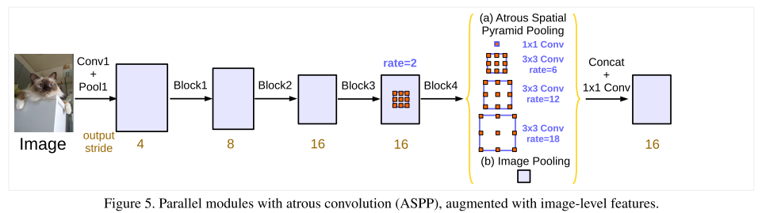

最终ASPP包括(a)一个1x1的卷积和3个3x3的rate=（6，12，18）的空洞卷积，滤波器数量都为256，包含BN，还有(b)图像级特征。当output_stride=8（输入图像的分辨率与最终输出分辨率的比值）时，所有的采样率rate都乘2。然后将所有分支的特征图通过一个1×1卷积(有256个滤波器和BN)concatenate起来，送入最后的1×1卷积以产生最终分数。

## Experiment

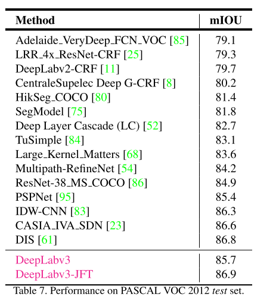

sth: [deeplabv3](https://blog.csdn.net/u011974639/article/details/79144773)

# Deeplab V3+

paper: [deeplab v3+](https://arxiv.org/abs/1802.02611)

code: [deeplab v3+](<https://github.com/tensorflow/models/tree/master/research/deeplab>)

## Abstract

空间金字塔池化模块或编码解码结构用于DCNN的语义分割任务中，前面的工作能够通过多个采样率rate和多个有效感受野的卷积和池化操作检测输入的特征，来编码多尺度的上下文信息。而后面的工作，可以通过逐渐恢复空间来捕获更清晰的对象边界信息。我们的工作建议结合两种方法的优势，提出Deeplab V3+，在deeplab v3的基础上添加一个简单有效的解码器模块，来调整分割结果尤其是边界。我们进一步探索Xception模型，并将深度可分离卷积应用于ASPP和解码器模块，从而产生了更快更强的编码器-解码器模块。我们展示了拟议模型在PASCAL VOC 2012和Cityscapes上的有效数据集，无需任何后处理即可实现89.0％和82.1％的测试集性能。

## Contributions

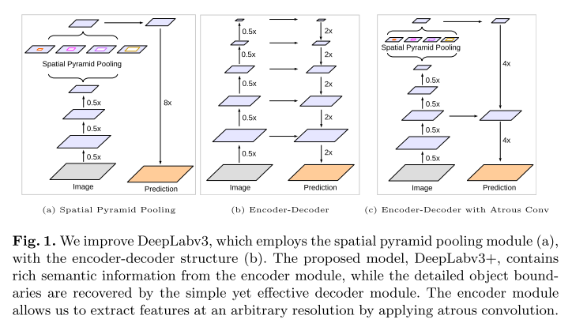

回顾语义分割的两种结构：空间金字塔池化和编解码结构。(a)可以池化不同分辨率的特征图来捕获丰富的上下文信息，(b)则可以获得锋利的边界，V3+通过采用编解码结构在V3中加入简单的解码模块来改善物体边缘的分割结果，(c)先上采样4倍再与编码器中的特征图concatenate，最后再上采样4倍恢复到原始图像大小。

除此之外，还采用Xception作为encoder，再ASPP和decoder中应用depth-wise separable convolution得到更快精度更高的网络。

##  Methods

**空洞卷积**

**深度可分离卷积**：将标准卷积分解成一个深度卷积和一个逐点卷积，大大降低计算复杂度。深度卷积对每个输入通道独立的进行空间卷积，而逐点卷积用于组合深度卷积的输出。

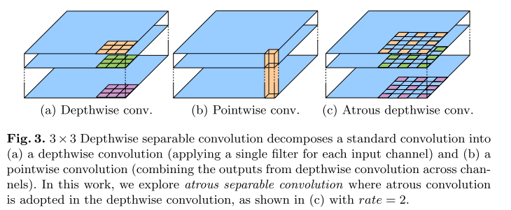

**DeepLabv3 as encoder**:对于分类任务outpout stride=32，对于语义分割任务output stride=16/8，通过去除最后1个/2个块中的stride并相应的应用空洞卷积来进行更密集的特征提取。此外，V3应用不同采样率的空洞卷积核图像级特征来探测多尺度的卷积特征，这样增强ASPP模块。将所得特征图与1x1卷积得到的256个通道的特征图concatenate。

**decoder**：首先以4倍的双线性上采样，然后与具有相同空间分辨率的网络主干的相应低级特征（如conv2）连接在一起，用另一个1x1卷积减少通道数量，因为相应的低级别特征通常包含大量通道。在concatenate之后用3×3的卷积改善特征，最后双线性上采样4倍恢复到原始图像大小。

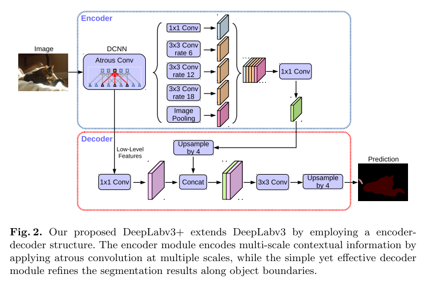

**Modified aligned xception：**

采用的Xception模型为MSRA team提出的改进的Xception，叫做Aligned Xception，并做了几点修改：

1. 网络深度与Aligned Xception相同，不同的地方在于不修改entry flow network的结构，为了快速计算和有效的使用内存。
2. 所有的max pooling操作替换成带stride的separable convolution，这能使得对任意分辨率的图像应用atrous separable convolution提取特征。
3. 在每个3×3的depath-wise convolution后增加BN层和ReLU。

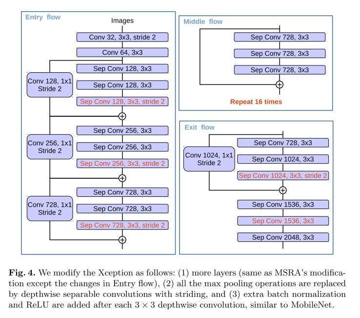

**原始Xception结构：**

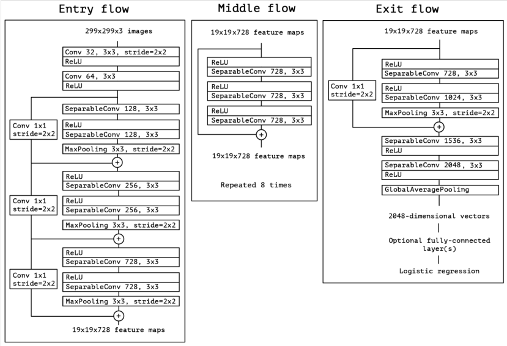

decoder的设计主要考虑三点：

1. 1×1卷积的通道数。最后采用了48。
2. 用来获得更锋利的边界的3×3的卷积。最后采用了2个3×3的卷积。在卷积类型方面，实验发现2个3×3的卷积效果要比1个或者3个3×3的卷积，或者卷积核为1×1的效果好。
3. 所使用的encoder的低级特征。当同时使用conv2和conv3的特征时，先上采样2倍与conv3的特征concat，然后再上采样2倍与conv2的特征concat。这种结构并没有观察到显著的改进。因此最后只利用了conv2的特征。

## Experiment

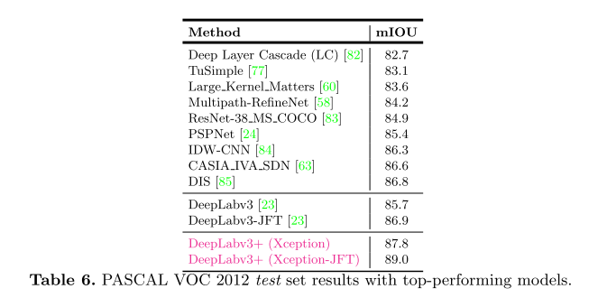

> DeepLab V3+综合了DeepLab、PSPNet和Encoder-Decoder，得到的效果是最好的，是思想的集大成者.

sth:[v3+](https://zhangbin0917.github.io/2018/06/03/Encoder-Decoder-with-Atrous-Separable-Convolution-for-Semantic-Image-Segmentation/)