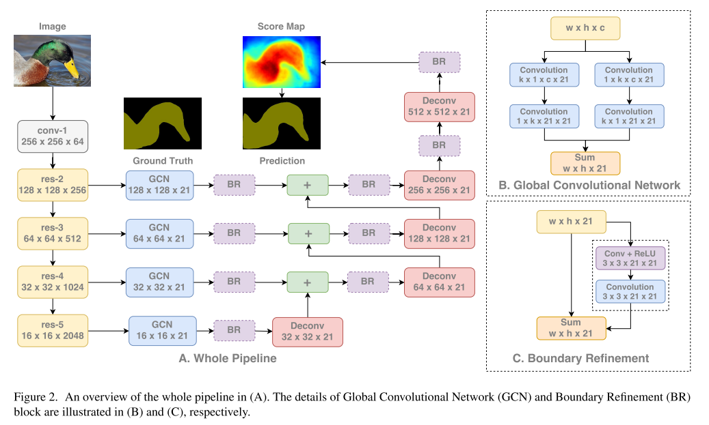

# RefineNet

**paper:**[RefineNet: Multi-Path Refinement Networks for High-Resolution Semantic Segmentation](<https://arxiv.org/abs/1611.06612>)`CVPR (2017)`  Submitted on 20 Nov 2016

**code：**[RefineNet](https://github.com/eragonruan/refinenet-image-segmentation)

## Abstract

最近，DCNN在对象检测和语义分割领域都表现很好，然而，重复的卷积中的stride或池化下采样操作会显著的减少原图像的分辨率。我们提出一个生成式的多路径增强网络，在保证高分辨率的预测时，借助远距离的残差连接，尽可能的利用下采样过程中的所有信息。这样通过前期卷积操作得到的细粒度特征可以直接提炼更深层捕获的高层语义特征，RefineNet的独立组建基于残差连接，可以进行端到端的训练。我们还引入链式残差池化操作，以一种高效的方式捕捉更加丰富的背景上下文信息。最终结果在7个数据集上达到最佳结果。

## Contributions

该文主要是利用所有层的特征信息，较高的网络层利于图片区域的类别识别，低层网络提取的可视化的特征利于高分辨率的更多细节信息的生成。

（1）提出了多路增强网络，从而利用多个层次网络层的特征提取用于高分辨率的抽象信息。该网络利用递归的方式增强低分辨率（粗糙）的语义特征来产生高分辨率的分割特征图。

（2）该级联网络可以进行端到端的训练，可以用于更好的预测。此外，RefineNet的所有组件都由残差连接，梯度在训练过程中可以通过长短距离的残差连接进行高效的端到端的传播。

（3）该文提出了一种新的网络组建-链式残差池化，可以从图片中较大区域捕捉背景上下文信息。该模块中不同大小的窗口得到的池化特征通过残差连接和可学习的权重进行融合。

使用空洞/带孔卷积的方法也有弊端。由于空洞卷积需要大量高分辨率特征图，因此其计算成本高昂，且占用大量内存。这妨碍了高分辨率预测的计算。例如，DeepLab 的预测结果大小是原始输入图像的 1/8。因此，这篇论文提出使用编码器-解码器结构。编码器是 ResNet-101 模块，解码器是 RefineNet 模块，该模块融合了编码器中的高分辨率特征和先前 RefineNet 模块中的低分辨率特征.每一个 RefineNet 模块都有两个组件，一个组件通过对低分辨率特征进行上采样来融合多分辨率特征，另一个组件基于步幅为 1、5 x 5 大小的重复池化层来获取背景信息。这些组件遵循单位映射的思想，采用残差连接设计。

## Method

**1.多路增强：multi-path refinement**

通过远距离的残差连接来获得不同尺寸的特征图用于高分辨率的预测。refinenet 提出一种通用的方式将粗糙的高级别的分割特征与细粒度低级别的特征进行融合进而产生高分辨率的分割特征图。从ResNet的block4开始，将RefineNet4与ResNet对用的block4进行直接连接。RefineNet4只有一个输入，RefineNet4后接一系列的卷积层用于调整与训练的ResNet权重，下一阶段，RefineNet4的输出与ResNet3的输出作为RefineNet3的2通路输入。RefineNet3的作用时利用从ResNet block3中的较高分辨率的feature map增强RefienNet4输出的低分辨率的feature map。如此重复。最终生成的高分辨率的feature map送入一个密集的soft-max分类层。产生用于预测的score map。得到的score map通过基于双线性插值进行上采样得到与原图大小相同的score map。该网络的一个重要部分在于在ResNet block与RefineNet之间引入了长距离的残差连接。在前向过程中，残差连接可以将低层编码的可视化细节信息用于增强粗糙的高级别的feature map。训练时，这些连接可以将梯度直接传递到前端的卷积层中，可以有效的端到端训练。

**2.refinenet**

残差卷积单元（RCU）：包含一系列可调整的卷积集合，用于微调预训练权重。最终每个输入通路经过两个RCU模块（移除了BN）。

多尺度融合模块：所有通路的输入通过一个多尺寸融合模块得到一个高分辨率的feature map。该模块首先用卷积调整输入，生成相同特征维度，通过上采样将所有尺寸调整为输入中最大的尺寸。最终，所有得到的feature map通过相加融合得到最终的feature map。对于输入特征通过卷积的调整可以将不同通路的特征值进行适当的调整，利于后面的特征融合。如果只有一个通路特征，则不会发生变化，直接穿过block。

链式残差池化：该模块从较大的图片区域中捕捉背景上下文信息。利用可学习的权重，通过不同窗口大小的卷积池化操作并将其特征进行融合高效的实现特征池化操作。该组件由一系列不同的pooling block连接组成，每个pooling block由一层池化和卷积组成。每个block的输入是前一个block的输出，因此，当前的block可以再利用前一层block得到的结果，不使用大尺寸窗口的条件下可以访问到更多区域的信息。本文使用了两个pooling block stride为1组成该链式残差池化模块。所有pooling blocks 输出的结果通过残差连接进行加和融合。该block中每一层池化后接一个卷积操作作为一个融合的权重层。从而在训练过程中，卷积层会调整池化block的重要性（通过卷积的权重参数调整）。

输出卷积：每个RefineNet的最后一块是另一个RCU。因此，在每个RefineNet中存在三个RCU组块。为了反应RefineNet-1的block上的效果，在softmax预测的前面添加了两个额外的RCU模块。这里对多通路的融合特征进行非线性操作生成后续进行预测的特征。在经过此模块后，特征的维度并未发生变化。

**3.refinenet中的独立映射**

 RefineNet中的所有卷积组件受ResNet启发，并一一对应进行映射。

## Experiment

 
</src>

 **Variants of cascaded RefineNet**

sth: [refinenet trans](https://www.cnblogs.com/fourmi/p/9983019.html)

net graphs: [net](https://github.com/guosheng/refinenet/tree/master/net_graphs)

# PSPNet

paper:[Pyramid Scene Parsing Network](https://arxiv.org/abs/1612.01105)`CVPR2017`  Submitted on 4 Dec 2016 

code: [PSPNet](https://github.com/hszhao/PSPNet)

## Abstract

对于不受限的开放词汇和不同场景，场景解析具有挑战性。本文我们通过金字塔池模块和提出的金字塔场景解析网络(PSPNet)，聚合了基于不同区域的上下文信息，来挖掘全局上下文信息的能力。我们的全局先验表示有效地在场景解析任务中产生高质量的结果，而PSPnet提出了一个优秀的像素级预测框架。所提出的方法在各种数据集上实现了最先进的性能。它首次出现在ImageNet场景解析挑战2016，PASCAL VOC 2012中基准和城市景观基准。单个PSPNet在PASCAL上产生了85.4％mIoU准确度的新记录，城市景观的VOC 2012和准确度为80.2％。

## Contributions

为了准确的感知场景，知识图谱要依赖场景上下文的先验信息，FCN缺乏合适的策略来利用全局场景中的类别线索。为了结合适当的全局特征，提出了金字塔场景解析网络，除了传统的空洞卷积FCN用于像素预测，我们将像素级特征扩展到专门设计的全局金字塔池化中，局部和全局的线索共同作用以使最终的预测更加可靠。

- 在基于FCN的像素预测框架中，我们提出了一种金字塔场景解析网络
- 我们为深层的ResNet开发了一种有效的优化策略，基于深度监督的loss
- 我们为最先进的场景解析和语义分割构建了一个实用的系统，其中包含了所有关键的实现细节

## Method

#### **1.Important observation**

通过检查ADE20K 数据集提供的FCN baseline预测结果，总结了复杂场景解析中容易出现的几个问题：

- **Mismatched Relationship:**上下文关系对理解复杂场景普遍十分重要，缺乏收集上下文增加了分错的可能。
- **Confusion Categories**： ADE20K数据集中有许多类标签对十分难以区分。
- **Inconspicuous Classes**：场景中往往包含任意大小的对象/东西。

综上所述，许多错误都部分或全部与上下文关系和不同感受野的全局信息相关。因此，一个具有合适全局场景级先验的深层网络可以大大提高场景解析的性能。

#### **2. Pyramid Pooling Module**

在SPPNet，金字塔池化生成的不同层次的特征图最终被flatten并concate起来，再送入全连接层以进行分类。为了进一步减少不同子区域间上下文信息的丢失，我们提出了一个有层次的全局先验结构，包含不同尺度、不同子区域间的信息。

**金字塔池化模块可以融合四种不同金字塔尺度的特征**

- 红色突出显示的是最粗糙级别的单个全局池化bin输出
- 下面的金字塔分支将特征映射划分为不同的子区域，并形成针对不同位置的集合表示
- 金字塔池化模块中不同级别的输出包含不同大小的特征映射
- 为了维护全局特性的权重，如果金字塔共有N个级别，则在每个级别后使用1×1卷积，将对应级别的通道数量降为原本的1/N
- 然后通过双线性插值直接对低维特征图进行上采样，得到与原始特征映射相同尺寸的特征图
- 最后，将不同级别的特征concate起来，作为最终的金字塔池化全局特性

金字塔层级的数量和每一层的大小都可以调整，尺寸大小与输入金字塔池化层的特征映射大小有关，该结构通过在几个stride中进行不同尺寸的池化来对不同的子区域实现抽样，多个层级的核尺寸应该保持合理的差距。我们的金字塔池化模块是一个四层结构，bin大小为1×1，2×2，3×3和6×6。

#### 3.**Network Architecture**网络结构

输入图像后，使用预训练的带空洞卷积ResNet提取特征图。最终的特征映射大小是输入图像的1/8，如图3(b)所示在特征图上，我们使用(c)中的金字塔池化模块来收集上下文信息。使用4层金字塔结构，池化内核覆盖了图像的全部、一半和小部分，它们被融合为全局先验信息。在(c)的最后部分将之前的金字塔特征映射与原始特征映射concate起来，再进行卷积，生成(d)中的最终预测图。

- PSPNet为像素级场景解析提供了有效的全局上下文先验
- 金字塔池化模块可以收集具有层级的信息，比全局池化更有代表性
- 在计算量方面，我们的PSPNet并没有比原来的空洞卷积FCN网络有很大的增加
- 在端到端学习中，全局金字塔池化模块和局部FCN特征可以被同时训练

#### 4.Deep supervision for resnet-based FCN

    

经过深度预训练的网络能带来良好的性能，然而网络的深度增加会带来额外的优化难度，resnet 在每个块中加入了skip-connect，我们提出了一个附加loss，可以监督初始结果，并用最终loss学习残差，深层网络的优化被分解为两个问题。

除了使用Softmax loss来训练最终分类器的的主分支外，在第四阶段后再使用另一个分类器，即res4b22残差块。这两个loss同时传播，通过各自前面所有层。辅助loss有助于优化学习过程，主loss仍是主要的优化方向。增加权重，以平衡辅助loss。在测试阶段，放弃辅助分支，只使用优化好的主分支来进行最终的预测。这种对基于ResNet的FCN进行深度监督的训练策略在不同的实验环境下是非常有用的，与预训练的ResNet模型也可以很好结合。体现了这种学习策略的普遍性。

## **Experiments**

    

    

网络结构在resnet后面添加：

sth: [psp](https://zhuanlan.zhihu.com/p/42719930)

# ICNet

paper: [ICNet for Real-Time Semantic Segmentation on High-Resolution Images](https://arxiv.org/abs/1704.08545)`ECCV 2018`

## Abstract

我们专注于实时语义分割任务，像素级的预测有一个基本的困难是大量的计算量，我们提出图像级联网络，在适当的标签指导下结合了多分辨率分支来应对这一挑战。我们提供了对于框架的深度分析，并引入级联特征融合单元，以快速实现高质量的分割。我们的系统在单个GPU卡上实现事实推断，并在具有挑战性的数据集上评估质量良好like Cityscapes, CamVid and COCO-Stuff

## Contributions

本文的贡献是利用低分辨率图像的处理效率和高分辨率图像的高推断质量，并提出图像级联框架来逐步细化分段预测。这个想法是首先让低分辨率图像通过完整的语义感知网络来获得粗略的预测图。然后提出的级联融合单元引入中高分辨率图像特征，并逐步改进粗略语义映射。

- 提出了图像级联网络（ICNet），该网络利用低分辨率的语义信息以及高分辨率图像的细节。
- ICNet实现了5倍以上的推理加速，并将内存消耗减少了5倍以上。
- 提出的快速语义分割系统可以以30fps的速度以1024×2048的分辨率运行，同时实现高质量的结果。

## Method

#### 1.Image Cascade Network

除了图像分辨率，网络的宽度（输入图像通道数）和卷积核数量（输出图像通道数）也影响着运行时间，比如在stage4和stage5特征图的空间分辨率一样，但是stage5 的运行时间是stage4的4倍，因为stage5的卷积核数量是stage4的两倍。

ICNet架构采用级联的图像输入（高中低分辨率下采样2倍和4倍），低分辨率分支来获取语义信息，将原图1/4大侠的图像输入到PSPNet中，降采样率为8，产生了原图1/32的特征图。**中分辨率和高分辨率的分支进行粗糙预测的恢复和细化**，图2中部和底部分支，获得高质量的分割，可以减少中部分支和下部分支的参数数目。虽然最上面的分支导致了细节缺失和边界模糊，但它已经获得了大部分语义信息。高分辨率分支采用轻加权的CNNs(绿色虚线框，底部分支和中部分支)；不同分支输出的特征图采用级联特征融合单元进行融合，训练时接受梯级标签监督。

#### 2.cascade feature fusion

为了连接不同分辨率输入的级联特征，我们提出了级联特征融合单元，输入包含三部分，两个特征图和一个监督标签。首先在F1上应用采样率2的上采样通过线性插值生成相同大小的F2，然后应用C3x3x3 rate=2的空洞卷积层去调整上采样特征，生成特征为C3xH2xW2。与反卷积相比，使用空洞卷积上采样只需要小卷积核就能获得相同大小的感受野。要达到相同的感受野反卷积需要更大的卷积核，需要更多的计算量。F2需要一个C3x1x1投影卷积使其输出与F1的输出具有相同的通道数，使用两个BN来标准化这两个已处理的特征，然后使用一个元素相加层和一个RELU得到C3xH2xW2维度的特征融合F2`，为了强化F1的学习，对F1的上采样特征使用了一个辅助的标签指导。

    

#### 3.Cascade label guidance

为了提高每个分支的学习过程，采用级联标签指导策略。在每个分支中添加一份损失权重，将每个分支变成加权的Softmax交叉熵损失,L = λ1L1 + λ2L2 + λ3L3。再优化这个损失函数。测试阶段，不使用低和中阶段的指导，只保留高分辨率分支。这一策略使梯度优化更加流畅，便于训练。由于每个分支具有更强的学习能力，最终的预测图不受任何一个分支的支配。

 minimize the loss function：

    

#### **4. Structure Comparison and Analysis**

ICNet级联结构的不同之处，下图是语义分割系统的典型结构。以前的框架针对高分辨率输入都有相对密集的计算过程，而在ICnet的级联结构中，只有低分辨率的输入被送入了heavy CNN中，得到了粗糙的语义预测又大大减少计算量。高分辨率的输入用来恢复和完善模糊边界和丢失的细节，只被轻量级的CNN处理。新引入的级联特征融合单元和级联标签指导策略集成了中、高分辨率特征，逐步细化了粗糙的语义图。

#### Experiment

the end of the net : 

sth: [icnet trans](https://www.jianshu.com/p/8b4c8e7beba4)

[icnet1](https://zhuanlan.zhihu.com/p/31376919)   [icnet2](https://zhuanlan.zhihu.com/p/43198935)

# Large Kernel Matters

paper: [Large Kernel Matters -- Improve Semantic Segmentation by Global Convolutional Network](https://arxiv.org/abs/1703.02719)

## Abstract

现在网络结构设计的趋势是小卷积核，因为同样计算复杂度下小卷积核更有效。但是在语义分割领域，我们需要提高密集像素级的预测，我们发现大卷积核和有效的感受野在分类和定位任务中扮演重要的角色。按照我们的设计原则，我们提出一个全局卷积网络（GCN），来解决分类和定位的问题。我们也建议使用基于残差的边界调整来优化物体边界。我们的方法 82.2% (vs 80.2%) on PASCAL VOC2012 dataset and 76.9% (vs 71.8%) on Cityscapes获得最佳结果。

## Contributions

语义分割中分类和定位任务本身是矛盾的，对于分类任务模型需要具有不变性，以适应目标的各种形式如平移和旋转；但是对于定位任务，模型应该对变换敏感，能够精确定位每个像素的语义类别。

- 从定位的角度看，模型结构应该是完全卷积的，以保持定位性能，不应该使用全连接或全局池化层，因为这些层会丢弃位置信息。
- 从分类的角度看，网络结构应该采用较大的核大小，使特征映射和逐像素分类器之间能够紧密地连接起来，以增强应对变换的能力。

    

**类FCN结构作为基本框架，GCN用于生成语义得分图**

- 为了使全局卷积更具实用性，我们采用了大卷积核的对称分离卷积，以降低模型参数和计算量。
- 为了进一步提高目标边界附近的定位能力，我们引入了边界细化模块。它可以将边界对齐建模为残差结构，如图2.C所示。不同于CRF式的后处理，我们的边界细化模块被集成到了网络中，可以端到端的训练。

本文的主要贡献如下：

- 针对语义分割任务提出了GCN网络，能够同时处理“分类”和“定位”问题
- 提出了一种边界细化模块，进一步提高了对象边界附近的定位性能
- 在两个标准基准上取得了state-of-the-art的结果，PASCAL VOC 2012(82.2%)、Cityscapes(76.9%)

**Context Embedding**

- Zoom-out提出了一个手工构建的层次化上下文特性
- ParseNet添加了一个全局池化分支来提取上下文信息
- Dilated-Net在score map后添加了几个层，以嵌入多尺度上下文
- Deeplab V2使用ASPP，通过结合卷积层，直接从特征映射中组合上下文信息

**Resolution Enlarging**

- FCN使用反卷积来提高小尺寸分数图的分辨率
- DeconvNet和SegNet引入了反池化操作和一个glass-like(感觉应该翻成“小蛮腰状”)的网络来学习上采样过程
- LRR认为上采样特征图要好于上采样分数图
- Deeplab和Dilated-Net没有学习上采样的过程，而是使用空洞卷积来直接增加小尺寸特征映射的空间大小，从而得到更大尺寸的分数映射

**Boundary Alignment**

- 在众多的方法中，条件随机场(ConditionalRandomfield，CRF)因其良好的数学结构而被广泛采用
- Deeplab直接使用denseCRF，作为CNN的一种后处理方法
- CRF as RNN将denseCRF建模为类RNN的结构，并提出了一个端到端的算法，但它在Permutohedral Lattice格点上引入了过多的CPU计算
- DPN对denseCRF进行了一个近似，将整个算法流程全部迁移到了GPU上
- Adelaide将CRF和CNN深深地结合在一起，CRF中手工设计的势能函数被卷积和非线性层取代

与以往的工作不同，我们认为语义分割可以看成大尺寸特征图上的分类任务，并且我们的全局卷积网络能够满足分类和定位的要求。

## Method

在深度学习中，分类和定位的差异导致两类模型有很大的差异。对于分类，大多数现代框架，如AlexNet，VGG、 GoogleNet或ResNet这种“锥形”网络，如图1.A中所示：特征是从相对较小的隐藏层中提取出来的，在空间维度上来说是粗糙的，分类器通过全连接层或全局池化层与feature map相连。这使得特征对局部扰动和不同类型的输入变化具有鲁棒性。而对于定位，我们需要相对较大的feature map来编码更多的空间信息。这就是为什么大多数语义分割框架，如FCN、DeepLab、Deconv-Net，采用如图1.B所示的“桶形”网络。通过反卷积，反池化和空洞卷积等技术来生成高分辨率的特征映射，然后将分类器连接起来。对每个feature map上的空间位置进行分类，生成像素级语义标签。‌

paper:[Learning a Discriminative Feature Network for Semantic Segmentation](https://arxiv.org/abs/1804.09337) `CVPR2018`

