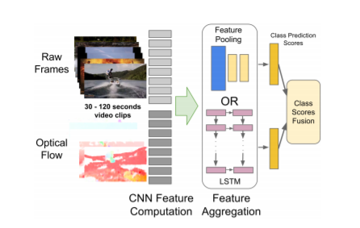

# Paper:Beyond Short Snippets: Deep Networks for Video Classification,arXiv:1503.08909v2 [cs.CV] 13 Apr 2015

## Abstract

Convolutional neural networks (CNNs) have been extensively applied for image recognition problems giving stateof-the-art results on recognition, detection, segmentation
and retrieval. In this work we propose and evaluate several
deep neural network architectures to combine image information across a video over longer time periods than previously attempted. We propose two methods capable of handling full length videos. The first method explores various
convolutional temporal feature pooling architectures, examining the various design choices which need to be made
when adapting a CNN for this task. The second proposed
method explicitly models the video as an ordered sequence
of frames. For this purpose we employ a recurrent neural
network that uses Long Short-Term Memory (LSTM) cells
which are connected to the output of the underlying CNN.
Our best networks exhibit significant performance improvements over previously published results on the Sports 1 million dataset (73.1% vs. 60.9%) and the UCF-101 datasets
with (88.6% vs. 88.0%) and without additional optical flow
information (82.6% vs. 73.0%).

### Contribution

CNN在静态图像的处理中大显神通，但是在处理视频信息时，却是力有不逮。这主要是有两个原因。\
1.CNN处理静态图像的时候丢失了许多视频帧之间的暂态信息。\
2.处理一个短视频也需要许多计算资源。\
基于此，本论文将CNN与LSTM结合在一起对视频数据进行特征提取，单帧的图像信息通过CNN获取特征，然后将CNN的输出按时间顺序通过LSTM，
最终将视频数据在空间和时间维度上进行了特征表达。在这个过程中引入了光流这一个概念，为以后视频处理提供了范式。

# Paper：Salient Object Detection: A Discriminative Regional Feature Integration Approach,arXiv:1410.5926v1 [cs.CV] 22 Oct 2014

## Abstract

Salient object detection has been attracting a lot of interest, and recently various heuristic computational models have
been designed. In this paper, we formulate saliency map computation as a regression problem. Our method, which is based
on multi-level image segmentation, utilizes the supervised learning approach to map the regional feature vector to a saliency
score. Saliency scores across multiple layers are finally fused to produce the saliency map. The contributions lie in two-fold.
One is that we propose a discriminate regional feature integration approach for salient object detection. Compared with existing
heuristic models, our proposed method is able to automatically integrate high-dimensional regional saliency features and choose
discriminative ones. The other is that by investigating standard generic region properties as well as two widely studied concepts
for salient object detection, i.e., regional contrast and backgroundness, our approach significantly outperforms state-of-the-art
methods on six benchmark datasets. Meanwhile, we demonstrate that our method runs as fast as most existing algorithms.

### Contribution

显性图计算一直是深度学习领域中比较有挑战性的问题，起初是为了预测人在一张图片上的视觉关注区域，而后扩展到预测会包含显性物体的区域。
在本论文中，计算问题被转化为回归问题，采用的方法是基于多层次的图像分割，并利用监督学习方法将区域特征向量映射为一个显著性分数。
![image](image/
