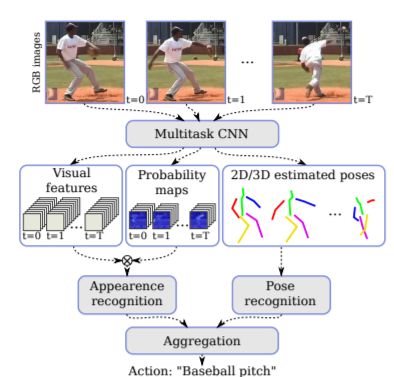

# Paper:2D/3D Pose Estimation and Action Recognition using Multitask Deep Learning,arXiv:1802.09232v1

## Abstract

Action recognition and human pose estimation are
closely related but both problems are generally handled
as distinct tasks in the literature. In this work, we propose a multitask framework for jointly 2D and 3D pose
estimation from still images and human action recognition from video sequences. We show that a single architecture can be used to solve the two problems in an efficient way and still achieves state-of-the-art results. Additionally, we demonstrate that optimization from end-toend leads to significantly higher accuracy than separated
learning. The proposed architecture can be trained with
data from different categories simultaneously in a seamlessly way. The reported results on four datasets (MPII,
Human3.6M, Penn Action and NTU) demonstrate the effectiveness of our method on the targeted tasks.

### Contribution
\
本文利用作者设计的多任务CNN网络，既可处理姿态识别，也可处理外形识别。其中姿态估计通过对主要关节以及人的
肢体运动信息的提取,实现了较好姿态估计和行为识别的效果。

### Datasets

MPII、Human3.6M、Penn Action、NTU

# Paper：Relation Networks for Object Detection，arXiv:1711.11575v2

## Abstract
Although it is well believed for years that modeling relations between objects would help object recognition, there
has not been evidence that the idea is working in the deep
learning era. All state-of-the-art object detection systems
still rely on recognizing object instances individually, without exploiting their relations during learning.
This work proposes an object relation module. It processes a set of objects simultaneously through interaction
between their appearance feature and geometry, thus allowing modeling of their relations. It is lightweight and
in-place. It does not require additional supervision and is
easy to embed in existing networks. It is shown effective on
improving object recognition and duplicate removal steps in
the modern object detection pipeline. It verifies the efficacy
of modeling object relations in CNN based detection. It
gives rise to the first fully end-to-end object detector

# Contribution
该文章主要是在detection当中引入了relation的信息，在神经网络中对object的relations进行建模。主要贡献点有两条:

提出了一种relation module，可以在以往常见的物体特征中融合进物体之间的关联性信息，同时不改变特征的维数，能很好地嵌进目前各种检测框架，提高性能;

在上面的基础上，提出了一种特别的代替NMS的去重模块，可以避免NMS需要手动设置参数的问题。
