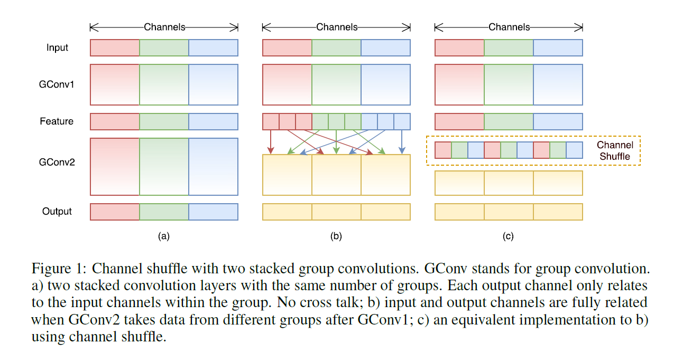

## Paper Readings of Jacky Ma

<!-- TOC -->

- [2018/11/28 -- 1. ShuffleNet: An Extremely Efficient Convolutional Neural Network for Mobile Devices](#1-ShuffleNet-An-Extremely-Efficient-Convolutional-Neural-Network-for-Mobile-Devices)

<!-- /TOC -->

### 1. ShuffleNet: An Extremely Efficient Convolutional Neural Network for Mobile Devices
***Keywords: Mobilenet, CNN***
+ Abstract
We introduce an extremely computation-efficient CNN architecture named ShuffleNet, which is designed specially for mobile devices with very limited computing power (e.g., 10-150 MFLOPs). The new architecture utilizes two new operations, pointwise group convolution and channel shuffle, to greatly reduce computation cost while maintaining accuracy. Experiments on ImageNet classification and MS COCO object detection demonstrate the superior performance of ShuffleNet over other structures, e.g. lower top-1 error (absolute 7.8%) than recent MobileNet [12] on ImageNet classification task, under the computation budget of 40 MFLOPs. On an ARM-based mobile device, ShuffleNet achieves ∼13× actual speedup over AlexNet while maintaining comparable accuracy.
+ 摘要
论文介绍一个效率极高的CNN架构ShuffleNet，专门应用于计算力受限的移动设备。新的架构利用两个操作：逐点群卷积(pointwise group convolution)和通道混洗(channel shuffle),与现有先进模型相比在类似的精度下大大降低计算量。在ImageNet和MS COCO上ShuffleNet表现出比其他先进模型的优越性能。
+ 创新点/性能等
略

+ 个人评价
略
