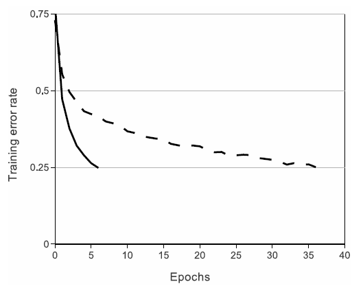
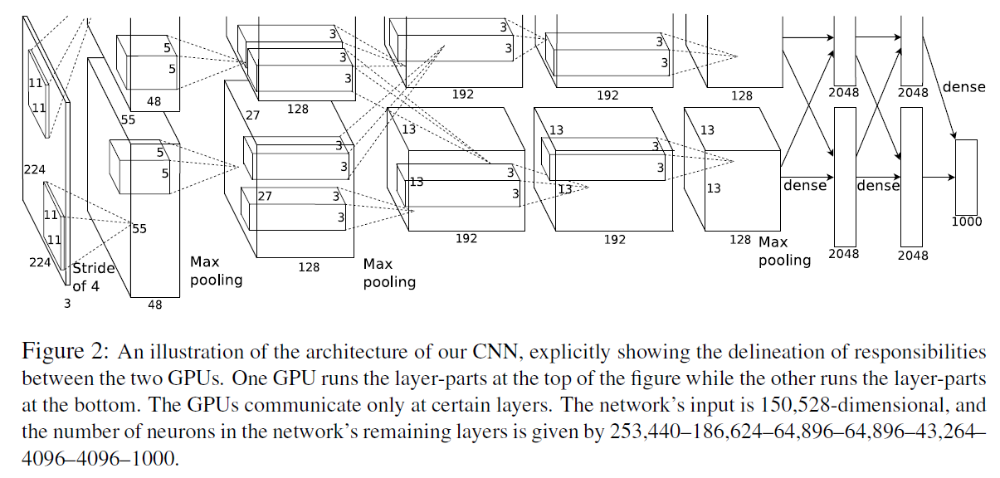
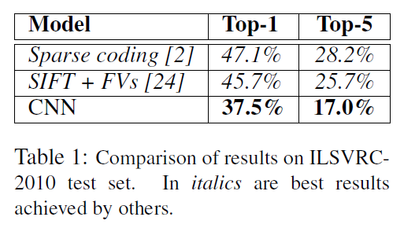
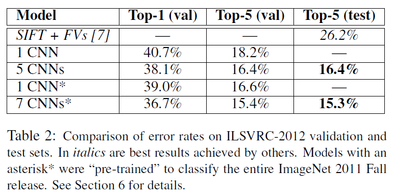

# ImageNet Classification with Deep Convolutional Neural Networks

NIPS2012，[PDF](http://papers.nips.cc/paper/4824-imagenet-classification-with-deep-convolutional-neural-networks.pdf)

> **Abstract.** We trained a large, deep convolutional neural network to classify the 1.2 million high-resolution images in the ImageNet LSVRC-2010 contest into the 1000 different classes. On the test data, we achieved top-1 and top-5 error rates of 37.5% and 17.0% which is considerably better than the previous state-of-the-art. The neural network, which has 60 million parameters and 650,000 neurons, consists of five convolutional layers, some of which are followed by max-pooling layers, and three fully-connected layers with a final 1000-way softmax. To make training faster, we used non-saturating neurons and a very efficient GPU implementation of the convolution operation. To reduce overfitting in the fully-connected layers we employed a recently-developed regularization method called “dropout” that proved to be very effective. We also entered a variant of this model in the ILSVRC-2012 competition and achieved a winning top-5 test error rate of 15.3%, compared to 26.2% achieved by the second-best entry.

**摘要：** 我们训练了一个大型深度卷积神经网络来将`ImageNet LSVRC-2010`竞赛的120万高分辨率的图像分到1000不同的类别中。在测试数据上，我们得到了`top-1 37.5%, top-5 17.0%`的错误率，这个结果比目前的最好结果好很多。这个神经网络有6000万参数和650000个神经元，包含5个卷积层（某些卷积层后面带有池化层）和3个全连接层，最后是一个1000维的softmax。为了训练的更快，我们使用了非饱和神经元并对卷积操作进行了非常有效的GPU实现。为了减少全连接层的过拟合，我们采用了一个最近开发的名为`dropout`的正则化方法，结果证明是非常有效的。我们也使用这个模型的一个变种参加了`ILSVRC-2012`竞赛，赢得了冠军并且与第二名 `top-5 26.2%`的错误率相比，我们取得了`top-5 15.3%`的错误率。

## Introduction

本文具体的贡献如下：我们在ILSVRC-2010和ILSVRC-2012的ImageNet子集上训练了到目前为止最大的神经网络之一，并取得了迄今为止在这些数据集上报道过的最好结果。我们编写了高度优化的2D卷积GPU实现以及训练卷积神经网络内部的所有其它操作，我们把它公开了。我们的网络包含许多新的不寻常的特性，这些特性提高了神经网络的性能并减少了训练时间，详见第三节。即使使用了120万标注的训练样本，我们的网络尺寸仍然使过拟合成为一个明显的问题，因此我们使用了一些有效的技术来防止过拟合，详见第四节。我们最终的网络包含5个卷积层和3个全连接层，深度似乎是非常重要的：我们发现移除任何卷积层（每个卷积层包含的参数不超过模型参数的1%）都会导致更差的性能。

ImageNet数据集有超过1500万的标注高分辨率图像，这些图像属于大约22000个类别。这些图像是从网上收集的，使用了Amazon’s Mechanical Turk的众包工具通过人工标注的。从2010年起，作为Pascal视觉对象挑战赛的一部分，每年都会举办ImageNet大规模视觉识别挑战赛（ILSVRC）。ILSVRC使用ImageNet的一个子集，1000个类别每个类别大约1000张图像。总计，大约120万训练图像，50000张验证图像和15万测试图像。

## The Architecture

下面，我们将描述我们网络结构中的一些新奇的不寻常的特性，最重要的最优先。

### ReLU 非线性

ReLU的好处：

1. 在训练时间上，比tanh和sigmoid快，而且BP的时候求导也很容易，如下图中使用ReLU的四层卷积神经网络在CIFAR-10数据集上达到25%的训练误差比使用tanh神经元的等价网络（虚线）快六倍。
2. 因为是非饱和函数，所以基本不会出现梯度消失的情况。

### 多GPU训练

GPU并行计算在当时是个很好思路，因为单个GPU显存有限限制了训练大规模的网络。作者采用的并行方案基本上每个GPU放置一半的核（或神经元），还有一个额外的技巧：只在某些特定的层上进行GPU通信。这意味着，例如，第3层的核会将第2层的所有核映射作为输入。然而，第4层的核只将位于相同GPU上的第3层的核映射作为输入。

### 局部响应归一化

ReLU具有让人满意的特性，它不需要通过输入归一化来防止饱和。如果至少一些训练样本对ReLU产生了正输入，那么那个神经元上将发生学习。然而，我们仍然发现接下来的局部响应归一化有助于泛化。
$$
b^i_{x,y} = a_{x,y}^i / ( k + \alpha \sum _{j = max(0, i-n / 2)} ^{min(N-1, i+n / 2)} (a_{x,y}^i)^2 )^\beta
$$

### 重叠池化

使池化的$stride<size$，这个方案分别降低了`top-1 0.4%`，`top-5 0.3%`的错误率，我们在训练过程中通常观察采用重叠池化的模型，发现它更难过拟合。

## Reducing Overfitting

### 数据增强

1. 图像变换，这是一个非常好，非常常用和实用的方法。
2. 改变训练图像的RGB通道的强度，这个方案减少了`top 1`错误率1%以上。

### Dropout

将许多不同模型的预测结合起来是降低测试误差的一个非常成功的方法，但对于需要花费几天来训练的大型神经网络来说，这似乎太昂贵了。然而，**Dropout** 只需要花费两倍的训练成本，就可以得到一个非常有效的模型结合版本。它会以0.5的概率对每个隐层神经元的输出设为0。那些“失活的”的神经元不再进行前向传播并且不参与反向传播。因此每次输入时，神经网络会采样一个不同的架构，但所有架构共享权重。这个技术减少了复杂的神经元互适应，因为一个神经元不能依赖特定的其它神经元的存在。因此，神经元被强迫学习更鲁棒的特征，它在与许多不同的其它神经元的随机子集结合时是有用的。在测试时，我们使用所有的神经元但它们的输出乘以0.5，对指数级的许多失活网络的预测分布进行几何平均，这是一种合理的近似。

## Result

## Conclusion

经典之作，提出了几个关键的点都一直被沿用，例如选用ReLU、数据增强、Dropout等。

存在的问题：GPU 1上的核主要是没有颜色的，而GPU 2上的核主要是针对颜色的。这种专业化在每次运行时都会发生，并且是与任何特别的随机权重初始化（以GPU的重新编号为模）无关的。